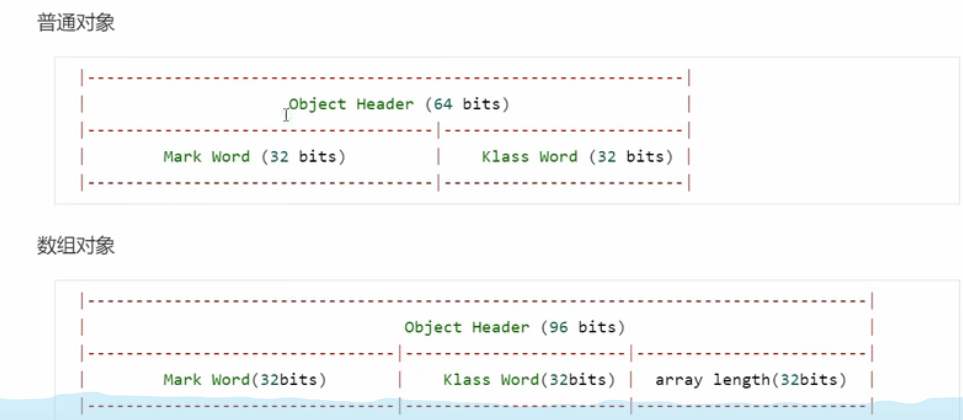
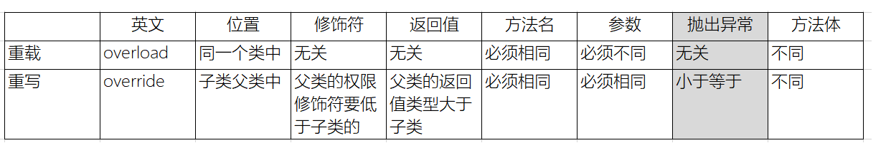
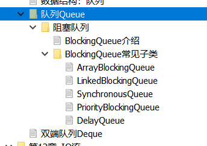
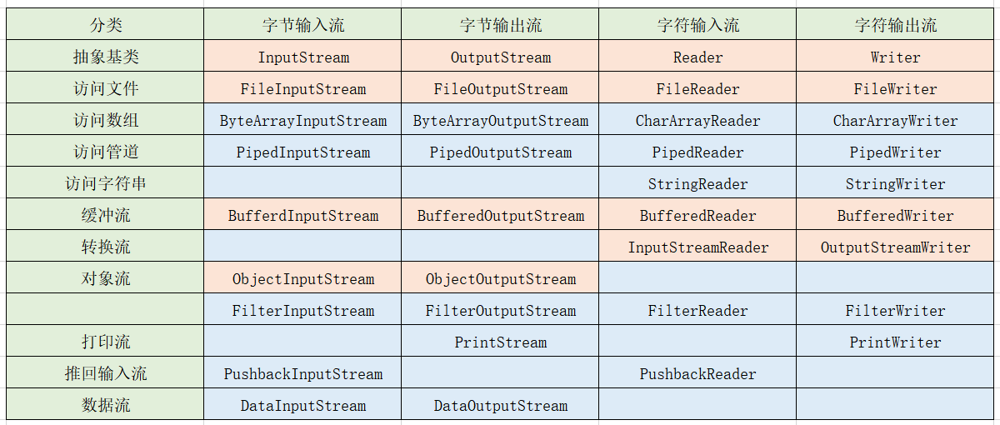

# 一、java基础概念

## 1.1、字符集

演化历史(中国版)

1. ASCII：英文字符集  七位

2. IOS8859-1： 西欧字符集  八位

3. GB2312： 简体中文字符集  最多使用两个字节编码（中文：2个字节）

4. GBK：GB2312的升级，加入了繁体字 最多使用两个字节编码

5. Unicode：国际通用字符集，融合了目前人类使用的所有字符。为每个字符分配唯一的字符码。

   推出了UTF标准：

   三种编码方案：  UTF-8，UTF-16,UTF-32 

   - UTF-8：一个到六个字节
   - UTF-16：2个或者四个字节
   - UTF-32：四个字节

## 1.2、char

1. 字符用单引号''定义
2. 只能保存一个字符
3. 不可以表达null（char a = ''编译出错）
4. 转义字符（\ 会把之后的字母转换为特殊含义）
5. 底层计算时候，按照码进行计算（jvm中全部转换为unicode）

## 1.3、基本类型转换

1.  类型级别：(从低到高的)
    byte-->short-->char-->int--->long--->float--->double
2. 当一个表达式中有多种数据类型的时候，类型都转换为当前表达式中级别最高的类型进行计算。
3. 在进行赋值的时候：
   左=右  :   直接赋值
   左<右  ：强转
   左>右  ：直接自动转换

## 1.4、this

代指当前对象

## 1.5、类的组成

### 1.5.1、类的组成：

类的组成：属性，方法，构造器，代码块（普通块，静态块，构造块，同步块），内部类

内部类：成员内部类 (静态的，非静态的) 和  局部内部类（位置：方法内，块内，构造器内）

### 1.5.2、代码块分类：

普通块（方法内部），构造块（类内部，方法外），静态块，同步块（多线程）

## 1.6、包

在Java中的导包没有包含和被包含的关系：

导入的类是两个东西

## 1.7、类之间的关系

1. 继承
2. 实现：类实现接口
3. 依赖：让类B作为参数被类A在某个method方法中使用
4. 关联：三者用法一样，都是某个类作为另一个类的属性：两者平等
5. 聚合：has-a，整体与部分的关系，即has-a的关系
6. 组合：体现的是一种contains-a的关系

## 1.8、向上转型，向下转型

Father f = new Father（）；

Child c = new Child ();

f = c

向上转型：此时父类在编译期无法访问子类特有的属性和方法

向下转型：父类转化为子类

## 1.9、抽象类

在抽象类中定义抽象方法，目的是为了为子类提供一个通用的模板

（1）抽象类不能创建对象，那么抽象类中是否有构造器？ 
抽象类中一定有构造器。构造器的作用  给子类初始化对象的时候要先super调用父类的构造器。

（2）抽象类是否可以被final修饰？
不能被final修饰，因为抽象类设计的初衷就是给子类继承用的。要是被final修饰了这个抽象类了，就不存在继承了，就没有子类。

## 2.0、接口

单继承，多实现

### 2.1.1、1.8之前

（1）常量：固定修饰符：public static final
（2）抽象方法：固定修饰符：public abstract 

## 2.1、异常

多重异常只会捕获第一个，之后的不会再捕获

throw声明异常，throws抛出异常，表示该方法不抛出异常

## 2.2、常用类

### 2.2.1、时间相关

1. java.util.date 表示  相对于1970年1月1号，经过n毫秒后的日期，如果参数为0（不是null）则时间为1970年1月1号

2. java.sql.date 只有年月日，用于数据库

3. SimpleDateFormat：parse，用于将string转化为date对象，format，用于将date转化为string

4. Calendar(抽象类）：Calendar.getInstance()或者new GregorianCalendar（），包含了日期中需要的各种属性，可以通过Calendar.get(Calendar.xxx)得到（除此外Calendar还有各种其他的getXXX属性））

   set方法可以更改日期

### 2.2.2、第三期日期相关

#### 2.2.2.1、LocalDate，LocalTime，LocalDateTime

LocalDate localDate = LocalDate.now();

LocalDate of = LocalDate.of(2010, 5, 6);

没有set方法，因为其不可变，有with

有加减操作

 LocalDateTime localDateTime1 = localDateTime.plusMonths(4);
 LocalDateTime localDateTime3 = localDateTime.minusMonths(5);

#### 2.2.2.2、DateTimeFormatter 

DateTimeFormatter df2 = DateTimeFormatter.ofLocalizedDateTime(FormatStyle.SHORT);

DateTimeFormatter df3 = DateTimeFormatter.ofPattern("yyyy-MM-dd hh:mm:ss");

df2.format、parse

## 2.3、IO流

1. 路径分隔符，winfows是"\\",linux是"/",所以用File.separator
2. mkdir(创建单级目录）,mkdirs(创建多级目录)
3. list，listfiles

## 2.4、测试

@before

@after