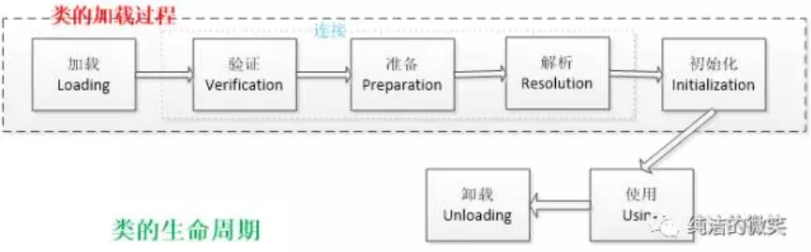
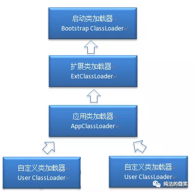
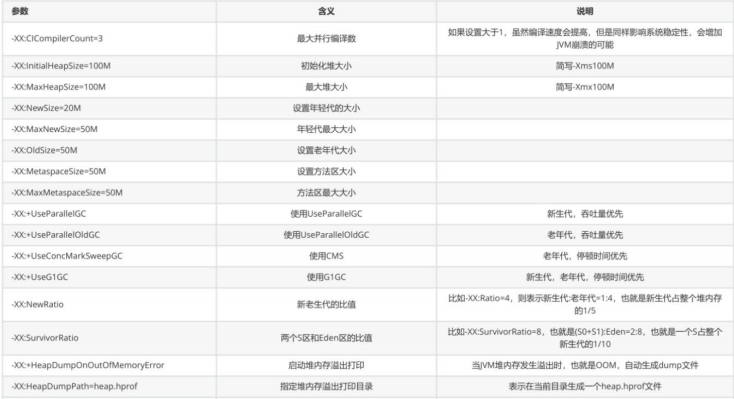
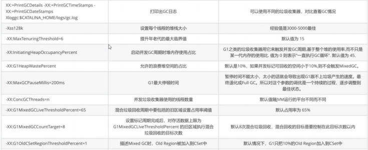
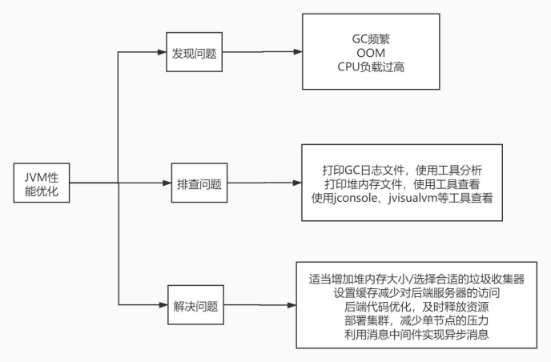

# 一、java类的加载机制

## 1.1，加载方式

1. 从本地系统中直接加载
2. 通过网络下载.class文件
3. 从zip，jar等归档文件中加载.class文件
4. 从专有数据库中提取.class文件
5. 将Java源文件动态编译为.class文件
6. 方式
   - 1、命令行启动应用时候由JVM初始化加载
   - 2、通过Class.forName()方法动态加载
   - 3、通过ClassLoader.loadClass()方法动态加载

## 1.2，类的生命周期
a


### 1.2.1、要点

1. 解析在某些情况下可以在初始化阶段之后开始，这是为了支持Java语言的运行时绑定（也成为动态绑定或晚期绑定）。
2. 阶段是按顺序**开始**，而不是按顺序进行或完成
3. 因为这些阶段通常都是互相**交叉**地混合进行的，通常在一个阶段执行的过程中调用或激活另一个阶段。

### 1.2.2、详细介绍

#### 1.2.2.1、加载

- 通过一个类的全限定名来获取其定义的二进制字节流。
- 将这个字节流所代表的静态存储结构转化为方法区的运行时数据结构。
- 在Java堆中生成一个代表这个类的 `java.lang.Class`对象，作为对方法区中这些数据的访问入口。
- 新建对象、新建子类对象、调用类的静态成员、反射的时候类会被加载

#### 1.2.2.1.1、生成对象要点

1. 指针碰撞：如果Java堆的内存是规整，即所有用过的内存放在一边，而空闲的的 放在另一边。分配

   内存时将位于中间的指针指示器向空闲的内存移动一段与对象大小 相等的距离，这样便完成分配内

   存工作。

2. 空闲列表：如果Java堆的内存不是规整的，则需要由虚拟机维护一个列表来记录 那些内存是可用

   的，这样在分配的时候可以从列表中查询到足够大的内存分配给对 象，并在分配后更新列表记录。

3. 对分配内存空间的动作进行同步处理（采用 CAS + 失败重试来保障更新操作的 原子性）

4. 把内存分配的动作按照线程划分在不同的空间之中进行，即每个线程在 Java 堆 中预先分配一小块内

   存，称为本地线程分配缓冲（Thread Local Allocation Buffer, TLAB）。哪个线程要分配内存，就在哪

   个线程的 TLAB 上分配。只有 TLAB 用完并 分配新的 TLAB 时，才需要同步锁。通过-XX:+/-UserTLAB参

   数来设定虚拟机是否使 用TLAB。

5. 句柄池、直接指针

6. 引用类型

   1. 强引用：发生 gc 的时候不会被回收。
   2. 软引用：有用但不是必须的对象，在发生内存溢出之前会被回收。
   3. 弱引用：有用但不是必须的对象，在下一次GC时会被回收。
   4. 虚引用（幽灵引用/幻影引用）：无法通过虚引用获得对象，用PhantomReference 实现虚引用，虚引用的用途是在 gc 时返回一个通知。

#### 1.2.2.2、验证

验证是连接阶段的第一步，这一阶段的目的是为了确保Class文件的字节流中包含的信息符合当前虚拟机的要求，并且不会危害虚拟机自身的安全。验证阶段大致会完成4个阶段的检验动作：

- **文件格式验证**：验证字节流是否符合Class文件格式的规范；例如：是否以 `0xCAFEBABE`开头、主次版本号是否在当前虚拟机的处理范围之内、常量池中的常量是否有不被支持的类型。
- **元数据验证**：对字节码描述的信息进行语义分析（注意：对比javac编译阶段的语义分析），以保证其描述的信息符合Java语言规范的要求；例如：这个类是否有父类，除了 `java.lang.Object`之外。
- **字节码验证**：通过数据流和控制流分析，确定程序语义是合法的、符合逻辑的。
- **符号引用验证**：确保解析动作能正确执行。

#### 1.2.2.3、准备

为类的 **静态变量**分配内存，并将其初始化为默认值（不包括**实例变量**！！！！！！）

static和final**同时**修饰的常量，必须在声明的时候就为其显式地赋值，否则编译时不通过

#### 1.2.2.3、解析

把类中的符号引用转换为直接引用

#### 1.2.2.4、初始化

初始化，为类的静态变量赋予正确的初始值

方式：

- ①声明类变量是指定初始值
- ②使用静态代码块为类变量指定初始值

JVM初始化步骤

- 1、假如这个类还没有被加载和连接，则程序先加载并连接该类
- 2、假如该类的直接父类还没有被初始化，则先初始化其直接父类
- 3、假如类中有初始化语句，则系统依次执行这些初始化语句

类初始化时机：只有当对类的主动使用的时候才会导致类的初始化

#### 1.2.2.5、类的主动使用

包括以下六种：

- 创建类的实例，也就是new的方式
- 访问某个类或接口的静态变量，或者对该静态变量赋值
- 调用类的静态方法
- 反射（如 `Class.forName(“com.shengsiyuan.Test”)`）
- 初始化某个类的子类，则其父类也会被初始化
- Java虚拟机启动时被标明为启动类的类（ `JavaTest`），直接使用 `java.exe`命令来运行某个主类

#### 1.2.2.6、结束生命周期

在如下几种情况下，Java虚拟机将结束生命周期

- 执行了 `System.exit()`方法
- 程序正常执行结束
- 程序在执行过程中遇到了异常或错误而异常终止
- 由于操作系统出现错误而导致Java虚拟机进程终止

## 1.3、类加载器



### 1.3.1、介绍

启动类加载器由C++编写，其他类加载器全部继承于java.lang.Classloader，由启动类加载器加载到内存中之后才能去加载其他的类

### 1.3.2、JVM类加载机制

- **全盘负责**，当一个类加载器负责加载某个Class时，该Class所依赖的和引用的其他Class也将由该类加载器负责载入，除非显示使用另外一个类加载器来载入
- **双亲委派机制**，先让父类加载器试图加载该类，只有在父类加载器无法加载该类时才尝试从自己的类路径中加载该类
- **缓存机制**，缓存机制将会保证所有加载过的Class都会被缓存，当程序中需要使用某个Class时，类加载器先从缓存区寻找该Class，只有缓存区不存在，系统才会读取该类对应的二进制数据，并将其转换成Class对象，存入缓存区。这就是为什么修改了Class后，必须重启JVM，程序的修改才会生效

### 1.3.3、自定义类加载器

- 1、这里传递的文件名需要是类的全限定性名称，即 `com.paddx.test.classloading.Test`格式的，因为 defineClass 方法是按这种格式进行处理的。
- 2、最好不要重写loadClass方法，因为这样容易破坏双亲委托模式。
- 3、这类Test 类本身可以被 `AppClassLoader`类加载，因此我们不能把 `com/paddx/test/classloading/Test.class`放在类路径下。否则，由于双亲委托机制的存在，会直接导致该类由 `AppClassLoader`加载，而不会通过我们自定义类加载器来加载。

```
package com.xinshou;

import java.io.*;


public class MyClassLoader extends ClassLoader {
    private String root;

    protected Class<?> findClass(String name) throws ClassNotFoundException {
        byte[] classData = loadClassData(name);
        if (classData == null) {
            throw new ClassNotFoundException();
        } else {
            return defineClass(name, classData, 0, classData.length);
        }
    }


    private byte[] loadClassData(String className) {
        String fileName = root + File.separatorChar + className.replace('.', File.separatorChar) + ".class";
        try {
            InputStream ins = new FileInputStream(fileName);
            ByteArrayOutputStream baos = new ByteArrayOutputStream();
            int bufferSize = 1024;
            byte[] buffer = new byte[bufferSize];
            int length = 0;
            while ((length = ins.read(buffer)) != -1) {
                baos.write(buffer, 0, length);
            }
            return baos.toByteArray();
        } catch (IOException e) {
            e.printStackTrace();
        }
        return null;
    }


    public String getRoot() {
        return root;
    }


    public void setRoot(String root) {
        this.root = root;
    }


    public static void main(String[] args) {
        MyClassLoader classLoader = new MyClassLoader();
        classLoader.setRoot("E:\\temp");
        Class<?> testClass = null;
        try {
            testClass = classLoader.loadClass("com.neo.classloader.Test2");
            Object object = testClass.newInstance();
            System.out.println(object.getClass().getClassLoader());
        } catch (ClassNotFoundException e) {
            e.printStackTrace();
        } catch (InstantiationException e) {
            e.printStackTrace();
        } catch (IllegalAccessException e) {
            e.printStackTrace();
        }
    }
}
```

# 二、内存结构

堆、方法区、java虚拟机栈、本地方法栈、程序计数器

1. 堆

   新生代：老年代 = 2:1

   新生代（eden，from Survivor，to survivor）：8:1:1

2. 方法区，线程共享

   存储已被虚拟机加载的类信息、常量、静态变量、即时编译器编译后的代码

3. 虚拟机栈

   线程私有

   每个方法被执行的时候都会同时创建一个栈帧（Stack Frame）用于存储局部变量表、操作栈、动态链接、方法出口等信息-

   局部变量表存放了编译期可知的各种基本数据类型（boolean、byte、char、short、int、float、long、double）、对象引用（reference类型，它不等同于对象本身，根据不同的虚拟机实现，它可能是一个指向对象起始地址的引用指针，也可能指向一个代表对象的句柄或者其他与此对象相关的位置）和returnAddress类型（指向了一条字节码指令的地址）。

# 三、垃圾收集器


## 3.1、对象存活判断

**引用计数**：此方法简单，无法解决对象相互循环引用的问题。
**可达性分析**：当一个对象到GC Roots没有任何引用链相连时，则证明此对象是不可用的。不可达对象。

**GC Roots**

- 虚拟机栈中引用的对象。
- 方法区中类静态属性实体引用的对象。
- 方法区中常量引用的对象。
- 本地方法栈中JNI引用的对象。

## 3.2、垃圾收集算法

1. 标记 -清除算法

   效率低

   有大量内存碎片

2. 复制算法（老年代不用）

   实现简单，效率高

   可用内存缩小为原来的一半

   如果有长期存活对象，效率低

3. 标记-整理算法

   效率比复制算法低

   要重新整理引用地址

   stw

4. 分代收集算法

## 3.3、垃圾收集器

1.  Serial收集器

   单线程

   新生代复制算法

   垃圾收集的过程中会Stop The World（服务暂停）

2. Serial Old收集器 

   老年代标记-压缩

3. ParNew收集器

   Serial收集器的多线程版本

   新生代并行，老年代串行；

4. Parallel Scavenge收集器（类似parNew）

   Parallel收集器更关注系统的吞吐量

   可以通过参数来打开自适应调节策略

   虚拟机会根据当前系统的运行情况收集性能监控信息

   动态调整这些参数以提供最合适的停顿时间或最大的吞吐量；

   也可以通过参数控制GC的时间不大于多少毫秒或者比例

5. Parallel Old 收集器（Parallel Scavenge老年代版本）

6. CMS收集器（标记、清除）

   - 初始标记（CMS initial mark）

   - 并发标记（CMS concurrent mark）

   - 重新标记（CMS remark）

   - 并发清除（CMS concurrent sweep）

     优点: 并发收集、低停顿
     缺点: 产生大量空间碎片

     ​          并发阶段会降低吞吐量

     ​          无法清除浮动垃圾

7. G1收集器

   1. 初始标记（Initial Marking）：标记一下GC Roots能直接关联到的对象，伴随着一次普通的Young GC发生，并修改NTAMS（Next Top at Mark Start）的值，让下一阶段用户程序并发运行时，能在正确可用的Region中创建新对象，此阶段是stop-the-world操作。
   2. 根区间扫描，标记所有幸存者区间的对象引用，扫描 Survivor到老年代的引用，该阶段必须在下一次Young GC 发生前结束。
   3. 并发标记（Concurrent Marking）：是从GC Roots开始堆中对象进行可达性分析，找出存活的对象，这阶段耗时较长，但可与用户程序并发执行，该阶段可以被Young GC中断。
   4. 最终标记（Final Marking）：是为了修正并发标记期间因用户程序继续运作而导致标记产生变动的那一部分标记记录，虚拟机将这段时间对象变化记录在线程Remembered Set Logs里面，最终标记阶段需要把Remembered Set Logs的数据合并到Remembered Set中，此阶段是stop-the-world操作，使用snapshot-at-the-beginning (SATB) 算法。
   5. 筛选回收（Live Data Counting and Evacuation）：首先对各个Region的回收价值和成本进行排序，根据用户所期望的GC停顿时间来制定回收计划,回收没有存活对象的Region并加入可用Region队列。这个阶段也可以做到与用户程序一起并发执行，但是因为只回收一部分Region，时间是用户可控制的，而且停顿用户线程将大幅提高收集效率。

## 3.3、进入老年代

- 大对象直接进入老年代（大对象是指需要大量连续内存空间的对象）。这样做的目的是避免在Eden区和两个Survivor区之间发生大量的内存拷贝（新生代采用复制算法收集内存）。
- 长期存活的对象进入老年代。虚拟机为每个对象定义了一个年龄计数器，如果对象经过了1次Minor GC那么对象会进入Survivor区，之后每经过一次Minor GC那么对象的年龄加1，知道达到阀值对象进入老年区。
- 动态判断对象的年龄。如果Survivor区中相同年龄的所有对象大小的总和大于Survivor空间的一半，年龄大于或等于该年龄的对象可以直接进入老年代。

## 3.4、FULL GC触发场景

1）System.gc

2）promotion failed (年代晋升失败,比如eden区的存活对象晋升到S区放不下，又尝试直接晋 升到Old

区又放不下，那么Promotion Failed,会触发FullGC)

3）CMS的Concurrent-Mode-Failure 由于CMS回收过程中主要分为四步: 

1.CMS initial mark 

2.CMS Concurrent mark 

3.CMS remark 

4.CMS Concurrent sweep。在2中gc线程与用户线程同时执行，那么用户线程依旧可 能同时产生垃圾，

如果这个垃圾较多无法放入预留的空间就会产生CMS-Mode-Failure， 切换 为SerialOld单线程做mark

sweep-compact。 

 当使用G1,CMS 时，FullGC发生的时候 是 Serial+SerialOld。 当使用ParallOld时，FullGC发生的时候是

ParallNew +ParallOld.

4）空间分配担保。每次进行Minor GC时，JVM会计算Survivor区移至老年区的对象的平均大小，如果这个值大于老年区的剩余值大小则进行一次Full GC，如果小于检查HandlePromotionFailure设置，如果true则只进行Monitor GC,如果false则进行Full GC。

# 四、参数

-Xms：初始堆内存（ms:memory start）默认1/64

-Xmx：最大堆内存（x：max）默认1/4

-Xms2g：初始化推大小为 2g；

-Xmx2g：堆最大内存为 2g；

-XX:NewRatio=4：设置年轻的和老年代的内存比例为 1:4；

-XX:SurvivorRatio=8：设置新生代 Eden 和 Survivor 比例为 8:2；

–XX:+UseParNewGC：指定使用 ParNew + Serial Old 垃圾回收器组合；

-XX:+UseParallelOldGC：指定使用 ParNew + ParNew Old 垃圾回收器组合；

-XX:+UseConcMarkSweepGC：指定使用 CMS + Serial Old 垃圾回收器组合；

-XX:+PrintGC：开启打印 gc 信息；

-XX:+PrintGCDetails：打印 gc 详细信息。

因为超过32g后每个jvm对象指针的长度会翻倍，导致内存与cpu的开销增大





# 五、jvm调优

对于还在正常运⾏的系统： 

1. 可以使⽤jmap来查看JVM中各个区域的使⽤情况 

2. 可以通过jstack来查看线程的运⾏情况，⽐如哪些线程阻塞、是否出现了死锁 

3. 可以通过jstat命令来查看垃圾回收的情况，特别是fullgc，如果发现fullgc⽐较频繁，那么就得进⾏ 

调优了 

4. 通过各个命令的结果，或者jvisualvm等⼯具来进⾏分析 

5. ⾸先，初步猜测频繁发送fullgc的原因，如果频繁发⽣fullgc但是⼜⼀直没有出现内存溢出，那么表 

示fullgc实际上是回收了很多对象了，所以这些对象最好能在younggc过程中就直接回收掉，避免 

这些对象进⼊到⽼年代，对于这种情况，就要考虑这些存活时间不⻓的对象是不是⽐较⼤，导致年 

轻代放不下，直接进⼊到了⽼年代，尝试加⼤年轻代的⼤⼩，如果改完之后，fullgc减少，则证明 

修改有效 

6. 同时，还可以找到占⽤CPU最多的线程，定位到具体的⽅法，优化这个⽅法的执⾏，看是否能避免 

某些对象的创建，从⽽节省内存 


对于已经发⽣了OOM的系统： 

1. ⼀般⽣产系统中都会设置当系统发⽣了OOM时，⽣成当时的dump⽂件（

\- 

XX:+HeapDumpOnOutOfMemoryError -XX:HeapDumpPath=/usr/local/base） 

2. 我们可以利⽤jsisualvm等⼯具来分析dump⽂件 

3. 根据dump⽂件找到异常的实例对象，和异常的线程（占⽤CPU⾼），定位到具体的代码 

4. 然后再进⾏详细的分析和调试 



# 六、命令

## 6.1、jps

-q：本地虚拟机id

-l：程序的全类名，或者jar包名称

-m：程序启动时传给main的参数

-v虚拟机启动时级别jvm参数

## 6.2、jstat