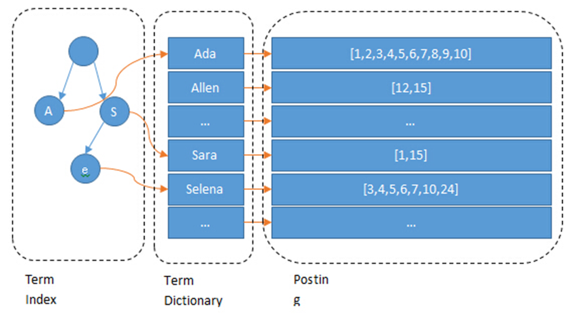
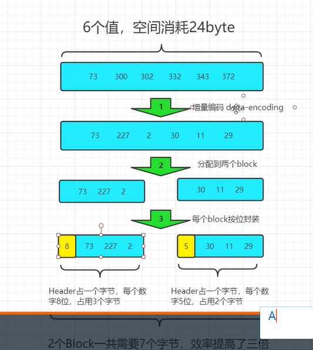
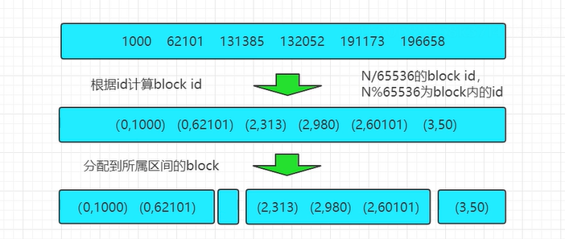
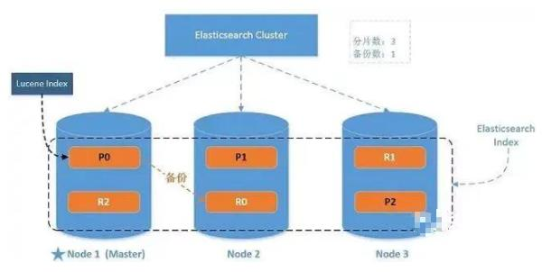

# 一、常用面试题

## 1.1、倒排索引原理

term index：提高查询字段效率

term dictionary：当前索引的所有字段

posting list：某一个词的所有id的集合



### 1.1.1、底层数据结构

term index：fst

term dictionary：fst

### 1.1.2、倒排表压缩算法

1. （for：索引帧）frame of reference

   

2. （rom：咆哮位图）roming bitmaps

   

### 1.1.3、trie 字典树、fst

前缀字典树：共享前缀 

fst：共享前缀和后缀并且用**通用最小化算法**标记数字（es中表示**.tm**文件中的地址值）

## 1.2、写入流程

1. 协调节点默认使用文档 ID 参与计算（也支持通过 routing），以便为路由提供合适的分片：shard = hash(document_id) % (num_of_primary_shards)
2. 当分片所在的节点接收到来自协调节点的请求后，会将请求写入到 Memory Buffer
3. 然后定时（默认是每隔 1 秒）写入到 Filesystem Cache（os cache，这里可以查询），这个从 Memory Buffer 到 Filesystem Cache 的过程就叫做 refresh；，同时也会写入到 translog 中
4. 当 Filesystemcache 中的数据写入到磁盘中时，才会清除掉，这个过程叫做 flush；
   在 flush 过程中，内存中的缓冲将被清除，内容被写入一个新段，段的 fsync 将创建一个新的提交点，并将内容刷新到磁盘，旧的 translog 将被删除并开始一个新的 translog。
   flush 触发的时机是定时触发（默认 30 分钟）或者 translog 变得太大（默认为 512M）时；

## 1.4、脑裂

### 1.4.1、原因

1. 网络问题：

   集群间的网络延迟导致一些节点访问不到master, 认为master 挂掉了从而选举出新的master,并对master上的分片和副本标红，分配新的主分片。

2. 节点负载：

   主节点的角色既为master又为data,访问量较大时可能会导致ES停止响应造成大面积延迟，此时其他节点得不到主节点的响应认为主节点挂掉了，会重新选取主节点。

3. 内存回收：

   data 节点上的ES进程占用的内存较大，引发JVM的大规模内存回收，造成ES进程失去响应。

### 1.4.2、解决

1. 减少误判：增大discovery.zen ping_ timeout
2. 选举触发：discovery.zen.minimum. _master_ nodes:1（改为n/2+1）
3. 角色分离：即master节点与data节点分离，限制角色
   - 主节点配置为：node master: true，node data: false
   - 从节点配置为：node master: false，node data: true

# 二、入门

## 2.1、索引

### 2.1.1、HTTP-索引-创建

```
PUT 请求 ： http://127.0.0.1:9200/shopping
{
    "title":"华为手机",
    "category":"华为",
    "images":"http://www.gulixueyuan.com/hw.jpg",
    "price":1999.00
}

```

重复发送会报错

### 2.1.2、查看索引

```
查看所有：
GET 请求 ： http://127.0.0.1:9200/_cat/indices?v
查看一个：
GET 请求 ： http://127.0.0.1:9200/shopping
```

### 2.1.3、删除索引

```
 DELETE 请求 ： http://127.0.0.1:9200/shopping
```

## 2.2、数据

### 2.2.1、添加数据

```
POST 请求 ： http://127.0.0.1:9200/shopping/_doc
一定要用post，put会报错
```

### 2.2.2、查询数据

```
查看所有：
GET 请求 ： http://127.0.0.1:9200/shopping/_search
可以加请求体
{
	"query":{
		"match_all":{}
	}
}

查看一个：
GET 请求 ： http://127.0.0.1:9200/shopping/_doc/1
```

### 2.2.3、全量修改

```
POST 请求 ： http://127.0.0.1:9200/shopping/_doc/1
{
    "title":"华为手机",
    "category":"华为",
    "images":"http://www.gulixueyuan.com/hw.jpg",
    "price":1999.00
}
会覆盖
```

### 2.2.4、局部修改

```
POST 请求 ： http://127.0.0.1:9200/shopping/_update/1
{
	"doc": {
		"title":"小米手机",
		"category":"小米"
	}
}
```

### 2.2.3、删除

```
DELETE 请求 ： http://127.0.0.1:9200/shopping/_doc/1
```

### 2.2.4、条件查询

```
GET 请求：http://127.0.0.1:9200/shopping/_search?q=category:小米
```

或者

```
GET 请求：http://127.0.0.1:9200/shopping/_search
{
	"query":{
		"match":{
			"category":"小米"
		}
	}
}
```

### 2.2.5、分页查询

```
GET 请求：http://127.0.0.1:9200/shopping/_search
{
	"query":{
		"match_all":{}
	},
	"from":0,
	"size":2
}

```

### 2.2.5、查询排序

```
GET 请求：http://127.0.0.1:9200/shopping/_search
{
	"query":{
		"match_all":{}
	},
	"sort":{
		"price":{
			"order":"desc"
		}
	}
}
```

### 2.2.6、多条件查询

```
GET请求 ： http://127.0.0.1:9200/shopping/_search
{
	"query":{
		"bool":{
			"must、should":[{
				"match":{
					"category":"小米"
				}
			},{
				"match":{
					"price":3999.00
				}
			}]
		}
	}
}
```

### 2.2.7、范围查询

```
GET请求 ： http://127.0.0.1:9200/shopping/_search
{
	"query":{
		"bool":{
			"should":[{
				"match":{
					"category":"小米"
				}
			},{
				"match":{
					"category":"华为"
				}
			}]
		},
        "filter":{
            "range":{
                "price":{
                    "gt":2000
                }
            }
        }
	}
}

```

### 2.2.8、完全匹配

可以禁止对查询条件分词

例如：match：小华，可以查询出小米和华为

​            match_phrase:不可以，只能查询出包含小华的

```
GET请求 ： http://127.0.0.1:9200/shopping/_search
{
	"query":{
		"match_phrase":{
			"category" : "为"
		}
	}
}

```

### 2.2.9、高亮显示

```
GET请求 ： http://127.0.0.1:9200/shopping/_search
{
	"query":{
		"match_phrase":{
			"category" : "为"
		}
	},
    "highlight":{
        "fields":{
            "category":{}//<----高亮这字段
        }
    }
}
```

### 2.2.10、聚合

```
 GET请求 ： http://127.0.0.1:9200/shopping/_search
 {
	"aggs":{//聚合操作
		"price_group":{//名称，随意起名
			"terms，avg，max":{
				"field":"price"//字段
			}
		}
	}
	 "size":0/////可以去除原始数据
}

```

### 2.2.11、映射

代表索引的结构

```
# PUT http://127.0.0.1:9200/user/_mapping
text，keyword
index：是否可以作为条件被检索到
{
    "properties": {
        "name":{
        	"type": "text",
        	"index": true
        },
        "sex":{
        	"type": "keyword",
        	"index": true
        },
        "tel":{
        	"type": "keyword",
        	"index": false
        }
    }
}
```

## 2.3、java api

#### 2.3.1、环境

```
<!-- elasticsearch 的客户端 -->
    <dependency>
        <groupId>org.elasticsearch.client</groupId>
        <artifactId>elasticsearch-rest-high-level-client</artifactId>
        <version>7.8.0</version>
    </dependency>
    <!-- elasticsearch 依赖 2.x 的 log4j -->
    <dependency>
        <groupId>org.apache.logging.log4j</groupId>
        <artifactId>log4j-api</artifactId>
        <version>2.8.2</version>
    </dependency>
```

```
        // 创建客户端对象
		RestHighLevelClient client = new RestHighLevelClient(
				RestClient.builder(new HttpHost("localhost", 9200, "http")));
        //		...
		System.out.println(client);

		// 关闭客户端连接
		client.close();
```

#### 2.3.2、索引建立、查询、删除

```
// 创建索引 - 请求对象
        CreateIndexRequest request = new CreateIndexRequest("user2");
        // 发送请求，获取响应
        CreateIndexResponse response = client.indices().create(request,
                RequestOptions.DEFAULT);
        boolean acknowledged = response.isAcknowledged();


// 创建客户端对象
        RestHighLevelClient client = new RestHighLevelClient(
                RestClient.builder(new HttpHost("localhost", 9200, "http")));

        // 查询索引 - 请求对象
        GetIndexRequest request = new GetIndexRequest("user2");
        // 发送请求，获取响应
        GetIndexResponse response = client.indices().get(request,
                RequestOptions.DEFAULT);


// 删除索引 - 请求对象
        DeleteIndexRequest request = new DeleteIndexRequest("user2");
        // 发送请求，获取响应
        AcknowledgedResponse response = client.indices().delete(request,RequestOptions.DEFAULT);
        
```

#### 2.3.3、新增数据

```
// 新增文档 - 请求对象
            IndexRequest request = new IndexRequest();
            // 设置索引及唯一性标识
            request.index("user").id("1001");

            // 创建数据对象
            User user = new User();
            user.setName("zhangsan");
            user.setAge(30);
            user.setSex("男");

            ObjectMapper objectMapper = new ObjectMapper();
            String productJson = objectMapper.writeValueAsString(user);
            // 添加文档数据，数据格式为 JSON 格式
            request.source(productJson, XContentType.JSON);
            // 客户端发送请求，获取响应对象
            IndexResponse response = client.index(request, RequestOptions.DEFAULT);

```

#### 2.3.4、修改数据

```
 // 修改文档 - 请求对象
            UpdateRequest request = new UpdateRequest();
            // 配置修改参数
            request.index("user").id("1001");
            // 设置请求体，对数据进行修改
            request.doc(XContentType.JSON, "sex", "女");
            // 客户端发送请求，获取响应对象
            UpdateResponse response = client.update(request, RequestOptions.DEFAULT);
```

#### 2.3.5、删除

```
 //创建请求对象
            DeleteRequest request = new DeleteRequest().index("user").id("1001");
            //客户端发送请求，获取响应对象
            DeleteResponse response = client.delete(request, RequestOptions.DEFAULT);
```

#### 2.3.6、批量新增

```
//创建批量新增请求对象
            BulkRequest request = new BulkRequest();
            request.add(new
                    IndexRequest().index("user").id("1001").source(XContentType.JSON, "name",
                    "zhangsan"));
            request.add(new
                    IndexRequest().index("user").id("1002").source(XContentType.JSON, "name",
                            "lisi"));
            request.add(new
                    IndexRequest().index("user").id("1003").source(XContentType.JSON, "name",
                    "wangwu"));
            //客户端发送请求，获取响应对象
            BulkResponse responses = client.bulk(request, RequestOptions.DEFAULT);
```

#### 2.3.7、批量删除

```
//创建批量删除请求对象
            BulkRequest request = new BulkRequest();
            request.add(new DeleteRequest().index("user").id("1001"));
            request.add(new DeleteRequest().index("user").id("1002"));
            request.add(new DeleteRequest().index("user").id("1003"));
            //客户端发送请求，获取响应对象
            BulkResponse responses = client.bulk(request, RequestOptions.DEFAULT);
```

#### 2.3.8、全部查询

```
// 创建搜索请求对象
            SearchRequest request = new SearchRequest();
            request.indices("user");
            // 构建查询的请求体
            SearchSourceBuilder sourceBuilder = new SearchSourceBuilder();
            // 查询所有数据
            sourceBuilder.query(QueryBuilders.matchAllQuery());
            request.source(sourceBuilder);
            SearchResponse response = client.search(request, RequestOptions.DEFAULT);
            // 查询匹配
            SearchHits hits = response.getHits();
```

#### 2.3.9、条件查询

```
 // 创建搜索请求对象
        SearchRequest request = new SearchRequest();
        request.indices("user");
        // 构建查询的请求体
        SearchSourceBuilder sourceBuilder = new SearchSourceBuilder();
        sourceBuilder.query(QueryBuilders.termQuery("age", "30"));
        request.source(sourceBuilder);
        SearchResponse response = client.search(request, RequestOptions.DEFAULT);
```

#### 3.3.10、分页查询

```
 // 创建搜索请求对象
        SearchRequest request = new SearchRequest();
        request.indices("user");
        // 构建查询的请求体
        SearchSourceBuilder sourceBuilder = new SearchSourceBuilder();
        sourceBuilder.query(QueryBuilders.matchAllQuery());
        // 分页查询
        // 当前页其实索引(第一条数据的顺序号)， from
        sourceBuilder.from(0);

        // 每页显示多少条 size
        sourceBuilder.size(2);
        request.source(sourceBuilder);
```

#### 3.3.11、查询排序

```
        // 构建查询的请求体
        SearchSourceBuilder sourceBuilder = new SearchSourceBuilder();
        sourceBuilder.query(QueryBuilders.matchAllQuery());
        // 排序
        sourceBuilder.sort("age", SortOrder.ASC);
        request.source(sourceBuilder);
```

#### 3.3.12、组合查询

```
// 创建搜索请求对象
        SearchRequest request = new SearchRequest();
        request.indices("user");
        // 构建查询的请求体
        SearchSourceBuilder sourceBuilder = new SearchSourceBuilder();
        BoolQueryBuilder boolQueryBuilder = QueryBuilders.boolQuery();
        // 必须包含
        boolQueryBuilder.must(QueryBuilders.matchQuery("age", "30"));
        // 一定不含
        boolQueryBuilder.mustNot(QueryBuilders.matchQuery("name", "zhangsan"));
        // 可能包含
        boolQueryBuilder.should(QueryBuilders.matchQuery("sex", "男"));
        sourceBuilder.query(boolQueryBuilder);

```

#### 3.3.13、范围查询

```
// 创建搜索请求对象
        SearchRequest request = new SearchRequest();
        request.indices("user");
        // 构建查询的请求体
        SearchSourceBuilder sourceBuilder = new SearchSourceBuilder();
        RangeQueryBuilder rangeQuery = QueryBuilders.rangeQuery("age");
        // 大于等于
        //rangeQuery.gte("30");
        // 小于等于
        rangeQuery.lte("40");
        sourceBuilder.query(rangeQuery);
        request.source(sourceBuilder);
```

# 三、集群部署

#### 3.1、要点

1. 一定要保证集群名字唯一
2. 一定要保证节点名字在集群内唯一
3. 一定要保证http port和tcp port唯一

#### 3.2、配置文件

config/elasticsearch.yml

##### 3.2.1、主节点

```
#节点 1 的配置信息：
#集群名称，节点之间要保持一致
cluster.name: my-elasticsearch
#节点名称，集群内要唯一
node.name: node-1001
node.master: true
node.data: true
#ip 地址
network.host: localhost
#http 端口
http.port: 1001
#tcp 监听端口
transport.tcp.port: 9301
#discovery.seed_hosts: ["localhost:9301", "localhost:9302","localhost:9303"]
#discovery.zen.fd.ping_timeout: 1m
#discovery.zen.fd.ping_retries: 5
#集群内的可以被选为主节点的节点列表
#cluster.initial_master_nodes: ["node-1", "node-2","node-3"]
#跨域配置
#action.destructive_requires_name: true
http.cors.enabled: true
http.cors.allow-origin: "*"
```

##### 3.2.2、从节点

```
其余和主节点相同（需更改节点名字，http port，tcp port）
discovery.seed_hosts: ["localhost:9301"]
discovery.zen.fd.ping_timeout: 1m
discovery.zen.fd.ping_retries: 5
```

##### 3.2.3、第二个从节点

```
discovery.seed_hosts: ["localhost:9301", "localhost:9302"]
discovery.zen.fd.ping_timeout: 1m
discovery.zen.fd.ping_retries: 5
```

#### 3.3、架构

shards：分片

replicas：副本



#### 3.4、名词解释&作用

##### 3.4.1、master节点：

集群中的一个节点会被选为master节点，它将负责管理集群范畴的变更，例如创建或删除索引，添加节点到集群或从集群删除节点。master节点无需参与文档层面的变更和搜索，这意味着仅有一个master节点并不会因流量增长而成为瓶颈。任意一个节点都可以成为 master 节点

##### 3.4.2、data节点：

持有数据和倒排索引。默认情况下，每个节点都可以通过设定配置文件elasticsearch.yml中的node.data属性为true(默认)成为数据节点。如果需要一个专门的主节点，应将其node.data属性设置为false

##### 3.4.3、Client节点：

如果将node.master属性和node.data属性都设置为false，那么该节点就是一个客户端节点，扮演一个负载均衡的角色，将到来的请求路由到集群中的各个节点

##### 3.4.5、故障转移：

主分片和副本不在一台机器上，避免单点故障问题

##### 3.4.6、水平扩容：

增加节点，使每一台机器的硬件资源被更少的分片分享

不可以再增加分片数，但是可以增加副本数，所以上图中可以有超过七个节点，可以提高并发

##### 3.4.7、从分片

在硬件故障时提供数据保护，同时服务于搜索和检索这种只读请求

##### 3.4.8、路由计算 & 分片控制

```
shard = hash(routing) % number_of_primary_shards
```

##### 3.4.9、分片控制

用户可以访问任何一个节点（即协调节点）访问数据，访问节点则为协调节点

##### 3.4.10、写操作

新增，修改，删除


参数控制：

1. consistency 
   - one ：只要主分片状态 ok 就允许执行写操作。
   - all：必须要主分片和所有副本分片的状态没问题才允许执行写操作。
   - quorum：默认值为quorum , 即大多数的分片副本状态没问题就允许执行写操作。
2. timeout

##### 3.4.11、读取流程


1. 更新

   （1）客户端向Node 1发送更新请求。
   （2）协调节点请求转发到主分片所在的Node 3 。
   （3）Node 3从主分片检索文档，修改_source字段中的JSON，并且尝试重新索引主分片的文档。如果文档已经被另一个进程修改,它会重试步骤3 ,超过retry_on_conflict次后放弃。
   （4）如果 Node 3成功地更新文档，它将新版本的文档并行转发到Node 1和 Node 2上的副本分片，重新建立索引。

   （5）一旦所有副本分片都返回成功，Node 3向协调节点也返回成功，协调节点向客户端返回成功。

##### 3.4.12、文档搜索

早起倒排索引不会更新，一旦新的索引就绪，旧的就会被其替换

##### 3.4.13、动态更新索引

如何在保留不变性的前提下实现倒排索引的更新？

答案是：用更多的索引。通过增加新的补充索引来反映新近的修改，而不是直接重写整个倒排索引。每一个倒排索引都会被轮流查询到,从最早的开始查询完后再对结果进行合并。

##### 3.4.14、删除索引文件

每个提交点会包含一个.del 文件，文件中会列出这些被删除文档的段信息。

# 四、es优化

## 4.1、硬件优化

### 4.1.1、磁盘

1. 使用ssd，比机械硬盘好
2. 使用raid0（能够并行传输）
3. 使用多块磁盘，并允许es通过多个path.data目录配置把数据条带化分配到他们上面
4. 不使用远程挂在的存储

### 4.1.2、内存

1. 不要超过物理内存的 50%
2. 堆内存的大小最好不要超过 32GB，最终我们都会采用 31 G 设置

## 4.2、设计优化

### 4.2.1、索引设计

1. 分片不超过最大堆内存的一半（节点数<=主节点*（副本数+1））
2. 根据业务增量需求，采取基于日期模板创建索引，通过 roll over API 滚动索引；
3. Mapping 阶段充分结合各个字段的属性，是否需要检索、是否需要存储等。

### 4.2.2、参数设计

1. 加大Translog Flush

2. 增加Index Refesh间隔

3. 推迟分片分配时间，判断集群节点中断

   对于节点瞬时中断的问题，默认情况，集群会等待一分钟来查看节点是否会重新加入，如果这个节点在此期间重新加入，重新加入的节点会保持其现有的分片数据，不会触发新的分片分配。

4. 脑裂discovery.zen ping_ timeout

## 4.3、使用优化

1. 尽量批量处理
2. 减少副本（先禁止副本，写入master之后，在开启）
3. 写入时禁止刷新机制
4. 每天凌晨定时对索引做 force_merge 操作，以释放空间；
5. 采取冷热分离机制，热数据存储到 SSD，提高检索效率；冷数据定期进行 shrink操作，以缩减存储；

## 4.4、分片，副本设计缺点

1. 分片不可修改
2. 一个分片的底层即为一个 Lucene 索引，会消耗一定文件句柄、内存、以及 CPU运转。

3. 如果多个分片都需要在同一个节点上竞争使用相同的资源就有些糟糕了。

4. 用于计算相关度的词项统计信息是基于分片的。如果有许多分片，每一个都只有很少的数据会导致很低的相关度。


