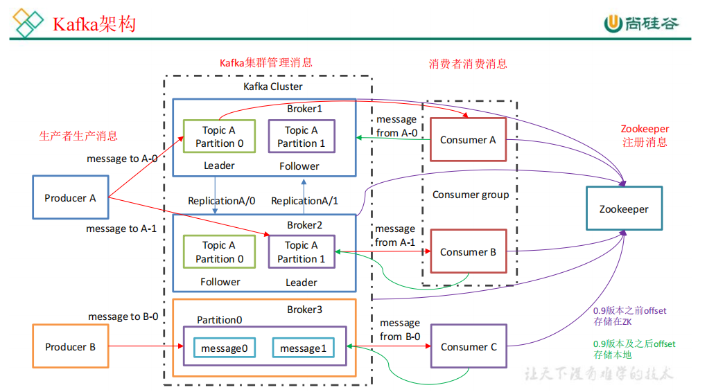
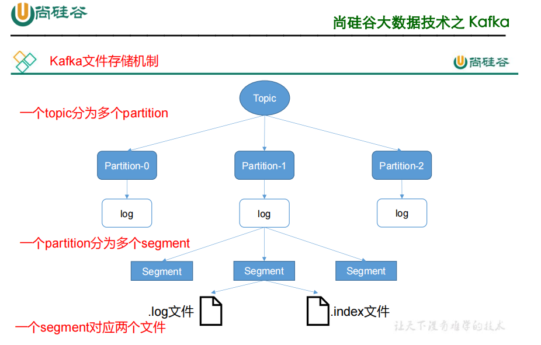
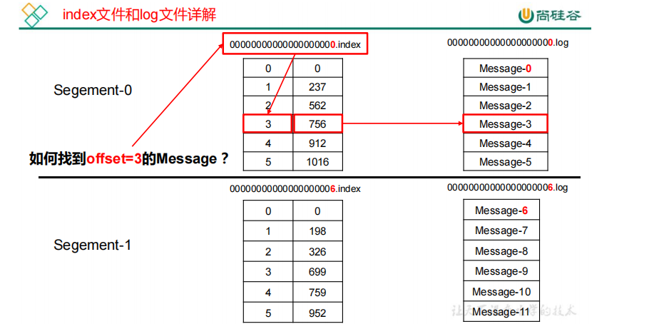

# 一、kafka概述

## 1.1、消息队列

### 1.1.1、两种模式

1. 点对点（消费之后会清除数据，消费者主动拉拢）
2. 发布/订阅模式（一对多，消费之后不会清除数据，消费者主动拉取数据，被所有消费者消费）

### 1.1.2、kafka架构

Consumer Group：消费者组，**消费者组是逻辑上的一个订阅者**，由多个 consumer 组成。消费者组内每个消费者负责消费不同分区的数据，一个分区只能由**一个组内消费者**消费；消费者组之间互不影响。所有的消费者都属于某个消费者组。

偏移量：0.9之前存储在zookeeper，之后存储在kafka本地topic中

# 二、kafka架构深入

## 2.1 Kafka工作流程及文件存储机制

### 2.1.1，工作流程

Producer 生产的数据会被不断追加到该log 文件末端，且每条数据都有自己的 offset。消费者组中的每个消费者，都会实时记录自己消费到了哪个 offset，以便出错恢复时，从上次的位置继续消费。

### 2.1.2，文件结构

Kafka 采取了**分片**和**索引**机制，将每个 partition 分为多个 segment。每个 segment对应两个文件——“.index”文件和“.log”文件。这些文件位于一个文件夹下，该文件夹的命名规则为：topic 名称+分区序号

index 和 log 文件以当前 segment 的第一条消息的 offset 命名。下图为 index 文件和 log文件的结构示意图。

## 2.2、kafka生产者

### 2.2.1 分区策略

#### 2.2.1.1、分区的原因

1. 方便在集群中扩展，每个 Partition 可以通过调整以适应它所在的机器，而一个 topic

   又可以有多个 Partition 组成，因此整个集群就可以适应任意大小的数据了；

2. 可以提高并发，因为可以以 Partition 为单位读写了。

#### 2.2.1.2、分区的原则

我们需要将 producer 发送的数据封装成一个 ProducerRecord对象。 

1. 指明 partition 的情况下，直接将指明的值直接作为 partiton 值；
2. 没有指明 partition 值但有 key 的情况下，将 key 的 hash 值与 topic 的 partition 数进行取余得到 partition 值；
3. 轮询，既没有 partition 值又没有 key 值的情况下，第一次调用时随机生成一个整数（后面每次调用在这个整数上自增），将这个值与 topic 可用的 partition 总数取余得到 partition 值，也就是常说的 round-robin 算法。

### 2.2.2、数据可靠性保证

1. 回复ack

   topic 的每个 partition 收到producer 发送的数据后，都需要向 producer 发送 ack，如果producer 收到 ack，就会进行下一轮的发送，否则重新发送数据。

2. ack回复机制

   全部完成同步，才发送ack（虽然延时高，但是需要的副本少，只有n，如果是半数，需要n+1个，会早晨如果大量冗余）

3. ISR（防止某个节点故障）Leader 维护了一个动态的 in-sync replica set (ISR)，意为和 leader 保持同步的 follower 集合。当 ISR 中的 follower 完成数据的同步之后，leader 就会给 follower 发送 ack。如果 follower长时间 未 向 leader 同 步 数 据 ， 则 该 follower 将 被 踢 出 ISR ， 该 时 间 阈 值 由**replica.lag.time.max.ms** 参数设定。Leader 发生故障之后，就会从 ISR 中选举新的 leader。

4. ack应答机制（对于某些不太重要的数据，对数据的可靠性要求不是很高，能够容忍数据的少量丢失，所以没必要等 ISR 中的 follower 全部接收成功）

   acks参数配置： 

   0：producer 不等待 broker 的 ack，这一操作提供了一个最低的延迟，broker 一接收到还没有写入磁盘就已经返回，当 broker 故障时有可能**丢失数据**； 

   1：producer 等待 broker 的 ack，partition 的 leader 落盘成功后返回 ack，如果在 follower同步成功之前 leader 故障，那么将会**丢失数据**；

   -1（all）：producer 等待 broker 的 ack，partition 的 leader 和 follower 全部落盘成功后才返回 ack。但是如果在 follower 同步完成后，broker 发送 ack 之前，leader 发生故障，那么会造成**数据重复**

5. 故障处理

   **LEO**（LOG ENG OFFSET）：指的是每个副本最大的*offset

   **HW**：指的是消费者能见到的最大的 offset，ISR队列中最小的*LEO

​      (1)**follower故障**

​      follower 发生故障后会被临时踢出 ISR，待该 follower 恢复后，follower 会读取本地磁盘记录的上次的 HW，并将 log 文件高于 HW 的部分截取掉，从 HW 开始向 leader 进行同步。等该 **follower** **的** **LEO** **大于等于该** **Partition** **的** **HW**，即 follower 追上 leader 之后，就可以重新加入 ISR 了。

​      (2)**leader** **故障**

​     leader 发生故障之后，会从 ISR 中选出一个新的 leader，之后，为保证多个副本之间的 数据一致性，其余的 follower 会先将各自的 log 文件高于 HW 的部分截掉，然后从新的 leader同步数据。

**注意：这只能保证副本之间的数据一致性，并不能保证数据不丢失或者不重复。**

### 2.2.3、Exactly Once语义

1. At Least Once + 幂等性 = Exactly Once
2. 要启用幂等性，只需要将 Producer 的参数中 enable.idompotence 设置为 true 即可
3. 开启幂等性的 Producer 在初始化的时候会被分配一个 PID，发往同一 Partition 的消息会附带 Sequence Number。而Broker 端会对<PID, Partition, SeqNumber>做缓存，当具有相同主键的消息提交时，Broker 只会持久化一条。
4. 但是 PID 重启就会变化，同时不同的 Partition 也具有不同主键，所以幂等性无法保证跨分区跨会话的Exactly Once。

## 2.3、kafka面试题

### 2.3.1、kafka为什么快

1. 顺序写 由于现代的操作系统提供了预读和写技术，磁盘的顺序写大多数情况下比随机写内存还要快。

2. Zero-copy 零拷技术减少拷贝次数

3. Batching of Messages 批量量处理。合并小的请求，然后以流的方式进行交互，直顶网络上限。

4. pull模式消费

    pull 模式不足之处是，如果 kafka 没有数据，消费者可能会陷入循环中，一直返回空数据。针对这一点，Kafka 的消费者在消费数据时会传入一个时长参数 timeout，如果当前没有数据可供消费，consumer 会等待一段时间之后再返回，这段时长即为 timeout。

5. Cache Filesystem Cache PageCache缓存
   
