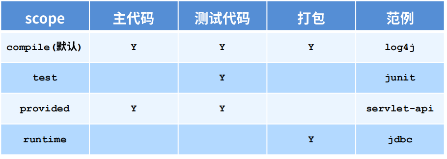
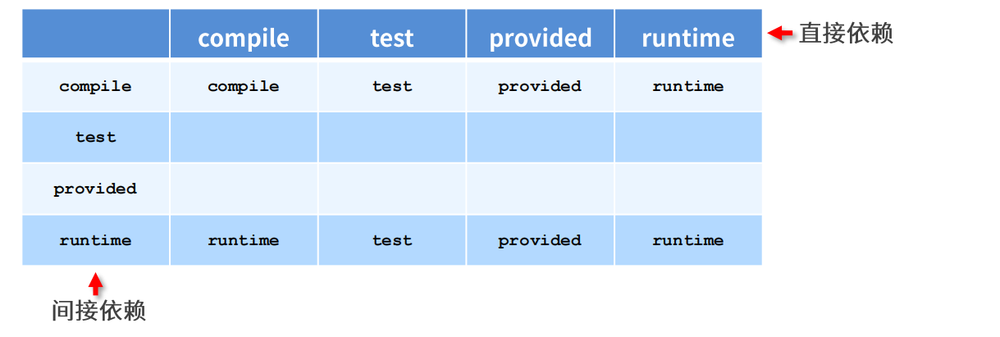

## 一、依赖管理

### 1，依赖冲突

依赖传递冲突问题

- 路径优先∶当间接依赖中出现相同的资源时，层级越深，优先级越低，层级越浅，优先级越高
- 声明优先∶当资源在相同层级被间接依赖时，配置顺序靠前的覆盖配置顺序靠后的
- 特殊优先∶当同级配置了相同资源的不同版本（直接依赖），后配置的覆盖先配置的

### 2，对外隐藏

对外隐藏自己的依赖

```java
<dependency>
  <groupId>junit</groupId>
  <artifactId>junit</artifactId>
  <version>4.12</version>
  <optional>true</optional>
</dependency>
```

### 3，排除依赖

对外隐藏自己的依赖，不用**指定版本**

```
<dependency> 
  <groupId>junit</groupId> 
  <artifactId>junit</artifactId>
  <version>4.12</version> 
  <exclusions> 
    <exclusion> 
      <groupId>org.hamcrest</groupId> 
      <artifactId>hamcrest-core</artifactId>
    </exclusion>
   </exclusions>
</dependency>
```

### 4，依赖范围

#### 4.1、介绍

主代码：main文件夹

测试代码：test文件

打包：package



#### 4.2、传递



## 二、模块聚合

其余模块的父工程，用于快速构建，打包

```
<packaging>pom</packaging>
类型可以是war，jar，pom
```

## 三、聚合

```
父工程：
<depencyManagement><depencyManagement>
子工程：
<parent> 
  <groupId>com.itheima</groupId> 
  <artifactId>ssm</artifactId> 
  <version>1.0-SNAPSHOT</version>
<!-- pom --> 
  <relativePath>../ssm/pom.xml</relativePath>
</parent>

不用写版本号
<dependencies>
  <!--spring -->
  <dependency> 
    <groupId>org.springframework</groupId> 
    <artifactId>spring-context</artifactId>
  </dependency>
</dependencies>
```

