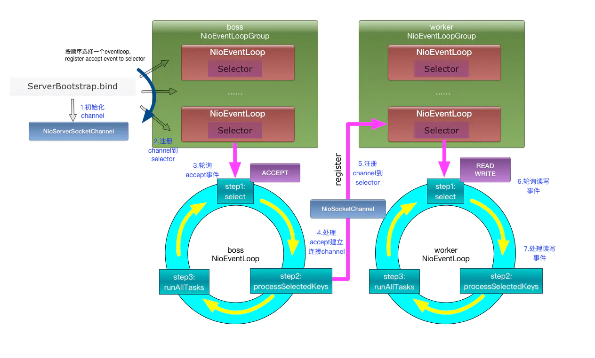
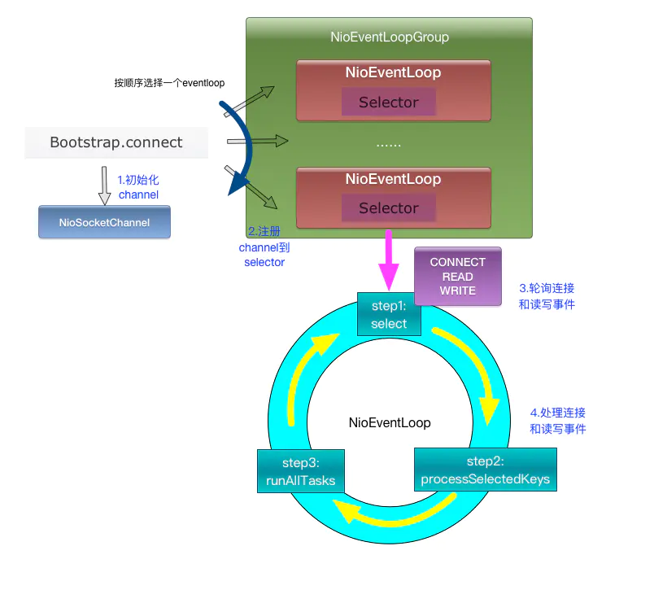

# 一、架构

## 1.1、server端

每个boss NioEventLoop循环执行的任务包含3步：

- 第1步：轮询accept事件；
- 第2步：处理io任务，即accept事件，与client建立连接，生成NioSocketChannel，并将NioSocketChannel注册到某个worker NioEventLoop的selector上；
- 第3步：处理任务队列中的任务，runAllTasks。任务队列中的任务包括用户调用eventloop.execute或schedule执行的任务，或者其它线程提交到该eventloop的任务。

每个worker NioEventLoop循环执行的任务包含3步：

- 第1步：轮询read、write事件；
- 第2步：处理io任务，即read、write事件，在NioSocketChannel可读、可写事件发生时进行处理；
- 第3步：处理任务队列中的任务，runAllTasks。

## 1.2、client

第1步：轮询connect、read、write事件；

第2步：处理io任务，即connect、read、write事件，在NioSocketChannel连接建立、可读、可写事件发生时进行处理；

第3步：处理非io任务，runAllTasks。

