# 一、redis数据类型

## 1.1、redis自身数据存储类型

1. redis 自身是一个 Map，其中所有的数据都是采用 key : value 的形式存储
2. 数据类型指的是存储的数据的类型，也就是 value 部分的类型，key 部分永远都是字符串
3. redis操作是原子性的

## 1.2、String

### 1.2.1、基本操作

1. 添加/修改数据

   set key value

2. 获取数据

   get key

3. 删除数据

   del key string

4. 添加/修改多个数据

   mset key1 value1 key2 value2

5. 获取多个数据

   mget key1 key2

6. 获取数据字符个数（字符串长度）

   strlen key

7. 追加信息到原始信息后部（如果原始信息存在就追加，否则新建）

   append key value

8. 设置数值数据增加指定范围的值

   incr key

   incrby key increment

   incrbyfloat key increment

9. 设置数值数据减少指定范围的值

   decr key

   decrby key increment

10. 设置数据具有指定的生命周期

    setex key seconds value

    psetex key milliseconds value

### 1.2.2、单数据操作与多数据操作的选择之惑

程序到redis之间的传输时间减少。

### 1.2.3、其他概念

1. 数据最大存储量

   512MB

2. 数值计算最大范围（java中的long的最大值）

   9223372036854775807

3. 数据库中的热点数据key命名惯例

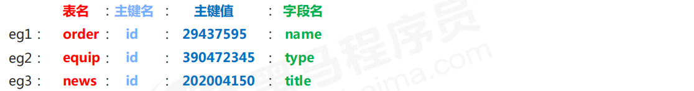

## 1.3、Hash

### 1.3.1、介绍

1. 作用

   对象类数据的存储如果具有较频繁的更新需求操作会显得笨重，对一系列存储的数据进行编组，方便管理，典型应用存储对象信息

2. hash存储结构优化

   如果field数量较少，存储结构优化为类数组结构

   如果field数量较多，存储结构使用HashMap结构

### 1.3.2、基本操作

1. 添加/修改数据

   hset key field value

2. 获取数据

   hget key field

   hgetall key

3. 删除数据

   hdel key field1 [field2]

4. 添加/修改多个数据

   hmset key field1 value1 field2 value2 …

5. 获取多个数据

   hmget key field1 field2 … 

6. 获取哈希表中字段的数量

   hlen key

7. 获取哈希表中是否存在指定的字段

   hexists key field

8. 获取哈希表中所有的字段名或字段值

   hkeys key

   hvals key

9. 设置指定字段的数值数据增加指定范围的值

   hincrby key field increment

   hincrbyfloat key field increment

## 1.4、list

### 1.4.1、介绍

保存多个数据，底层使用双向链表存储结构实现

### 1.4.2、基本操作

1. 添加、修改数据

   lpush key value1 [value2] ……

   rpush key value1 [value2] ……

2. 获取数据

   lrange key start stop

   （-1代表遍历所有）

   lindex key index

3. 获取长度

   llen key

4. 获取并移除数据

   lpop key

   rpop key

5. 规定时间内获取并移除数据

   blpop key1 [key2] timeout

   brpop key1 [key2] timeout

6. 移除指定数据

   lrem key count value

### 1.4.3、常见解决方案

1. 依赖list的数据具有顺序的特征对信息进行管理
2. 使用队列模型解决多路信息汇总合并的问题
3. 使用栈模型解决最新消息的问题

## 1.4、set

### 1.4.1、基本操作

1. 添加数据

   sadd key member1 [member2]

2. 获取全部数据

   smembers key

3. 删除数据 

   srem key member1 [member2]

4. 获取集合数据总量

   scard key

5. 判断集合中是否包含指定数据

   sismember key member

6. 随机获取集合中指定数量的数据

   srandmember key [count]

7. 随机获取集合中的某个数据并将该数据移出集合

   spop key [count]

8. 求两个集合的交、并、差集

   sinter key1 [key2] 

   sunion key1 [key2] 

   sdiff key1 [key2]

9. 求两个集合的交、并、差集并存储到指定集合中

   sinterstore destination key1 [key2]

   sunionstore destination key1 [key2]

   sdiffstore destination key1 [key2]

10. 将指定数据从原始集合中移动到目标集合中

    smove source destination member

### 1.4.2、应用场景

1. 基于经营战略设定问题用户发现、鉴别规则
2. 周期性更新满足规则的用户黑名单，加入set集合
3. 用户行为信息达到后与黑名单进行比对，确认行为去向
4. 黑名单过滤IP地址：应用于开放游客访问权限的信息源
5. 黑名单过滤设备信息：应用于限定访问设备的信息源
6. 黑名单过滤用户：应用于基于访问权限的信息源

## 1.5、sorted_set

### 1.5.1、介绍

数据排序有利于数据的有效展示

### 1.5.2、基本操作

1. 添加数据

   zadd key score1 member1 [score2 member2]

2. 获取全部数据

   zrange key start stop [WITHSCORES]

   zrevrange key start stop [WITHSCORES]

3. 删除数据

4. zrem key member [member ...]

5. 按照条件获取数据

   zrangebyscore key min max [WITHSCORES] [LIMIT]

   zrevrangebyscore key max min [WITHSCORES]

6. 条件删除数据

   zremrangebyrank key start stop

   zremrangebyscore key min max

7. 获取集合数据总量

   zcard key

   zcount key min max

8. 集合交、并操作

   zinterstore destination numkeys key [key ...]

9. zunionstore destination numkeys key [key ...]

# 二、jedis

## 2.1、引入maven

```
<dependency>
 <groupId>redis.clients</groupId>
 <artifactId>jedis</artifactId>
 <version>2.9.0</version>
</dependency>
```

## 2.2、jedis

1. ```
   public JedisPool(GenericObjectPoolConfig poolConfig, String host, int port) {
    this(poolConfig, host, port, 2000, (String)null, 0, (String)null);
   }
   ```

2. ```
   jedis.host=localhost
   jedis.port=6379
   jedis.maxTotal=30
   jedis.maxIdle=10
   ```

3. ```
   static{
    //读取配置文件 获得参数值
    ResourceBundle rb = ResourceBundle.getBundle("jedis");
    host = rb.getString("jedis.host");
    port = Integer.parseInt(rb.getString("jedis.port"));
    maxTotal = Integer.parseInt(rb.getString("jedis.maxTotal"));
    maxIdle = Integer.parseInt(rb.getString("jedis.maxIdle"));
    poolConfig = new JedisPoolConfig();
    poolConfig.setMaxTotal(maxTotal);
    poolConfig.setMaxIdle(maxIdle);
    jedisPool = new JedisPool(poolConfig,host,port);
   }
   ```

4. ```
   public static Jedis getJedis(){
    Jedis jedis = jedisPool.getResource();
    return jedis;
   }
   ```

# 三、持久化

## 3.1、方式

1. rdb

   将当前数据状态进行保存，快照形式，存储数据结果，存储格式简单，关注点在数据

2. aof

   将数据的操作过程进行保存，日志形式，存储操作过程，存储格式复杂，关注点在数据的操作过程

## 3.2、rdb

### 3.2.1、启动方式

1. save指令

   缺点：数据量太大，效率会降低，因为redis单线程，会阻塞其他命令的执行

2. bgsave，开启子进程执行

    bgsave命令是针对save阻塞问题做的优化。Redis内部所有涉及到RDB操作都采用bgsave的方式，save命令可以放弃使用。

   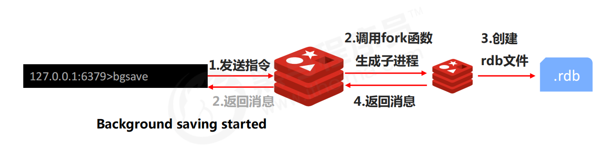

### 3.2.2、次数的定义

save second changes

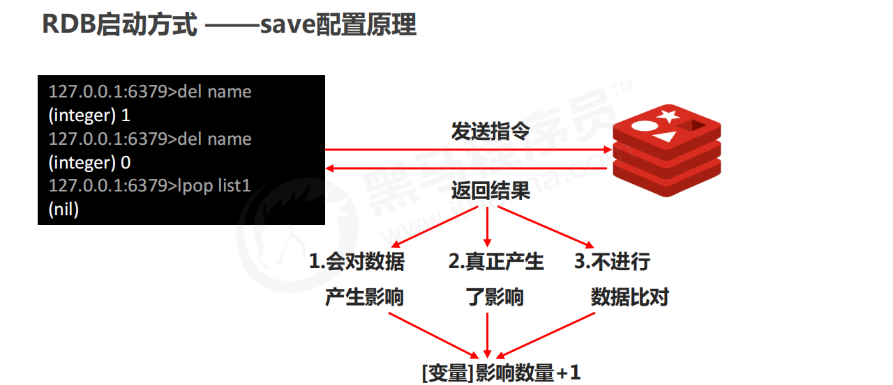

### 3.2.3、两种方式对比

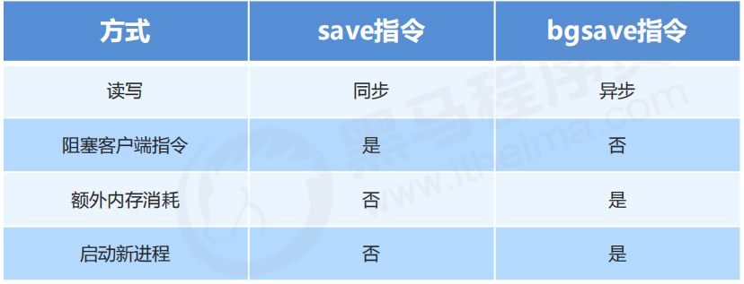

### 3.2.4、RDB存储的弊端

1.  存储数据量较大，效率较低
2. 基于快照思想，每次读写都是全部数据，当数据量巨大时，效率非常低
3. 大数据量下的IO性能较低
4. 基于fork创建子进程，内存产生额外消耗
5. 宕机带来的数据丢失风险

### 3.2.5、配置文件参数

1. dbfilename dump.rdb

   说明：设置本地数据库文件名，默认值为 dump.rdb

   经验：通常设置为dump-端口号.rdb

2. dir

   说明：设置存储.rdb文件的路径

   经验：通常设置成存储空间较大的目录中，目录名称data

3. rdbcompression yes

   说明：设置存储至本地数据库时是否压缩数据，默认为 yes，采用 LZF 压缩

   经验：通常默认为开启状态，如果设置为no，可以节省 CPU 运行时间，但会使存储的文件变大（巨大）

4.  rdbchecksum yes

   说明：设置是否进行RDB文件格式校验，该校验过程在写文件和读文件过程均进行

   经验：通常默认为开启状态，如果设置为no，可以节约读写性过程约10%时间消耗，但是存储一定的数据损坏风险
   
5. stop-writes-on-bgsave-error yes

   说明：后台存储过程中如果出现错误现象，是否停止保存操作

   经验：通常默认为开启状态

6. save second changes

   满足限定时间范围内key的变化数量达到指定数量即进行持久化

## 3.3、aof

### 3.3.1、AOF写数据三种策略(appendfsync)

1. always(每次）

   每次写入操作均同步到AOF文件中

   数据零误差，性能较低

2. everysec（每秒）

   每秒将缓冲区中的指令同步到AOF文件中

   数据准确性较高，性能较高

   在系统突然宕机的情况下丢失1秒内的数据

3. no（系统控制）

   由操作系统控制每次同步到AOF文件的周期

   整体过程不可控

### 3.3.1、配置文件配置

1. appendonly yes|no

   是否开启AOF持久化功能，默认为不开启状态

2. appendfsync always|everysec|no

   AOF写数据策略AOF

3. appendfilename filename

   AOF持久化文件名，默认文件名未appendonly.aof，建议配置为appendonly-端口号.aof

4. dir

   AOF持久化文件保存路径，与RDB持久化文件保持一致即可

### 3.3.2、aof重写

1. 作用

   - 降低磁盘占用量，提高磁盘利用率


   - 提高持久化效率，降低持久化写时间，提高IO性能


   - 降低数据恢复用时，提高数据恢复效率

2. 重写规则

   - 进程内已超时的数据不再写入文件

   - 忽略无效指令，重写时使用进程内数据直接生成，这样新的AOF文件只保留最终数据的写入命令

      如del key1、 hdel key2、srem key3、set key4 111、set key4 222等 

   - 对同一数据的多条写命令合并为一条命令

   ​       如lpush list1 a、lpush list1 b、 lpush list1 c 可以转化为：lpush list1 a b c。

   ​       为防止数据量过大造成客户端缓冲区溢出，对list、set、hash、zset等类型，每条指令最多写入64个元素

3. 重写方式

   - 手动重写

   ​       bgrewriteaof

   - 自动重写

   ​       auto-aof-rewrite-min-size size

   ​       auto-aof-rewrite-percentage percentage

4. 重写触发对比参数

   - aof_current_size
   - aof_base_size

5. 重写流程

- 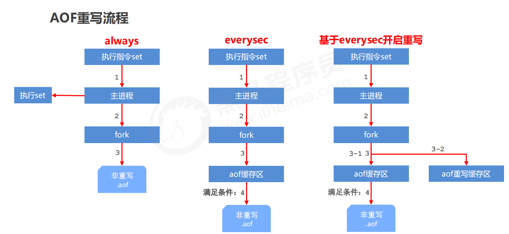

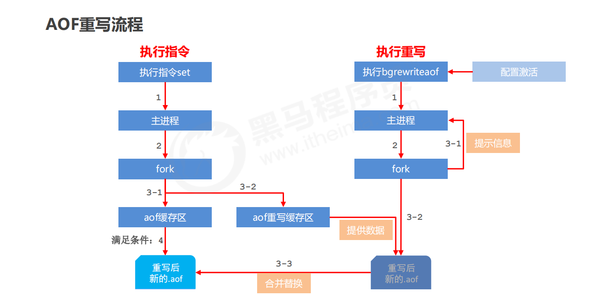

### 3.3.2、aof、rdb区别

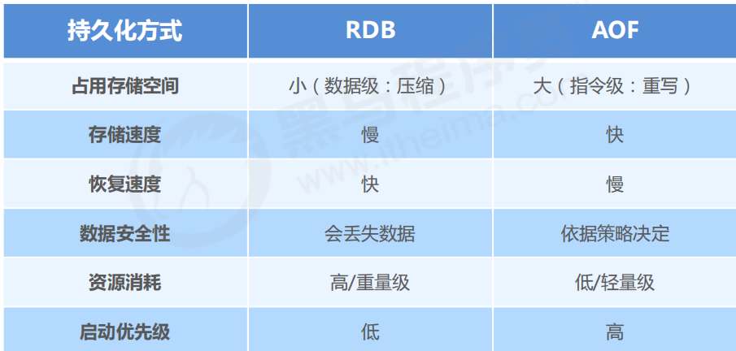

## 四、事务

### 4.1、事务的基本操作

1. 开启事务

   multi

2. 执行事务

   exec

3. 取消事务

   discard


加入事务的命令暂时进入到任务队列中，并没有立即执行，只有执行exec命令才开始执行

### 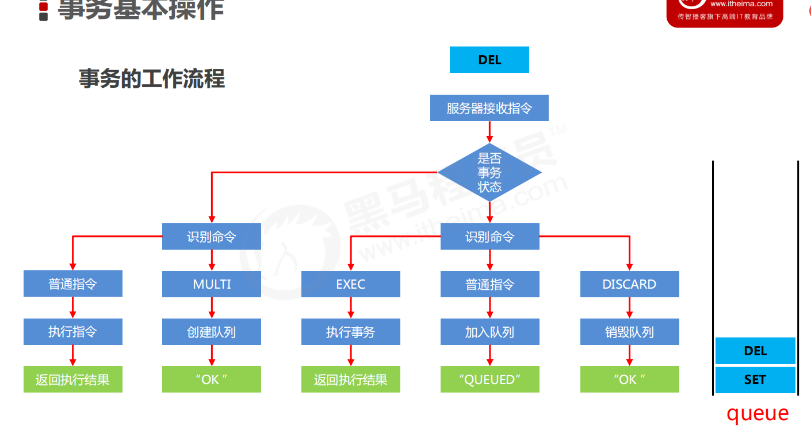4.2、事物的注意事项

定义事务的过程中，命令格式输入错误怎么办？

#### 4.2.1、语法错误

指命令书写格式有误

处理结果

如果定义的事务中所包含的命令存在语法错误，整体事务中所有命令均不会执行。包括那些语法正确的命令。

#### 4.2.2、运行错误

指命令格式正确，但是无法正确的执行。例如对list进行incr操作

处理结果

能够正确运行的命令会执行，运行错误的命令不会被执行

**注意：已经执行完毕的命令对应的数据不会自动回滚，需要程序员自己在代码中实现回滚。**

### 4.1、锁

#### 4.1.1、watch

对 key 添加监视锁，在执行exec前如果key发生了变化，终止事务执行

watch key1 [key2……]

取消对所有 key 的监视

unwatch

#### 4.1.2、setnx

setnx lock-key value

必须设置过期时间

expire lock-key second

pexpire lock-key milliseconds

#### 4.1.3、redission

参见分布式锁，此处不赘述

## 五、删除策略

## 5.1、前置知识

### 5.1.1、数据状态

TTL查看

XX ：具有时效性的数据

-1 ：永久有效的数据

-2：已经过期的数据 

### 5.1.2、时间存储结构

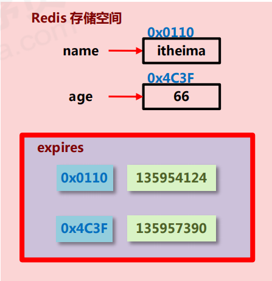

## 5.2、删除方式

### 5.2.1、定时删除

过期时间到达时，由定时器任务立即执行对键的删除操作

优点：节省内存

缺点：cpu负载重，会影响redis服务器响应时间和指令吞吐量

### 5.2.2、惰性删除

数据到达过期时间，不做处理。等下次访问该数据时

优点：节约cpu性能

缺点：内存压力大

### 5.2.3、定期删除

#### 5.2.3.1、策略：

1. Redis启动服务器初始化时，读取配置server.hz的值，默认为10
2. 每秒钟执行server.hz次serverCron()-->databasesCron()-->activeExpireCycle()
3. activeExpireCycle()对每个expires[*]逐一进行检测，每次执行250ms/server.hz

#### 5.2.3.2、activeExpireCycle()

1. 对某个expires[*]检测时，随机挑选W个key检测
2. 如果key超时，删除key
3. 如果一轮中删除的key的数量>W*25%，循环该过程
4. 如果一轮中删除的key的数量≤W*25%，检查下一个expires[*]，0-15循环
5. W取值=ACTIVE_EXPIRE_CYCLE_LOOKUPS_PER_LOOP属性值
6. 参数current_db用于记录activeExpireCycle() 进入哪个expires[*] 执行
7. 如果activeExpireCycle()执行时间到期，下次从current_db继续向下执行

## 5.3、逐出算法

### 5.3.1、步骤

1. Redis使用内存存储数据，在执行每一个命令前，会调用freeMemoryIfNeeded()检测内存是否充足。
2. 如果内存不满足新加入数据的最低存储要求，redis要临时删除一些数据为当前指令清理存储空间。
3. 注意：逐出数据的过程不是100%能够清理出足够的可使用的内存空间，如果不成功则反复执行。
4. 当对所有数据尝试完毕后，如果不能达到内存清理的要求，将出现错误信息

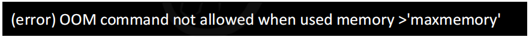

### 5.3.2、逐出算法配置

1. 最大可使用内存

   maxmemory

   占用物理内存的比例，默认值为0，表示不限制。生产环境中根据需求设定，通常设置在50%以上。

2. 每次选取待删除数据的个数

   maxmemory-samples

    选取数据时并不会全库扫描，导致严重的性能消耗，降低读写性能。因此采用随机获取数据的方式作为待检测删除数据

3. 删除策略

   maxmemory-policy

    达到最大内存后的，对被挑选出来的数据进行删除的策略

### 5.3.3、删除策略

检测易失数据（可能会过期的数据集server.db[i].expires ） 

① volatile-lru：挑选最近最少使用的数据淘汰

② volatile-lfu：挑选最近使用频率最少的数据淘汰

③ volatile-ttl：挑选将要过期的数据淘汰

④ volatile-random：任意选择数据淘汰

 检测全库数据（所有数据集server.db[i].dict ） 

⑤ allkeys-lru：挑选最近最少使用的数据淘汰

⑥ allkeys-lfu：挑选最近使用频率最少的数据淘汰

⑦ allkeys-random：任意选择数据淘汰

 放弃数据驱逐

⑧ no-enviction（驱逐）：禁止驱逐数据（redis4.0中默认策略），会引发错误OOM（Out Of Memory）

# 六、高级数据类型

## 6.1、bitmaps

### 6.1.1、基本操作

获取指定key对应偏移量上的bit值

getbit key offset

设置指定key对应偏移量上的bit值，value只能是1或0

setbit key offset value

对指定key按位进行交、并、非、异或操作，并将结果保存到destKey中 

 and：交

 or：并

 not：非

 xor：异或

 统计指定key中1的数量

bitop op destKey key1 [key2...]

bitcount key [start end]

## 6.2、HyperLogLog

统计基数

### 6.2.1、基本操作

添加数据

pfadd key element [element ...]

统计数据

pfcount key [key ...]

合并数据

pfmerge destkey sourcekey [sourcekey...]

根据半径求所有数据

georadius key longitude latitude radius m|km|ft|mi [withcoord] [withdist] [withhash] [count count]

根据点求所有数据

georadiusbymember key member radius m|km|ft|mi [withcoord] [withdist] [withhash] [count count]

计算坐标点距离

geohash key member [member ...]

### 6.2.2、注意事项

 用于进行基数统计，不是集合，不保存数据，只记录数量而不是具体数据

 核心是基数估算算法，最终数值存在一定误差

 误差范围：基数估计的结果是一个带有 0.81% 标准错误的近似值

 耗空间极小，每个hyperloglog key占用了12K的内存用于标记基数

 pfadd命令不是一次性分配12K内存使用，会随着基数的增加内存逐渐增大

 Pfmerge命令合并后占用的存储空间为12K，无论合并之前数据量多少

# 七：主从复制

## 7.1、作用

 读写分离：master写、slave读，提高服务器的读写负载能力

 负载均衡：基于主从结构，配合读写分离，由slave分担master负载，并根据需求的变化，改变slave的数

量，通过多个从节点分担数据读取负载，大大提高Redis服务器并发量与数据吞吐量

 故障恢复：当master出现问题时，由slave提供服务，实现快速的故障恢复

 数据冗余：实现数据热备份，是持久化之外的一种数据冗余方式

 高可用基石：基于主从复制，构建哨兵模式与集群，实现Redis的高可用方案

## 7.2、复制流程

### 7.2.1、流程

#### 7.2.2.1，**全量复制**

#### 7.2.2.2，**同步复制**

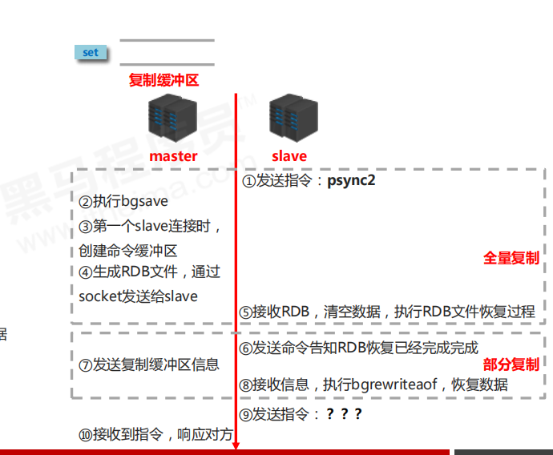

#### 7.2.2.3，**命令传播**

命令传播阶段出现了断网现象

 网络闪断闪连

 短时间网络中断

 长时间网络中断

部分复制的三个核心要素

 服务器的运行 id（run id） 

 主服务器的复制积压缓冲区

 主从服务器的复制偏移量

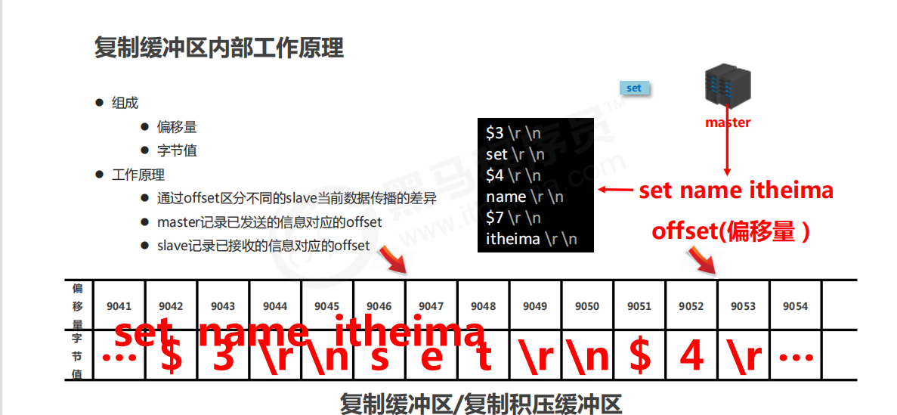

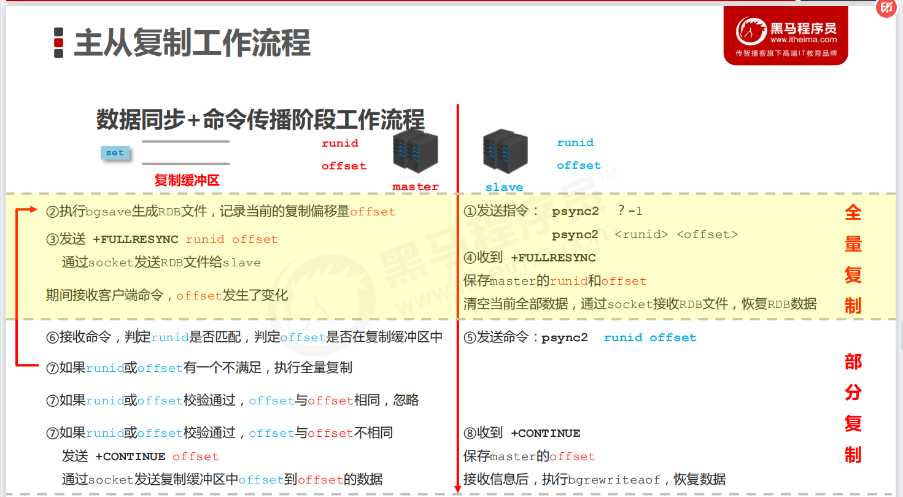

## 7.2.2、注意事项

**数据同步阶段slave说明**

\1. 为避免slave进行全量复制、部分复制时服务器响应阻塞或数据不同步，建议关闭此期间的对外服务

**slave-serve-stale-data** *yes***|***no*

\2. 数据同步阶段，master发送给slave信息可以理解master是slave的一个客户端，主动向slave发送

命令

\3. 多个slave同时对master请求数据同步，master发送的RDB文件增多，会对带宽造成巨大冲击，如果

master带宽不足，因此数据同步需要根据业务需求，适量错峰

\4. slave过多时，建议调整拓扑结构，由一主多从结构变为树状结构，中间的节点既是master，也是

slave。注意使用树状结构时，由于层级深度，导致深度越高的slave与最顶层master间数据同步延迟

较大，数据一致性变差，应谨慎选择

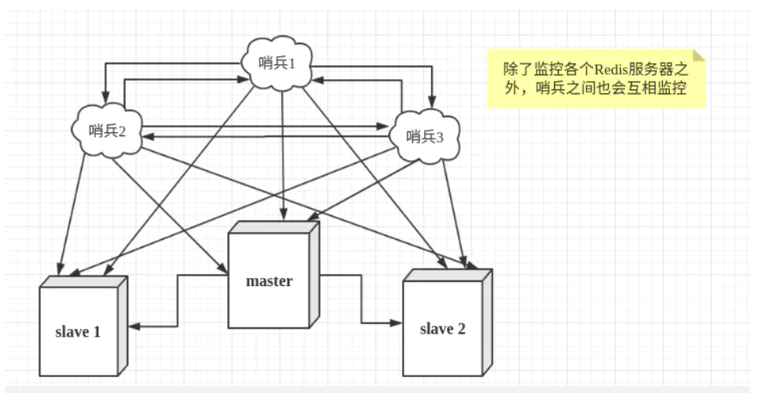

# 八，使用总结

## 8.1、批量操作

1. pipeline
2. lua脚本
3. mset，mget等（事务并且具有原子性）
4. 事务，multi，exec，discard（没有原子性，不会回滚）

## 8.2、线程

1. 工作线程所有版本只有一个
2. 6.x版本之后io多线程
3. io多线程优点为执行时间缩短，更好的的压榨硬件资源

## 8.3、缓存穿透

1. 规范key过滤：key统一加前缀，过滤掉恶意攻击
2. 缓存空值
3. 加锁
4. 布隆过滤器

## 8.4、缓存击穿

**热点**数据过期

1. 热点key永不过期
2. 分布式锁（取不到的时候再加锁）

## 8.5、缓存雪崩

缓存时间加随机值

加锁（4核cpu可以运行的线程有无数个，因为阻塞状态不占用cpu执行权）

## 8.6、缓存预热

nginx+lua+apache-druid分析，加载

业务上也要负责注意缓存击穿、穿透、雪崩，因为一定会有差集

