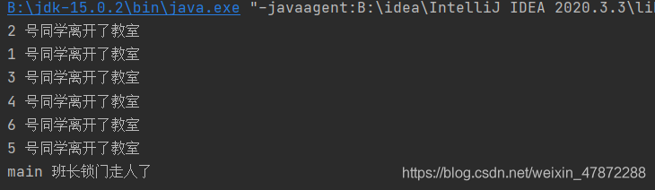
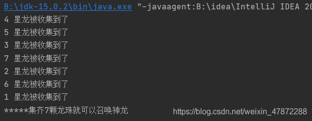
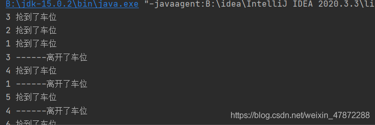
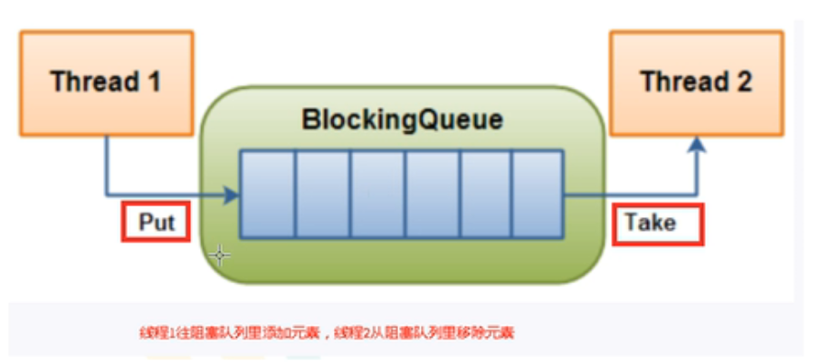
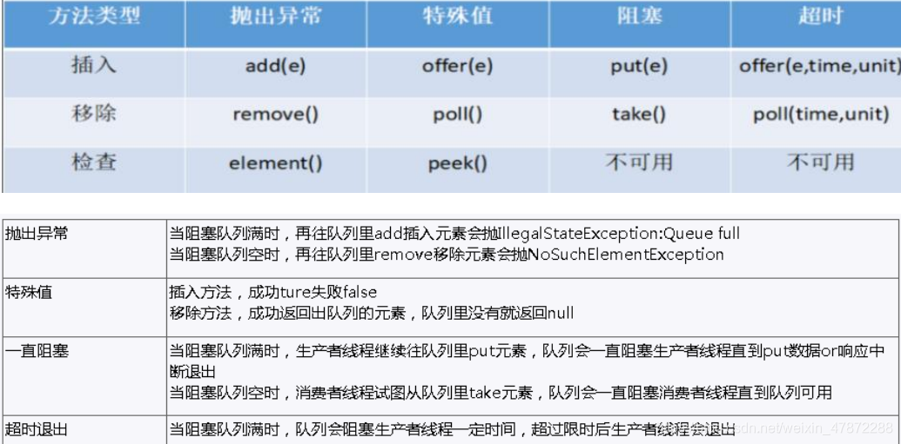

# 一、线程

## 1.1、线程与进程

进程：系统中正在运行的程序，资源分配的最小单元

线程：系统分配时间资源的最小单位，进程内独立执行的单元执行流，程序执行的最小单位

## 1.2、线程状态

新建、new

运行、runable

阻塞、blocked

等待：waiting

超时等待:timed_waiting

死亡：terminated

## 1.3、wait与sleep

1. sleep是线程中的方法，wait是object中的方法-任何对象都可以调用
2. wait前提是占有锁，调用后会释放锁，sleep不需要占有锁，也不会占有锁
3. 都可以被interrupted方法打断

## 1.4、并行与并发

1. 并发：一次只能取得一个任务并且执行
2. 并行：可以取得多个任务并且同时执行

## 1.5、管程

是一种同步机制，保证同一个时间，只有一个线程访问被保护的数据或者程序

## 1.6、用户线程和守护线程

# 二、synchronized

## 1.1、作用范围

1. 类（**放在类和静态方法时，和放在方法时候不是同一把锁**）
2. 方法
3. 代码块
4. 静态方法

# 三、虚假唤醒

notify/notifyAll会唤醒线程 ，但是wait()方法会在原处唤醒，继续向下执行，导致判断失效，所以一定要加while循环

```
public synchronized void desc(){
  if(number != 1){
    number++;
  }
  this.notifyAll
}
```


# 四、Lock

1、与synchronized区别

1. lock是一个接口，而synchronized是一个关键字
2. synchronized异常时候会放弃锁，而lock不会
3. Lock可以让等待它的线程中断，而synchronized不行
4. lock可以知道是否成功获取到锁
5. lock效率更高（线程竞争激烈时候）

1、定义

ReentrantLock lock = new ReentrantLock(true);

true：公平锁，false：非公平锁，默认为非公平锁

2，解锁

一定要在finally中解锁，防止程序出现问题，死锁

3，condition

condition的await(),signal(),signalAll()类似于wait,notify(),notifyAll(),

并且每一个的condition的await和signal是对应的

```
condition c1 = lock.newCondition();
condition c2 = lock.newCondition();
c1.notifyAll 不会唤起c2锁着的线程
```

# 五、集合线程安全

一、hashmap

1. Vector
2. Collections.synchrinizedList(new ArrayList())
3. CopyOnWriteArrayList()

二、hashset

CopyOnWriteArraySet()

三、hashmap

ConcurrentHashmap

# 六、可重入锁

可重入就是说某个线程已经获得某个锁，可以再次获取锁而不会出现死锁

# 七、CountDownLatch（倒计时锁）

`await()` 使当前线程在锁存器倒计数至零之前一直在等待，除非线程被中断
`countDown()`递减锁存器的计数，如果计数达到零，将释放所有等待的线程

```
//演示 CountDownLatch
public class CountDownLatchDemo {
    //6个同学陆续离开教室之后，班长锁门
    public static void main(String[] args) throws InterruptedException {

        //创建CountDownLatch对象，设置初始值
        CountDownLatch countDownLatch = new CountDownLatch(6);

        //6个同学陆续离开教室之后
        for (int i = 1; i <=6; i++) {
            new Thread(()->{
                System.out.println(Thread.currentThread().getName()+" 号同学离开了教室");

                //计数  -1
                countDownLatch.countDown();

            },String.valueOf(i)).start();
        }

        //等待
        countDownLatch.await();

        System.out.println(Thread.currentThread().getName()+" 班长锁门走人了");
    }
}
```



# 八、CyclicBarrier（栅栏）

CyclicBarrier 的构造方法第一个参数是目标障碍数

每次执行 CyclicBarrier 一次障碍数会加一，如果达到了目标障碍数，才会执行 cyclicBarrier.await()之后的语句。可以将 CyclicBarrier 理解为加 1 操作，该操作由最后一个进入barrier的线程操作

```java
//创建CyclicBarrier
        CyclicBarrier cyclicBarrier =
                new CyclicBarrier(NUMBER,()->{
                    System.out.println("*****集齐7颗龙珠就可以召唤神龙");
                });

        //集齐七颗龙珠过程
        for (int i = 1; i <=7; i++) {
            new Thread(()->{
                try {
                    System.out.println(Thread.currentThread().getName()+" 星龙被收集到了");
                    //等待
                    cyclicBarrier.await();
                } catch (Exception e) {
                    e.printStackTrace();
                }
            },String.valueOf(i)).start();
        }

```



1. CyclicBarrier 的某个线程运行到某个点上之后，该线程即**停止运行**，直到所有的线程都到达了这个点，所有线程才重新运行

   CountDownLatch 则不是，某线程运 行到某个点上之后，只是给某个数值-1 而已，该线程继续运行

2. CyclicBarrier 可 重 用 ， CountDownLatch 不 可 重 用 ， 计 数 值 为 0 该 

   CountDownLatch就不可再用了

# 九、Semaphore

具体常用的构造方法有：
Semaphore(int permits)创建具有给定的许可数和非公平的公平设置的Semapore

具体常用的方法有：
acquire()从此信号量获取一个许可，在提供一个许可前一直将线程阻塞，否则线程被中断
release()释放一个许可，将其返回给信号量

```
//6辆汽车，停3个车位
public class SemaphoreDemo {
    public static void main(String[] args) {
        //创建Semaphore，设置许可数量
        Semaphore semaphore = new Semaphore(3);

        //模拟6辆汽车
        for (int i = 1; i <=6; i++) {
            new Thread(()->{
                try {
                    //抢占
                    semaphore.acquire();

                    System.out.println(Thread.currentThread().getName()+" 抢到了车位");

                    //设置随机停车时间
                    TimeUnit.SECONDS.sleep(new Random().nextInt(5));

                    System.out.println(Thread.currentThread().getName()+" ------离开了车位");
                } catch (InterruptedException e) {
                    e.printStackTrace();
                } finally {
                    //释放
                    semaphore.release();
                }
            },String.valueOf(i)).start();
        }
    }
}

```



# 十、死锁

**表锁**：整个表操作，不会发生死锁
**行锁**：每个表中的单独一行进行加锁，会发生死锁
**读锁**：共享锁（可以有多个人读），会发生死锁
**写锁**：独占锁（只能有一个人写），会发生死锁

读写锁：一个资源可以被多个读线程访问，也可以被一个写线程访问，但不能同时存在读写线程，读写互斥，读读共享

读写锁ReentrantReadWriteLock
读锁为ReentrantReadWriteLock.ReadLock，readLock()方法
写锁为ReentrantReadWriteLock.WriteLock，writeLock()方法

锁降级：写锁可以降级为读锁，但是读锁不能降级为写锁

# 十一、阻塞队列

### 11.1、定义

1. 当队列为空时获取线程被阻塞
2. 当队列为满时添加线程被阻塞
3. 好处是我们不需要再关心什么时候阻塞线程，什么时候唤醒线程




