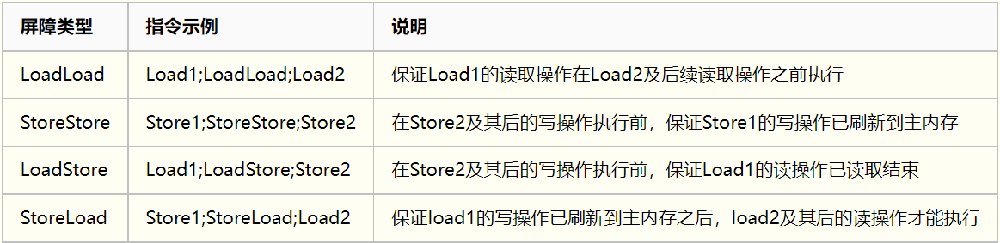

# 一、线程状态

1. 初始(NEW)：新创建了一个线程对象，但还没有调用start()方法。

2. 运行(RUNNABLE)：Java线程中将就绪（ready）和运行中（running）两种状态笼统的称为“运行”。
   线程对象创建后，其他线程(比如main线程）调用了该对象的start()方法。该状态的线程位于可运行线程池中，等待被线程调度选中，获取CPU的使用权，此时处于就绪状态（ready）。就绪状态的线程在获得CPU时间片后变为运行中状态（running）。
   
3. 阻塞(BLOCKED)：表示线程阻塞于锁。

   ①sleep()释放CPU执行权，但不释放同步锁；

   ②wait()释放CPU执行权，也释放同步锁，使得其他线程可以使用同步控制块或者方法。

6. 终止(TERMINATED)：表示该线程已经执行完毕。

## 1.1、僵死进程

僵死进程是指子进程退出时，父进程并未对其发出的SIGCHLD信号进行适当处理，导致子 进程停留在僵

死状态等待其父进程为其收尸，这个状态下的子进程就是僵死进程。

# 二、四种创建方式

1. Thread

   ```
   继承thread类
   重写run方法
   new Thread（).start()
   ```

2. runable

   ```
   class A implements runable
   重写run方法
   new Thread(new A()).start()
   ```

3. 实现 Callable 接口 + FutureTask

   ```
   class B implements Callable(T)
   实现call()方法
   FutureTask<T> fk = new FutureTask(new B());
   new Thread(fk).start();
   fk.get();
   ```

4. 线程池（推荐）

```
Executors.newFiexedThreadPool(3); 
//或者 new ThreadPoolExecutor(corePoolSize, maximumPoolSize, keepAliveTime, TimeUnit unit, workQueue, threadFactory, handler);
```

运行流程： 

# 三、内存泄漏

## 2.1、定义：

对象已经不再被使用，但是Java的垃圾回收器不能回收它们的时候，就产生了内存泄露

## 2.2、解决方法：

1.使用List、Map等集合时，在使用完成后赋值为null

2.使用大对象时，在用完后赋值为null

3.目前已知的jdk1.6的substring()方法会导致内存泄露

4.避免一些死循环等重复创建或对集合添加元素，撑爆内存

5.简洁数据结构、少用静态集合等

6.及时的关闭打开的文件，socket句柄等

7.多关注事件监听(listeners)和回调(callbacks)，比如注册了一个listener，当它不再被使用的时候，忘

了注销该listener，可能就会产生内存泄露

# 四、线程池

## 3.1、线程池的优点

1、线程是稀缺资源，使用线程池可以减少创建和销毁线程的次数，每个工作线程都可以重复使用。

2、可以根据系统的承受能力，调整线程池中工作线程的数量，防止因为消耗过多内存导致服务器崩溃。

## 3.2、线程池的创建

```java
public ThreadPoolExecutor(int corePoolSize, 
                          int maximumPoolSize, 
                          long keepAliveTime, 
                          TimeUnit unit, 
                          BlockingQueue<Runnable> workQueue, 
                          RejectedExecutionHandler handler)
```

corePoolSize：线程池核心线程数量

maximumPoolSize:线程池最大线程数量

keepAliverTime：当活跃线程数大于核心线程数时，空闲的多余线程最大存活时间

unit：存活时间的单位

workQueue：存放任务的队列

handler：超出线程范围和队列容量的任务的处理程序

### 3.2.1、handler

1、AbortPolicy：直接抛出异常

2、CallerRunsPolicy：用调用所在的线程运行任务

3、DiscardOldestPolicy：丢弃队列里最近的一个任务，并执行当前任务。

4、DiscardPolicy：不处理，丢弃掉。

## 3.3、执行流程

1、判断线程池里的核心线程是否都在执行任务，如果不是（核心线程空闲或者还有核心线程没有被创

建）则创建一个新的工作线程来执行任务。如果核心线程都在执行任务，则进入下个流程。

2、线程池判断工作队列是否已满，如果工作队列没有满，则将新提交的任务存储在这个工作队列里。如

果工作队列满了，则进入下个流程。

3、判断线程池里的线程是否都处于工作状态，如果没有，则创建一个新的工作线程来执行任务。如果已

经满了，则交给饱和策略来处理这个任务。

## 3.4、创建方式

ThreadPoolExecutor、ThreadScheduledExecutor、ForkJoinPool

不推荐Executors工厂模式。(类型是Runnable)

可以创建3种类型的ThreadPoolExecutor：

1. SingleThreadExecutor

   ```
   new ThreadPoolExecutor(1, 1, 0L, TimeUnit.MILLISECONDS, new LinkedBlockingQueue<Runnable>())
   ```

   

2. FixedThreadExecutor

   ```
   new ThreadPoolExecutor(nThreads, nThreads, 0L, TimeUnit.MILLISECONDS, new LinkedBlockingQueue<Runnable>());
   ```

   

3. CachedThreadPool

   ```
   new ThreadPoolExecutor(0, Integer.MAX_VALUE, 60L, TimeUnit.SECONDS, new SynchronousQueue<Runnable>()
   ```

   空闲的时间是60s。这个适用于执行很多短期异步的小程序或者负载较轻的服务器

## 3.5、手动创建

1、CPU密集型

尽量使用较小的线程池，一般Cpu核心数+1

因为CPU密集型任务CPU的使用率很高，若开过多的线程，只能增加线程上下文的切换次数，带来额外

的开销

2、IO密集型

方法一：可以使用较大的线程池，一般CPU核心数 * 2IO密集型CPU使用率不高，可以让CPU等待IO的时候处理别的任务，充分利用cpu时间

方法二：线程等待时间所占比例越高，需要越多线程。线程CPU时间所占比例越高，需要越少线程。

下面举个例子：

比如平均每个线程CPU运行时间为0.5s，而线程等待时间（非CPU运行时间，比如IO）为1.5s，CPU核

心数为8，那么根据上面这个公式估算得到：((0.5+1.5)/0.5)*8=32。这个公式进一步转化为：

**最佳线程数目** **=** **（线程等待时间与线程****CPU****时间之比** **+ 1****）***** CPU****数目**

3、混合型

可以将任务分为CPU密集型和IO密集型，然后分别使用不同的线程池去处理，按情况而定

## 3.6、线程池方法

execute 没有返回值，如果不需要知道线程的结果就使用 execute 方法，性能会好很多。

submit 返回一个 Future 对象，如果想知道线程结果就使用 submit 提交，而且它能 

在主线程中通过 Future 的 get 方法捕获线程中的异常。 

es.shutdown(); 不再接受新的任务，之前提交的任务等执行结束再关闭线程池。 

es.shutdownNow(); 不再接受新的任务，试图停止池中的任务再关闭线程池，返回所有未处理的线程 

list列表

# 五、Callable、Future、FutureTask

## 5.1、关系

1. Callable是Runnable封装的异步运算任务。
2. Future用来保存Callable异步运算的结果
3. FutureTask封装Future的实体类

## 5.2、Callable与Runnbale的区别

1. Callable定义的方法是call，而Runnable定义的方法是run。 
2. call方法有返回值，而run方法是没有返回值的。
3. call方法可以抛出异常，而run方法不能抛出异常。

## 5.3、FutureTask

FutureTask不仅实现了Future接口，还实现了Runnable接口

# 六、线程安全

## 6.1、前置知识

1. 线程安全 - 如果线程执行过程中不会产生共享资源的冲突，则线程安全
2. 线程不安全 - 如果有多个线程同时在操作主内存中的变量，则线程不安全
3. java的内存模型中有主内存和线程的工作内存之分
4. 主内存上存放的是线程共享的变量（实例字段，静态字段和构成数组的元素）
5. 线程的工作内存是线程私有的空间，存放的是线程私有的变量（方法参数与局部变量）
6. 线程在工作的时候如果要操作主内存上的共享变量，为了获得更好的执行性能并不是直接去修改主内存而是会在线程私有的工作内存中创建一份变量的拷贝（缓存），在工作内存上对变量的拷贝修改之后再把修改的值刷回到主内存的变量中去

## 6.2、实现线程安全的三种方式

1. 互斥同步
   1. 临界区：syncronized、ReentrantLock 
   2. 信号量 semaphore 
   3. 互斥量 mutex
2. 非阻塞同步
   1. CAS（Compare And Swap）
3. 无同步方案 
   1. 可重入代码 
   2. 使用Threadlocal 类来包装共享变量，做到每个线程有自己的copy 
   3. 线程本地存储

## 6.3、常用实现

1.互斥同步锁（悲观锁）

1）Synchorized

2）ReentrantLock

## 6.4、volatile



**volatile原理**

volatile变量进行写操作时，JVM 会向处理器发送一条 Lock 前缀的指令，将这个变量所在缓 存行的数据

写会到系统内存。 

Lock 前缀指令实际上相当于一个内存屏障（也成内存栅栏），它确保指令重排序时不会把其 后面的指

令排到内存屏障之前的位置，也不会把前面的指令排到内存屏障的后面；即在执行到内 存屏障这句指令

时，在它前面的操作已经全部完成。

**可见性**

- 当对volatile变量执行写操作后，JMM会把工作内存中的最新变量值强制刷新到主内存
- 写操作会导致其他线程中的缓存无效

**volatile的适用场景**

1）状态标志,如：初始化或请求停机

2）一次性安全发布，如：单列模式

3）独立观察，如：定期更新某个值

4）“volatile bean” 模式

5) 开销较低的“读－写锁”策略，如：计数器

## 6.5、ThreadLocal

每一个线程新建了一个map，key为当前线程名字，value为值。

```
public void set(T value) {
    //(1)获取当前线程（调用者线程）
    Thread t = Thread.currentThread();
    //(2)以当前线程作为key值，去查找对应的线程变量，找到对应的map
    ThreadLocalMap map = getMap(t);
    //(3)如果map不为null，就直接添加本地变量，key为当前定义的ThreadLocal变量的this引用，值为添加的本地变量值
    if (map != null)
        map.set(this, value);
    //(4)如果map为null，说明首次添加，需要首先创建出对应的map
    else
        createMap(t, value);
}
```

# 七：死锁、活锁、饥饿、无锁

是关于多线程是否活跃出现的运行阻塞障碍问题，如果线程出现 

了这三种情况，即线程不再活跃，不能再正常地执行下去了。 

**死锁**

死锁是多线程中最差的一种情况，多个线程相互占用对方的资源的锁，而又相互等 对方释放锁，此时若无外力干预，这些线程则一直处理阻塞的假死状态，形成死锁。  

**活锁**

 活锁是拿 到资源却又相互释放不执行。当多线程中出现了相互谦让，都主动将资源释放给别 

的线程使用，这样这个资源在多个线程之间跳动而又得不到执行，这就是活锁。 

**饥饿**

优先级高的线程一直抢占优先级低线程的资源，导致低优先级线程无 法得到执行，这就是饥饿。

当然还有一种饥饿的情况，一个线程一直占着一个资源 不放而导致其他线程得不到执行，与死锁不同的是饥饿在以后一段时间内还是能够 得到执行的，如那个占用资源的线程结束了并释放了资源。 

**无锁**

cas即为无锁

无锁，即没有对资源进行锁定，即所有的线程都能访问并修改同一个资源，但同时只有一个线程能修改成功。

