# 一、应用场景

1. 分库分表

   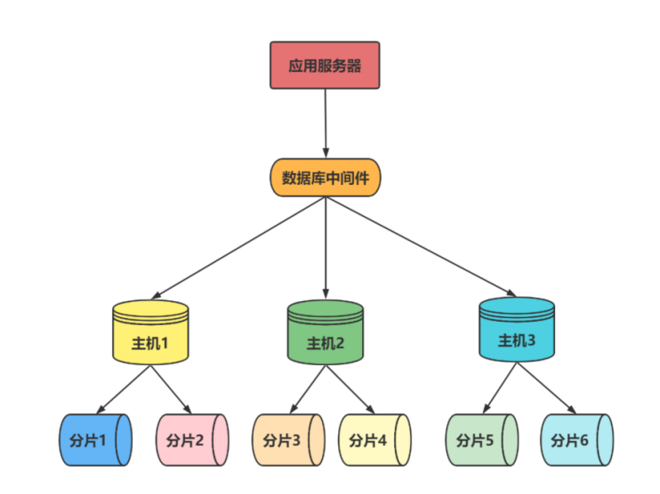

2. 读写分离，高可用性

   Mycat 的读写分离及自动切换都依赖于数据库产品的主从数据同步。

   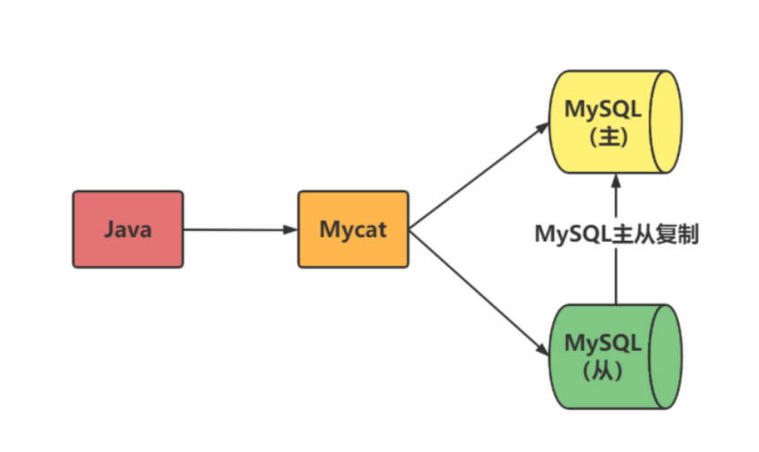

3. 整合数据源 

     当一个项目需要用到多种数据源如Oracle、MySQL、SQL Server、PostgreSQL时，可以利用Mycat进行整合，只需访问Mycat 这一个数据源就行。

   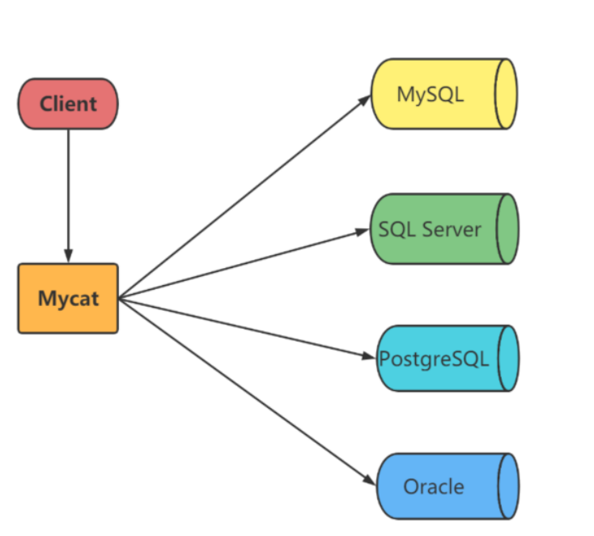

4. 数据库路由器

     Mycat基于MySQL 实例的连接池复用机制，可以让每个应用最大程度地共享一个MySQL实例的所有连接池，让数据库的并发访问能力大大提升。


# 二、基本概念

1. 逻辑库，逻辑表

   是真实数据库的映射

2. 节点主机DataNode

   一个或多个分片节点，真实数据库

3. 用户

   MyCat的用户(类似于MySQL的用户，支持多用户）

# 三、原理

主要是拦截

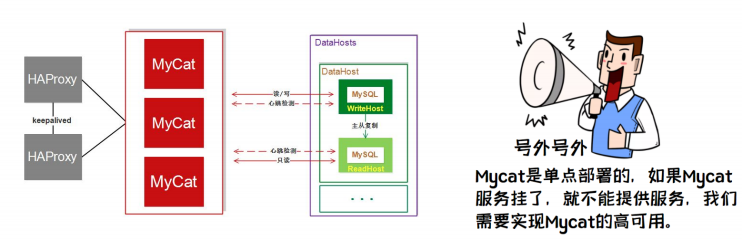

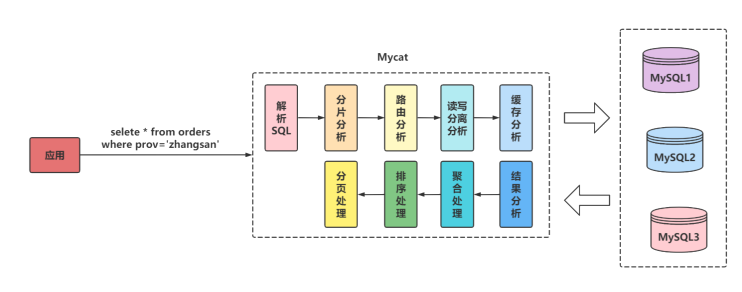

# 四、配置文件

## 4.1、内容

1. schema.xml：定义逻辑库，表、分片节点等内容
2. rule.xml：定义分片规则
3. server.xml：定义用户以及系统相关变量，如端口等

## 4.2、示例

```
<user name="root">
   <property name="password">123456</property>
   <property name="schemas">TESTDB</property>
</user>
```

# 五、mysql常用结构

1. 一主一从

   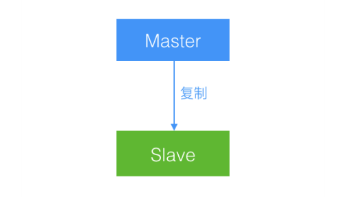

2. 一主多从

   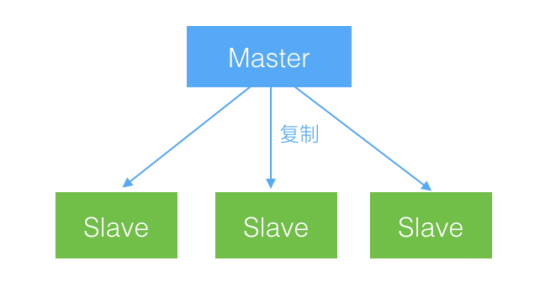

3. 双主双从

4. 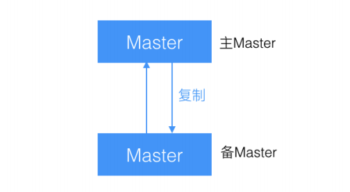

5. 级联复制

   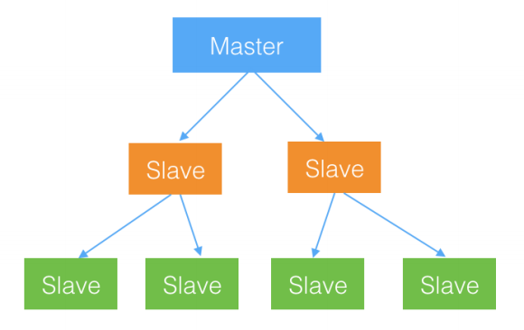

6. 双主延时

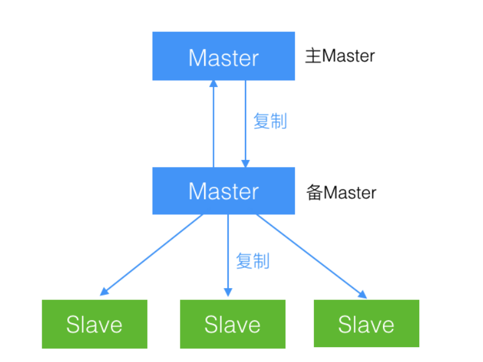


# 六、mycat使用

## 6.1、架构

### 6.1.1、读写分离

schema.xml:

```
<?xml version="1.0"?>
<!DOCTYPE mycat:schema SYSTEM "schema.dtd">
<mycat:schema xmlns:mycat="http://io.mycat/">
   <!-- 数据库配置 与server.xml 中的数据库对应 -->
 <schema name="db_test" checkSQLschema="false" dataNode="db_node" sqlMaxLimit="100">     </schema>
 
   <!-- 分片配置 -->
 <dataNode name="db_node" dataHost="db_host" database="db_test" />
 
   <!-- 物理数据库配置 -->
 <dataHost name="db_host" maxCon="1000" minCon="10" balance="0" writeType="0" dbType="mysql" dbDriver="native" switchType="1"  slaveThreshold="100">
 <heartbeat>select user()</heartbeat>
 <writeHost host="hostM1" url="192.168.66.101:3339" user="root" password="123456">
 <readHost host="hostS2"  url="192.168.66.101:3340" user="root" password="123456" />
 </writeHost>
 </dataHost>
 
</mycat:schema>
```

### 6.1.2、双主双从

schema.xml：

```
<dataNode name="db_node" dataHost="db_host" database="test" />
<dataHost name="db_host" maxCon="1000" minCon="10" balance="1" writeType="0" dbType="mysql" dbDriver="native" switchType="1" slaveThreshold="100" > 
<heartbeat>select user()</heartbeat>
<!-- can have multi write hosts -->
<writeHost host="hostM1" url="192.168.140.128:3306" user="root" password="123456">
<!-- can have multi read hosts -->
<readHost host="hostS1" url="192.168.140.127:3306" user="root" password="123456" />
</writeHost> 
<writeHost host="hostM2" url="192.168.140.126:3306" user="root" password="123456">
<!-- can have multi read hosts -->
<readHost host="hostS2" url="192.168.140.125:3306" user="root" password="123456" />
</writeHost>
</dataHost>
```

### 6.1.3、垂直分库分表

schema.xml：

```
<?xml version="1.0"?>
<!DOCTYPE mycat:schema SYSTEM "schema.dtd">
<mycat:schema xmlns:mycat="http://io.mycat/">
 <!-- 数据库配置 与server.xml 中的数据库对应 -->
 <schema name="db_test" checkSQLschema="false" dataNode="dn1" sqlMaxLimit="100">     <table name="customer" dataNode="dn2"/>
 </schema> 
  <!-- 两个数据库嘛 hadoop01,2 上都要创建orders 数据库 -->
<dataNode name="dn1" dataHost="host1" database="orders" />
<dataNode name="dn2" dataHost="host2" database="orders" />

 <!-- 两个数据库 肯定两个 dataHost -->
<dataHost name="host1" maxCon="1000" minCon="10" balance="0" writeType="0" dbType="mysql"
dbDriver="native" switchType="1" slaveThreshold="100">
<heartbeat>select user()</heartbeat>
<writeHost host="hostM1" url="192.168.66.101:3350" user="root" password="123456">
</writeHost>
</dataHost>

<dataHost name="host2" maxCon="1000" minCon="10" balance="0" writeType="0" dbType="mysql" dbDriver="native" switchType="1"  slaveThreshold="100">
<heartbeat>select user()</heartbeat>
<writeHost host="hostM2" url="192.168.66.102:3350" user="root" password="123456">
</writeHost>
</dataHost>
 
</mycat:schema>
```

### 6.1.4、水平拆分

schema.xml：

```
<table name="orders" dataNode="dn1,dn2" rule="mod_rule" ></table>
```

rule.xml:

```
<tableRule name="mod_rule">  
  <rule>    
    <columns>customer_id</columns> 
     <algorithm>mod-long</algorithm> 
   </rule> 
</tableRule> 
<function name="mod-long"  class="io.mycat.route.function.PartitionByMod">   
  <!-- how many data nodes -->
  <property name="count">2</property>
</function>
```

### 6.1.5、ER表

schema.xml：

```
<table name="orders" dataNode="dn1,dn2" rule="mod_rule" >
    <childTable name="orders_detail" primaryKey="id" joinKey="order_id" parentKey="id" />
</table>
```

### 6.1.6、全局表

schema.xml：

```
<!--全局表配置比较简单，不用写 Rule 规则，修改schema.xml，如下配置即可-->
<table name="dict_order_type" dataNode="dn1,dn2" type="global"></table>
```

## 6.2、分片规则

### 6.2.1、枚举

schema.xml：

```
<table name="orders_ware_info" dataNode="dn1,dn2" rule="sharding-by-intfile"></table>

<tableRule name="sharding-by-intfile">
    <rule>
      <columns>areacode</columns>
      <algorithm>hash-int</algorithm>
    </rule>
</tableRule>

<function name="hash-int" class="io.mycat.route.function.PartitionByFileMap">
    <property name="mapFile">partition-hash-int.txt</property>
    <property name="type">1</property>
    <property name="defaultNode">0</property>
 </function>
 
mapFile：指的是配置文件名
type：默认值为0，0表示Integer，非零表示String。因为我接下来的测试是基于省份分片，
所以需type指定为1。
defaultNode 默认节点：小于0表示不设置默认节点，大于等于0表示设置默认节点
默认节点的作用：枚举分片时，如果碰到不识别的枚举值，就让它路由到默认节点。
```

partition-hash-int.txt：

```
110=0
120=1
```

### 6.2.2、范围划分

schema.xml

```
<table name="payment_info" dataNode="dn1,dn2" rule="auto_sharding_long" ></table>

<tableRule name="auto_sharding_long">
  <rule>
  <columns>order_id</columns>
  <algorithm>rang-long</algorithm>
  </rule>
</tableRule>

<function name="rang-long"
  class="io.mycat.route.function.AutoPartitio
nByLong">
  <property name="mapFile">autopartitionlong.txt</property>
  <property name="defaultNode">0</property>
</function>
```

autopartition-long.txt：

```
0-102=0
103-200=1
```

### 6.2.3、日期划分

此规则为按天分片，设定时间格式、范围。

与之上两个一样，不赘述

### 6.2.4、全局规则

1， mycat配置sequence_conf.properties，缺点是节点宕机后会出bug

2，时间戳：

全局序列ID=64位二进制 (42(毫秒)+5(机器 ID)+5(业务编码)+12(重复累加) 换算成十进制为18位数的long类型，每毫秒可以并发12位二进制的累加。

### 6.2.5、数据库方式

Mycat 会预加载一部分号段到 Mycat 的内存中，这样大部分读写序列都是在内存中完成的。如果内存中的号段用完了 Mycat 会再向数据库要一次。

在数据库中建立一张表，存放 sequence 名称(name)，sequence 当前值(current_value)，步长(increment int 类型每次读取多少个 sequence，假设为 K)等信息；

# 七、Mycat优化

### 7.1、集群

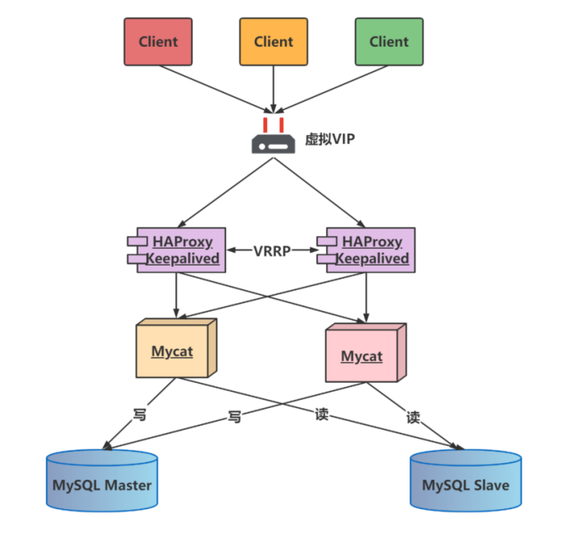

### 7.2、可以配置用户读写权限

### 7.3、DML 权限控制

 user 标签下的 privileges 标签可以对逻辑库（schema）、表（table）进行精细化的 DML 权限控制

### 7.4、黑白名单

可以配置ip黑名单和白名单

### 7.5、Mycat性能监控

1. Mycat-web 主要管理和监控 Mycat 的流量、连接、活动线程和内存等，
2. 具备IP白名单、邮件告警等模块，
3. 还可以统计SQL并分析慢SQL和高频 SQL等。为优化SQL提供依据。


### 7.6、分片规则

分库分表：

**原则一**：能不分就不分；

**原则二**：分片数量尽量少；

**原则三**：分片规则需要慎重选择；

**原则四**：尽量不要在一个事务中的SQL跨越多个分片；

**原则五**：查询条件尽量优化；

拆分原则：

达到一定数量级才拆分（800 万）；

不到 800 万但跟大表（超 800 万的表）有关联查询的表也要拆分，在此称为大表关联表 ；

小于100万的使用全局表；

大于100万小于800 万跟大表使用同样的拆分策略。