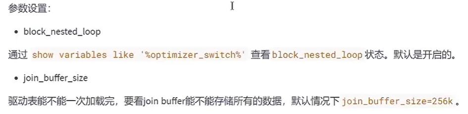

# mysql原理与调优

## 一、介绍

1. 第2-11章：调优
2. 第12-14章：事务
3. 第16-18章：日志与主从
4. 优化思路：


   5,sql执行顺序


## 二、数据库逻辑架构


### 2.1、缓存架构

1，使用要求

必须完全匹配，命中率不高

每次数据表结构或者数据被修改，缓存会删除

2, 5.8之后已经废除

### 2.2、缓冲池（buffer pool）

为了能让数据表或者索引中的数据随时被我们所用，DBMS 会申请 占用内存来作为 数据缓冲池 ，

在真正访问页面之前，需要把在磁盘上的页缓存到内存中的 Buffer Pool 之后才可以访问。

### 2.3、引擎区别


## 三、索引的数据结构


### 3.1、结构说明

#### 3.1.1、属性

record_type ：表示记录的类型，0 表示普通记录、1表示其他目录项纪录，2 表示最小记录、

next_record ：记录头信息的一项属性，表示下一条地址相对于本条记录的地址偏移量，我们用箭头来表明下一条记录是谁。

各个列的值 ：这里只记录在 index_demo 表中的三个列，分别是 c1 、 c2 和 c3 。 

其他信息 ：除了上述3种信息以外的所有信息，包括其他隐藏列的值以及记录的额外信息。

#### 3.1.2、结构B+树

假设叶子节点代表的数据页可以存放 100条用户记录 ，非叶子节点存放1000条，那么

只有一层，最多存100条

有两层，最多存放1000x100

有三层，最多存放1000x1000x100

所以io次数非常少

### 3.2、常见的索引概念

按照 功能逻辑划分，索引主要有 4 种，分别是普通索引、唯一索引、主键索引、全文索引。

按照 物理实现方式 ，索引可以分为 2 种：聚簇索引和非聚簇索引。

按照 作用字段个数进行划分，分成单列索引和联合索引。

#### 3.2.1、聚簇索引

设定为主键后数据库会自动建立索引，innodb为聚簇索引

##### 3.2.1.1、特点

1. 使用记录主键值的大小进行记录和页的排序，这包括三个方面的含义：

   页内 的记录是按照主键的大小顺序排成一个 单向链表 。

   各个存放 用户记录的页 也是根据页中用户记录的主键大小顺序排成一个 双向链表 。

   存放 目录项记录的页 分为不同的层次，在同一层次中的页也是根据页中目录项记录的主键大小顺序排成一个 双向链表 。 

2. B+树的 叶子节点 存储的是完整的用户记录。

   所谓完整的用户记录，就是指这个记录中存储了所有列的值（包括隐藏列）。

##### 3.2.1.2、优点

1. 数据访问更快 ，因为聚簇索引将索引和数据保存在同一个B+树中，因此从聚簇索引中获取数据比非聚簇索引更快
2. 聚簇索引对于主键的 排序查找 和 范围查找 速度非常快
3. 按照聚簇索引排列顺序，查询显示一定范围数据的时候，由于数据都是紧密相连，数据库不用从多个数据块中提取数据，所以 节省了大量的io操作 。

##### 3.2.1.3、缺点

1. 插入速度严重依赖于插入顺序 ，按照主键的顺序插入是最快的方式，否则将会出现页分裂，严重影响性能。因此，对于InnoDB表，我们一般都会定义一个自增的ID列为主键
2. 更新主键的代价很高 ，因为将会导致被更新的行移动。因此，对于InnoDB表，我们一般定义主键为不可更新
3. 二级索引访问需要两次索引查找 ，第一次找到主键值，第二次根据主键值找到行数据

#### 3.2.2、二级索引（辅助索引、非聚簇索引）

##### 3.2.2.1、回表

查找到记录的主键值（innodb）到聚簇索引中查询

或者地址值（myisam）时候到物理地址中查询

#### 3.2.3.、联合索引

1. 同时为多个列建立索引，比方说我们想让B+树按照 c2和c3列 的大小进行排序，这个包含两层含义：

   先把各个记录和页按照c2列进行排序。

   在记录的c2列相同的情况下，采用c3列进行排序

2. 注意一点，以c2和c3列的大小为排序规则建立的B+树称为 联合索引 ，本质上也是一个二级索引。它的意

   思与分别为c2和c3列分别建立索引的表述是不同的，不同点如下：

   建立 联合索引 只会建立如上图一样的1棵B+树。

   为c2和c3列分别建立索引会分别以c2和c3列的大小为排序规则建立2棵B+树。

### 3.3、MyISAM索引

#### 3.3.1、特点

非聚簇索引、MyISAM引擎使用 B+Tree 作为索引结构，叶子节点的data域存放的是 数据记录的地址 。


#### 3.3.2、对比

① 在InnoDB存储引擎中，我们只需要根据主键值对 聚簇索引 进行一次查找就能找到对应的记录，而在

MyISAM 中却需要进行一次回表 操作，意味着MyISAM中建立的索引相当于全部都是 二级索引 。 

② InnoDB的数据文件本身就是索引文件，而MyISAM索引文件和数据文件是 分离的 ，索引文件仅保存数

据记录的地址。

③ InnoDB的非聚簇索引data域存储相应记录 主键的值 ，而MyISAM索引记录的是 地址 。换句话说，

InnoDB的所有非聚簇索引都引用主键作为data域。

④ MyISAM的回表操作是十分 快速 的，因为是拿着地址偏移量直接到文件中取数据的，反观InnoDB是通

过获取主键之后再去聚簇索引里找记录，虽然说也不慢，但还是比不上直接用地址去访问。

⑤ InnoDB要求表 必须有主键 （ MyISAM可以没有 ）。如果没有显式指定，则MySQL系统会自动选择一个

可以非空且唯一标识数据记录的列作为主键。如果不存在这种列，则MySQL自动为InnoDB表生成一个隐

含字段作为主键，这个字段长度为6个字节，类型为长整型。

### 3.4、索引代价

#### 3.4.1、空间上的代价

每建立一个索引都要为它建立一棵B+树，每一棵B+树的每一个节点都是一个数据页，一个页默认会

占用 16KB 的存储空间，一棵很大的B+树由许多数据页组成，那就是很大的一片存储空间。

#### 3.4.2、时间上的代价

每次对表中的数据进行 增、删、改 操作时，都需要去修改各个B+树索引。而且我们讲过，B+树每

层节点都是按照索引列的值 从小到大的顺序排序 而组成了 双向链表 。不论是叶子节点中的记录，还

是内节点中的记录（也就是不论是用户记录还是目录项记录）都是按照索引列的值从小到大的顺序

而形成了一个单向链表。而增、删、改操作可能会对节点和记录的排序造成破坏，所以存储引擎需

要额外的时间进行一些 记录移位 ， 页面分裂 、 页面回收 等操作来维护好节点和记录的排序。如果

我们建了许多索引，每个索引对应的B+树都要进行相关的维护操作，会给性能拖后腿。

## 四、索引设计原则

### 4.1、应该建立

1. SELECT、UPDATE、DELETE的WHERE条件列

   如果进行更新的时候，更新的字段是非索引字段，提升的效率会更明显，这是因为非索引字段更新不需要对索引进行维护

2. 经常 GROUP BY和ORDER BY、DISTINCT的列

   索引就是让数据按照某种顺序进行存储或检索，因此当我们使用 GROUP BY 对数据进行分组查询，或者

   使用 ORDER BY 对数据进行排序的时候，就需要 对分组或者排序的字段进行索引 。如果待排序的列有多

   个，那么可以在这些列上建立 组合索引 。

   索引按照顺序排列，去重时候会非常快

3. 多表JOIN连接操作时，创建索引注意事项

   （1）连接表的数量尽量不要超过 3 张 ，因为每增加一张表就相当于增加了一次嵌套的循环，数量级增

   长会非常快，严重影响查询的效率。

   （2）对 WHERE 条件创建索引 ，因为 WHERE 才是对数据条件的过滤。如果在数据量非常大的情况下，

   没有 WHERE 条件过滤是非常可怕的。

   （3）对用于连接的字段创建索引 ，并且该字段在多张表中的 类型必须**一致** 。比如 course_id 在 

   student_info 表和 course 表中都为 int(11) 类型，而不能一个为 int 另一个为 varchar 类型。

   因为使用函数的话索引会失效，而类型不相等时候会使用函数

### 4.2、禁止建立情况

1. 用不到的不建立，在where中使用不到的字段，或者其他较少适用的

2. 数据量小的表(<1000)最好不要使用索引

3. 有大量重复数据（10%）的列上不要建立索引

4. 避免对经常更新的表创建过多的索引

5. 不建议用无序的值作为索引

7. 不要定义冗余或重复的索引

   冗余：建立联合索引后，对最左前缀字段建立索引

   重复：同一个字段有主键索引、唯一索引普通索引

### 4.3、索引失效情况

1. 计算、函数、**类型转换**、(自动或手动)、字符集导致索引失效
3. or前后存在非索引的列，索引失效，因为另一个必须全表扫描，索引无意义
4. 查询的数量是大表的大部分，应该是30％以上。
5. 联合索引范围条件右边的列索引失效
5. like以通配符%开头索引失效
6. 不等于(!=或者<>)索引失效

### 4.4、索引优化

1. 使用列的类型小的创建索引

2. 主键插入顺序有序：插入顺序会造成页分裂

3. 使用字符串前缀创建索引

4. 使用区分度高(散列性高)的列适合作为索引

   计算区分度：select count(distinct address) / count(*) from shop;

5. 在多个字段都要创建索引的情况下，联合索引优于单值索引

   使 用最频繁的列放到联合索引的左侧，删除原来的索引。

   这样也可以较少的建立一些索引。同时，由于"最左前缀原则"，可以增加联合索引的使用率。

## 五、sql优化


### 5.1、关联查询优化

#### 6.1.1、join原理

简单嵌套循环连接

索引嵌套循环连接

块嵌套循环连接

hash join（8.0.2之后） 



#### 6.1.2、优化

驱动表一定会全表扫描，无法避免


#### 6.1.3、总结

1. 保证被驱动表的JOIN字段已经创建了索引
2. 需要JOIN 的字段，数据类型保持绝对一致。
3. LEFT JOIN 时，选择小表作为驱动表， 大表作为被驱动表 。减少外层循环的次数。
4. INNER JOIN 时，MySQL会自动将 小结果集的表选为驱动表 。选择相信MySQL优化策略。
5. 能够直接多表关联的尽量直接关联，不用子查询。(减少查询的趟数)
6. 不建议使用子查询，建议将子查询SQL拆开结合程序多次查询，或使用 JOIN 来代替子查询。
7. 衍生表建不了索引

### 6.2、子查询优化

1. 执行子查询时，MySQL需要为内层查询语句的查询结果 建立一个临时表 ，然后外层查询语句从临时表

   中查询记录。查询完毕后，再撤销这些临时表 。这样会消耗过多的CPU和IO资源，产生大量的慢查询。

2. 子查询的结果集存储的临时表，不论是内存临时表还是磁盘临时表都 不会存在索引 ，所以查询性能会

   受到一定的影响。

3. 对于返回结果集比较大的子查询，其对查询性能的影响也就越大。

4. 在MySQL中，可以使用连接（JOIN）查询来替代子查询。连接查询 不需要建立临时表 ，其 速度比子查询要快 ，如果查询中使用索引的话，性能就会更好。

5. 不要用not in，可以使用join

### 6.3、排序优化

1. SQL 中，可以在 WHERE 子句和 ORDER BY 子句中使用索引，目的是在 WHERE 子句中 避免全表扫 

描 ，在 ORDER BY 子句 避免使用 FileSort 排序 。当然，某些情况下全表扫描，或者 FileSort 排

序不一定比索引慢。但总的来说，我们还是要避免，以提高查询效率。

2. 尽量使用 Index 完成 ORDER BY 排序。如果 WHERE 和 ORDER BY 后面是相同的列就使用单索引列；

如果不同就使用联合索引。

3. 无法使用 Index 时，需要对 FileSort 方式进行调优。

### 6.4、group by优化

和order by一致


### 6.5、优化分页查询

1. 在索引上完成排序分页操作，最后根据主键关联回原表查询所需要的其他列内容。

   EXPLAIN SELECT * FROM student t,(SELECT id FROM student ORDER BY id LIMIT 2000000,10) 

   a  WHERE t.id = a.id; 

2. 该方案适用于主键自增的表，可以把Limit 查询转换成某个位置的查询 。

   EXPLAIN SELECT * FROM student WHERE id > 2000000 LIMIT 10;

### 6.6、索引下推

是一种在存储引擎层使用索引过滤数据的一种优化方式。ICP可以减少存储引擎访问基表的次数以及MySQL服务器访问存储引擎（**回表**）的次数。

### 6.7、普通索引vs唯一索引

查询过程效率微乎其微

更新过程唯一索引需要判断唯一性约束，所以需要重新加载页到change buffer，效率低

写多读少时可以用change buffer，反之关闭

### 6.8、其他优化

1. exits和in如何选择

   a exits b相当于a是外层循环

   a in b相当于b是外层循环

   小表驱动大表

2. count(*),count(1),count(具体字段)

   效率：

   count（具体字段）(id大于二级索引）<count(1)=count(*)

3. select（*）禁止

   ① MySQL 在解析的过程中，会通过 查询数据字典 将"*"按序转换成所有列名，这会大大的耗费资源和时间。

   ② 无法使用 覆盖索引 

4. limit 1

   针对的是会扫描全表的 SQL 语句，如果你可以确定结果集只有一条，那么加上 LIMIT 1 的时候，当找

   到一条结果的时候就不会继续扫描了，这样会加快查询速度。

   如果数据表已经对字段建立了唯一索引，那么可以通过索引进行查询，不会全表扫描的话，就不需要加

   上 LIMIT 1 了。

5. 业务中尽量commit

   只要有可能，在程序中尽量多使用 COMMIT，这样程序的性能得到提高，需求也会因为 COMMIT 所释放的资源而减少。

   COMMIT 所释放的资源：

     （1）回滚段上用于恢复数据的信息

     （2）被程序语句获得的锁

     （3）redo / undo log buffer 中的空间

     （4）管理上述 3 种资源中的内部花费

## 六、性能分析工具的使用

session（不加global）：当前会话，也就是当前连接立即生效。

global：全局，`不包含当前连接`，之后新获取的连接都会生效。

### 6.1、步骤

1. 是否存在周期性波动，如果是，修改或查看缓存状态，如果不是或无法解决问题，见2

2. 查看慢查询，explain， show profiling如果sql等待时间长--见3，如果sql执行时间长，见4

3. sql等待时间长，调优服务器参数，如果不行，见五

4. sql执行时间长，

   （1）修改索引设计

   （2）JOIN表过多，需要优化

   （3）数据表设计优化

5. 更改mysql架构，读写分离，分库分表

### 6.2、方法

#### 6.2.1、慢条件查询

```
日志
show variable like '%show_query_log%';
set global slow_query_log='ON'

设置慢查询阈值
show global variables like '%long_query_time%'; 
set global long_query_time = 1; 

一共有多少条慢查询语句
SHOW GLOBAL STATUS LIKE '%Slow_queries%'; 
```

#### 6.2.3、explain


1. select_type：

   相关子查询：先查外面的查询，在查询里面，

   ```
   simple：无子查询，无union查询，连接查询也是simple
   primary：union，union all查询中最外面的查询（union去重，union all不会）
   union：union，union all中不是最外面的查询
   union result：union去重时候会创建临时表
   subquery：子查询不能转化为join，而且不是相关子查询
   dependent subquery：子查询不能转化为join，而且是相关子查询
   denpendent union:包含union，union all的大查询中，
   最外的子查询 dependent subquery，其余 dependent union
   dervived：派生表，临时生成的表 select key1，key2 as c from a，c派生
   materialized：当子查询物化后与外层查询进行连接查询，物化的查询就叫materialized
   ```

2. type

   system>const>eq_ref>ref>unique_subquery>range>index>all

   至少要达到range级别

   ```
   system：当数据表中只有一条记录，并且存储引擎中的统计数据是精确的，如myisam，memeory
   const：主键或唯一索引的索引列与常数比较
   eq_ref：连接查询中，被驱动表是主键或唯一索引的索引列与常数比较
   ref：使用普通的二级索引
   unique_subquery：子查询，而且是等值匹配
   range:使用索引的范围查询
   index：可以使用索引，但是必须扫描全部的索引记录
   all：全表扫描
   ```

3. possible_keys,keys

   可能用到的索引，实际用到的索引

4. key_len

   索引字节长度

5. ref

   等值匹配的对象信息 ，常数或者某一列

6. rows

   预估的需要查询的条数

7. filtered

   过滤后剩余条数的百分比

8. extra

   ```
   no tables used：没有涉及到表
   impossible where 不可能的顾虑条件（不符合逻辑，比如1！=1）
   using where：全表扫描或者使用了索引，但是需要用到where过滤
   ```

#### 6.2.4、profile

```dart
show variables like 'profiling'///查看是否开启
show profiles;//查看已经执行过的语句，有序号
show profile cpu, block io for query 14;///查看系统各部分耗时时间
```

## 七、淘宝id设计

### 7.1、自增id问题

1、可靠性不高

存在自增id回溯的问题，这个问题直到最新版本的mysql 8.0 才修复。

2 、安全性不高

对外暴露的接口可以非常容易猜测对应的信息。比如：/user/1 这样的接口，可以非常容易猜测用户  的

值为多少，总用户数量有多少，也可以非常容易地通过接口进行数据的爬取。

3、性能差

自增 id的性能较差，需要在数据库服务器端生成。

4、交互多

业务还需要额外执行一次类似 last_insert_id()的函数才能知道刚才插入的自增值，这需要多一次的网络交互。在海量并发的系统中，多一条sql，就多一次性能上的开销。

5、 局部唯一性

最重要的一点，自增 id 是局部唯一，只在当前数据库实例中唯一，而不是全局唯一，在任意服务器间都

是唯一的。对于目前分布式系统来说，这简直就是噩梦。

### 7.2、推荐主键设计

非核心业务：对应表的主键自增ID，告警，监控，日志

核心业务：设计全局唯一且单调递增。全局唯一是保证分布式正常，单调递增是为了数据库性能

推荐：改造后的uuid

## 八、数据库设计规范

### 8.1、范式

#### 8.1.1、定义

第一范式（1NF）、第二范式（2NF）、第三范式（3NF）、巴斯-科德范式（BCNF）第四范式（4NF）、第五范式（5NF）

#### 8.2.2、键的定义

超键：能唯一标识原组的属性集

候选键：不包含多余属性的超键

主键：用户选择的候选键

外键：本表中的某属性集，而且他们是另一张表的主键

主属性：包含在任一候选键中的属性

非主属性：除了主属性外的其他属性

#### 8.2.3、第一范式

数据表中每一个属性具有原子性

#### 8.2.4、第二范式

在第一范式的基础上，每一条数据记录均可唯一标识，非主键列完全依赖于主键，而不能是依赖于主键的一部分。

#### 8.2.5、第三范式

第三范式：在第二范式的基础上，非主键列只依赖于主键，不依赖于其他非主键。

## 九、数据库设计原则

**1.** 数据表的个数越少越好

**2.** 数据表中的字段个数越少越好

**3.** 数据表中联合主键的字段个数越少越好

**4.** 使用主键和外键越多越好

## 十、数据库对象编写建议

### 10.1、数据库

1. 【强制】库的名称必须控制在32个字符以内，只能使用英文字母、数字和下划线，建议以英文字母开头。

2. 【强制】库名中英文 一律小写 ，不同单词采用 下划线 分割。须见名知意。

3. 【强制】库的名称格式：业务系统名称_子系统名。

4. 【强制】库名禁止使用关键字（如type,order等）。

5. 【强制】创建数据库时必须 显式指定字符集 ，并且字符集只能是utf8或者utf8mb4。创建数据库SQL举例：CREATE DATABASE crm_fund DEFAULT CHARACTER SET 'utf8' ; 

6. 【建议】对于程序连接数据库账号，遵循 权限最小原则使用数据库账号只能在一个DB下使用，不准跨库。程序使用的账号 原则上不准有drop权限 。 

7. 【建议】临时库以 tmp_ 为前缀，并以日期为后缀；备份库以 bak_ 为前缀，并以日期为后缀。

### 10.2、数据表

- 命名格式
- 字符集
- 字段类型：存储相同数据的列名和列类型一致，必须not_null
- 内容：不要存图片，大文件，有create_time，update_time

1. 【强制】表和列的名称必须控制在32个字符以内，表名只能使用英文字母、数字和下划线，建议

以 英文字母开头 。 

2. 【强制】 表名、列名一律小写 ，不同单词采用下划线分割。须见名知意。

3. 【强制】表名要求有模块名强相关，同一模块的表名尽量使用 统一前缀 。比如：crm_fund_item 

4. 【强制】创建表时必须 显式指定字符集 为utf8或utf8mb4。 

5. 【强制】表名、列名禁止使用关键字（如type,order等）。

6. 【强制】创建表时必须 显式指定表存储引擎 类型。如无特殊需求，一律为InnoDB。 

7. 【强制】建表必须有comment。 

8. 【强制】字段命名应尽可能使用表达实际含义的英文单词或 缩写 。如：公司 ID，不要使用 corporation_id, 而用corp_id 即可。

9. 【强制】布尔值类型的字段命名为 is_描述 。如member表上表示是否为enabled的会员的字段命名为 is_enabled。 

10. 【强制】禁止在数据库中存储图片、文件等大的二进制数据通常文件很大，短时间内造成数据量快速增长，数据库进行数据库读取时，通常会进行大量的随机IO操作，文件很大时，IO操作很耗时。通常存储于文件服务器，数据库只存储文件地址信息。

11. 【建议】建表时关于主键： 表必须有主键 

    (1) 强制要求主键为id，类型为int或bigint，且为auto_increment 建议使用unsigned无符号型。 

     (2)标识表里每一行主体的字段不要设为主键，建议设为其他字段如user_id，order_id等，并建立unique key索引。因为如果设为主键且主键值为随机插入，则会导致innodb内部页分裂和大量随机I/O，性能下降。

12. 【建议】核心表（如用户表）必须有行数据的 创建时间字段 （create_time）和 最后更新时间字段 （update_time），便于查问题。

13. 【建议】表中所有字段尽量都是 NOT NULL 属性，业务可以根据需要定义 DEFAULT值 。 因为使用NULL值会存在每一行都会占用额外存储空间、数据迁移容易出错、聚合函数计算结果偏差等问题。

14. 【建议】所有存储相同数据的 列名和列类型必须一致 （一般作为关联列，如果查询时关联列类型不一致会自动进行数据类型隐式转换，会造成列上的索引失效，导致查询效率降低）。

15. 【建议】中间表（或临时表）用于保留中间结果集，名称以 tmp_ 开头。备份表用于备份或抓取源表快照，名称以 bak_ 开头。中间表和备份表定期清理。

16. 【建议】创建表时，可以使用可视化工具。这样可以确保表、字段相关的约定都能设置上。

    实际上，我们通常很少自己写 DDL 语句，可以使用一些可视化工具来创建和操作数据库和数据表。

    可视化工具除了方便，还能直接帮我们将数据库的结构定义转化成 SQL 语言，方便数据库和数据表结构

    的导出和导入。

### 10.3、索引

1. 【强制】InnoDB表必须主键为id int/bigint auto_increment，且主键值 禁止被更新 。 

2. 【强制】InnoDB和MyISAM存储引擎表，索引类型必须为 BTREE 。 

3. 【建议】主键的名称以 pk_ 开头，唯一键以 uni_ 或 uk_ 开头，普通索引以 idx_ 开头，一律使用小写格式，以字段的名称或缩写作为后缀。

4. 【建议】多单词组成的columnname，取前几个单词首字母，加末单词组成column_name。如: sample 表 member_id 上的索引：idx_sample_mid。 

5. 【建议】单个表上的索引个数 不能超过6个 。 

6. 【建议】在建立索引时，多考虑建立 联合索引 ，并把区分度最高的字段放在最前面。

7. 【建议】在多表 JOIN 的SQL里，保证被驱动表的连接列上有索引，这样JOIN 执行效率最高。

8. 【建议】建表或加索引时，保证表里互相不存在 冗余索引 。 比如：如果表里已经存在key(a,b)， 则key(a)为冗余索引，需要删除。

### 10.4、sql

1. 【强制】程序端SELECT语句必须指定具体字段名称，禁止写成 *。 

2. 【建议】程序端insert语句指定具体字段名称，不要写成INSERT INTO t1 VALUES(…)。 

3. 【建议】除静态表或小表（100行以内），DML语句必须有WHERE条件，且使用索引查找。

4. 【建议】INSERT INTO…VALUES(XX),(XX),(XX).. 这里XX的值不要超过5000个。 值过多虽然上线很快，但会引起主从同步延迟。077i

5. 【建议】SELECT语句不要使用UNION，推荐使用UNION ALL，并且UNION子句个数限制在5个以内。

6. 【建议】线上环境，多表 JOIN 不要超过5个表。

7. 【建议】减少使用ORDER BY，和业务沟通能不排序就不排序，或将排序放到程序端去做。ORDER BY、GROUP BY、DISTINCT 这些语句较为耗费CPU，数据库的CPU资源是极其宝贵的。

8. 【建议】包含了ORDER BY、GROUP BY、DISTINCT 这些查询的语句，WHERE 条件过滤出来的结果集请保持在1000行以内，否则SQL会很慢。

9. 【建议】对单表的多次alter操作必须合并为一次对于超过100W行的大表进行alter table，必须经过DBA审核，并在业务低峰期执行，多个alter需整合在一起。 因为alter table会产生 表锁 ，期间阻塞对于该表的所有写入，对于业务可能会产生极大影响。

10. 【建议】批量操作数据时，需要控制事务处理间隔时间，进行必要的sleep。 

11. 【建议】事务里包含SQL不超过5个。因为过长的事务会导致锁数据较久，MySQL内部缓存、连接消耗过多等问题。

12. 【建议】事务里更新语句尽量基于主键或UNIQUE KEY，如

    UPDATE… WHERE id=XX; 

    PRIMARY KEY (`id`), 

    UNIQUE KEY `uniq_user_id` (`user_id`), 

    KEY `idx_username`(`username`), 

    KEY `idx_create_time_status`(`create_time`,`user_review_status`) 

    ) ENGINE=InnoDB DEFAULT CHARSET=utf8 COMMENT='网站用户基本信息'

    否则会产生间隙锁，内部扩大锁定范围，导致系统性能下降，产生死锁。

## 十一、数据库调优步骤

### 11.1、调优目标

1. 尽可能 节省系统资源 ，以便系统可以提供更大负荷的服务。（吞吐量更大）
2. 合理的结构设计和参数调整，以提高用户操作 响应的速度 。（响应速度更快）
3. 减少系统的瓶颈，提高MySQL数据库整体的性能。

### 11.2、步骤

1. 选择合适的数据库
2. 优化表设计，参照十
3. 优化逻辑查询（sql），参照十
4. 优化物理查询（索引、join）
5. 添加缓存
6. 库级优化（读写分离，分库分表）

### 11.3、优化mysql服务器。 

1） 配置较大的内 存 

2） 配置高速磁盘系统 

3） 合理分布磁盘I/O 

4） 配置多处理器 

### 11.4、优化mysql参数

1. innodb_buffer_pool_size ：这个参数是Mysql数据库最重要的参数之一，表示InnoDB类型的 表 和索引的最大缓存 。它不仅仅缓存 索引数据 ，还会缓存 表的数据 。这个值越大，查询的速度就会越快。但是这个值太大会影响操作系统的性能。

2. key_buffer_size ：表示 索引缓冲区的大小 。索引缓冲区是所有的 线程共享 。增加索引缓冲区可以得到更好处理的索引（对所有读和多重写）。当然，这个值不是越大越好，它的大小取决于内存的大小。如果这个值太大，就会导致操作系统频繁换页，也会降低系统性能。对于内存在 4GB 左右的服务器该参数可设置为 256M 或 384M 。table_cache ：表示 同时打开的表的个数 。这个值越大，能够同时打开的表的个数越多。物理内存越大，设置就越大。默认为2402，调到512-1024最佳。这个值不是越大越好，因为同时打开的表太多会影响操作系统的性能。

3. query_cache_size ：表示 查询缓冲区的大小 。可以通过在MySQL控制台观察，如Qcache_lowmem_prunes的值非常大，则表明经常出现缓冲不够的情况，就要增加Query_cache_size的值；如果Qcache_hits的值非常大，则表明查询缓冲使用非常频繁，如果该值较小反而会影响效率，那么可以考虑不用查询缓存；Qcache_free_blocks，如果该值非常大，则表明缓冲区中碎片很多。MySQL8.0之后失效。该参数需要和query_cache_type配合使用。query_cache_type 的值是0时，所有的查询都不使用查询缓存区。但是query_cache_type=0并不会导致MySQL释放query_cache_size所配置的缓存区内存。当query_cache_type=1时，所有的查询都将使用查询缓存区，除非在查询语句中指定SQL_NO_CACHE ，如SELECT SQL_NO_CACHE * FROM tbl_name。 当query_cache_type=2时，只有在查询语句中使用 SQL_CACHE 关键字，查询才会使用查询缓存区。使用查询缓存区可以提高查询的速度，这种方式只适用于修改操作少且经常执行相同的查询操作的情况。

4. sort_buffer_size ：表示每个 需要进行排序的线程分配的缓冲区的大小 。增加这个参数的值可以提高 ORDER BY 或 GROUP BY 操作的速度。默认数值是2 097 144字节（约2MB）。对于内存在4GB左右的服务器推荐设置为6-8M，如果有100个连接，那么实际分配的总共排序缓冲区大小为100 × 6 ＝ 600MB。 

   join_buffer_size = 8M ：表示 联合查询操作所能使用的缓冲区大小 ，和sort_buffer_size一样，该参数对应的分配内存也是每个连接独享。

5. read_buffer_size ：表示 每个线程连续扫描时为扫描的每个表分配的缓冲区的大小（字节） 。当线程从表中连续读取记录时需要用到这个缓冲区。SET SESSION read_buffer_size=n可以临时设置该参数的值。默认为64K，可以设置为4M。 

6. innodb_flush_log_at_trx_commit ：表示 何时将缓冲区的数据写入日志文件 ，并且将日志文件写入磁盘中。该参数对于innoDB引擎非常重要。该参数有3个值，分别为0、1和2。该参数的默认值为1。值为 0 时，表示 每秒1次 的频率将数据写入日志文件并将日志文件写入磁盘。每个事务的commit并不会触发前面的任何操作。该模式速度最快，但不太安全，mysqld进程的崩溃会导致上一秒钟所有事务数据的丢失。值为 1 时，表示 每次提交事务时 将数据写入日志文件并将日志文件写入磁盘进行同步。该模式是最安全的，但也是最慢的一种方式。因为每次事务提交或事务外的指令都需要把日志写入（flush）硬盘。值为 2 时，表示 每次提交事务时 将数据写入日志文件， 每隔1秒 将日志文件写入磁盘。该模式速度较快，也比0安全，只有在操作系统崩溃或者系统断电的情况下，上一秒钟所有事务数据才可能丢失。

7. innodb_log_buffer_size ：这是 InnoDB 存储引擎的 事务日志所使用的缓冲区 。为了提高性能，也是先将信息写入 Innodb Log Buffer 中，当满足 innodb_flush_log_trx_commit 参数所设置的相应条件（或者日志缓冲区写满）之后，才会将日志写到文件（或者同步到磁盘）中。

8. max_connections ：表示 允许连接到MySQL数据库的最大数量 ，默认值是 151 。如果状态变量connection_errors_max_connections 不为零，并且一直增长，则说明不断有连接请求因数据库连接数已达到允许最大值而失败，这是可以考虑增大max_connections 的值。在Linux 平台下，性能好的服务器，支持 500-1000 个连接不是难事，需要根据服务器性能进行评估设定。这个连接数 不是越大 越好 ，因为这些连接会浪费内存的资源。过多的连接可能会导致MySQL服务器僵死。back_log ：用于 控制MySQL监听TCP端口时设置的积压请求栈大小 。如果MySql的连接数达到max_connections时，新来的请求将会被存在堆栈中，以等待某一连接释放资源，该堆栈的数量即back_log，如果等待连接的数量超过back_log，将不被授予连接资源，将会报错。5.6.6 版本之前默认值为 50 ， 之后的版本默认为 50 + （max_connections / 5）， 对于Linux系统推荐设置为小于512的整数，但最大不超过900。如果需要数据库在较短的时间内处理大量连接请求， 可以考虑适当增大back_log 的值。

9. thread_cache_size ： 线程池缓存线程数量的大小 ，当客户端断开连接后将当前线程缓存起来，当在接到新的连接请求时快速响应无需创建新的线程 。这尤其对那些使用短连接的应用程序来说可以极大的提高创建连接的效率。那么为了提高性能可以增大该参数的值。默认为60，可以设置为120。可以通过如下几个MySQL状态值来适当调整线程池的大小：

10. wait_timeout ：指定 一个请求的最大连接时间 ，对于4GB左右内存的服务器可以设置为5-10。 

11. interactive_timeout ：表示服务器在关闭连接前等待行动的秒数。

### 11.5、优化数据库结构

1.  拆分表：冷热数据分离

   减少磁盘io，提高缓存利用率

2. 增加中间表（多表连接join）

3. 增加冗余字段

4. 优化数据类型

   - 整数类型用int，unsigned
   - 既可以使用文本类型也可以使用整数类型的字段，要选择使用整数类型
   - 避免使用TEXT，BLOB数据类型
   - 避免使用ENUM类型（修改它需要alter，且order by排序困难）
   - 使用TIMESTAMP存储时间
   - 用DECIMAL代替FLOAT和DOUBLE存储精确浮点数

### 11.6、优化插入语句

1. MyISAM引擎的表：

   ① 禁用索引

   ② 禁用唯一性检查

   ③ 使用批量插入

   ④ 使用LOAD DATA INFILE批量导入

2. Innodb引擎

​        ① 禁用唯一性检查。同MyISAM引擎相同，通过 SET UNIQUE_CHECKS=0; 导入数据之后将该值置1。
​        ②禁用外键检查。插入数据之前执行禁止对外键的查询，数据插入完成之后再恢复对外键的检查。禁用外键检查语句为： SET FOREIGN_KEY_CHECKS=0; 恢复对外键的检查语句为： SET FOREIGN_KEY_CHECKS=1;
​        ③ 禁止自动提交。插入数据之前禁止事务的自动提交，数据导入完成之后，执行恢复自动提交操作。禁止自动提交语句为： SET AUTOCOMMIT=0; 恢复自动提交只需将该值置1。

### 11.7、使用非空约束

节省空间

比较运算时候，不用判断是否为空

### 11.8、大表优化

#### 11.8.1、限定查询的范围

禁止不带任何限制数据范围条件的查询语句。比如：我们当用户在查询订单历史的时候，我们可以控制

在一个月的范围内；

#### 11.8.2、读/写分离

经典的数据库拆分方案，主库负责写，从库负责读。

一主一从模式

双主双从模式

#### 11.8.3、分库分表

1，垂直拆分：

优点：可以使得列数据变小，在查询时减少读取的Block数，减少I/O次数。此外，垂直分区

可以简化表的结构，易于维护。

,缺点： 主键会出现冗余，需要管理冗余列，并会引起 JOIN 操作。此外，垂直拆分会让事务

变得更加复杂。

2，水平拆分：

客户端代理： 分片逻辑在应用端，封装在jar包中，通过修改或者封装JDBC层来实现。当当网的

Sharding-JDBC 、阿里的TDDL是两种比较常用的实现。

中间件代理： 在应用和数据中间加了一个代理层。分片逻辑统一维护在中间件服务中。我们现在

谈的 Mycat 、360的Atlas、网易的DDB等等都是这种架构的实现。

### 十二、事务日志

12.1、原子性、一致性、隔离性和持久性实现机制：

1. 事务的隔离性由锁机制实现。

2. undo log是逻辑日志，对事务回滚时，只是将数据库逻辑地恢复到原来的样子。

   redo log是物理日志，记录的是数据页的物理变化，undo log不是redo log的逆过程。

3. 而事务的原子性、一致性和持久性由事务的 redo 日志和undo 日志来保证。

- REDO LOG 称为 重做日志 ，提供再写入操作，恢复提交事务修改的页操作，用来保证事务的持久性。
- UNDO LOG 称为 回滚日志 ，回滚行记录到某个特定版本，用来保证事务的原子性、一致性。有的DBA或许会认为 UNDO 是 REDO 的逆过程，其实不然。


### 十三、锁

#### 13.1、从数据操作的类型划分：读锁、写锁 

读锁 ：也称为 共享锁 、英文用 S 表示。针对同一份数据，多个事务的读操作可以同时进行而不会

互相影响，相互不阻塞的。

写锁 ：也称为 排他锁 、英文用 X 表示。当前写操作没有完成前，它会阻断其他写锁和读锁。这样

就能确保在给定的时间里，只有一个事务能执行写入，并防止其他用户读取正在写入的同一资源。

#### 13.2、从数据操作的粒度划分：表级锁、页级锁、行锁

表锁：

（1）表级读/写锁

（2）意向锁（innodb）

（3） 自增锁（AUTO-INC锁）	

​           innodb_autoinc_lock_mode = 0(“传统”锁定模式)

​           innodb_autoinc_lock_mode = 1(“连续”锁定模式)

​           innodb_autoinc_lock_mode = 2(“交错”锁定模式) 

（4）元数据锁（MDL锁）

行锁：（innodb）

（1）记录锁（Record Locks）

（2)  间隙锁（防止幻读）

   (3)  临键锁：（Next-Key Locks）又想阻止其他事务在该记录前边的间隙插入新记录

   (4)  插入意向锁：插入意向锁是在插入一条记录行前，由 INSERT 操作产生的一种间隙锁 。意思为它打算插入gap锁，但是他还没有执行）

页锁：

每个层级的锁数量是有限制的，因为锁会占用内存空间， 锁空间的大小是有限的 。

当某个层级的锁数量超过了这个层级的阈值时，就会进行 锁升级 。

锁升级就是用更大粒度的锁替代多个更小粒度的锁，比如InnoDB 中行锁升级为表锁，这样做的好处是占用的锁空间降低了，但同时数据的并发度也下降了。

#### 13.3 、从对待锁的态度划分: 乐观锁、悲观锁

#### 13.4、按加锁的方式划分：显式锁、隐式锁

其他事物插入的时候为了防止脏读，会立刻生成的锁，叫隐式锁。

对于聚簇索引记录来说，有一个 trx_id 隐藏列

二级索引页面的 Page Header 部分有一个 PAGE_MAX_TRX_ID 属性

#### 13.5、全局锁

#### 13.6、死锁

1. 一种策略是，直接进入等待，直到超时。这个超时时间可以通过参数innodb_lock_wait_timeout 来设置。
2. 一种策略是，发起死锁检测，发现死锁后，主动回滚死锁链条中的某一个事务（将持有最少行级排他锁的事务进行回滚），让其他事务得以继续执行。将参数 innodb_deadlock_detect 设置为on ，表示开启这个逻辑。

### 十四、多版本并发控制

#### 14.1、定义

MVCC 是通过数据行的多个版本管理来实现数据库的 并发控制 。这项技术使得在InnoDB的事务隔离级别下执行 一致性读 操作有了保证

（无法解决幻读，因为出现update的时候，快照会被更新为最新版本）

#### 14.2、快照读与当前读

##### 快照读：

之所以出现快照读的情况，是基于提高并发性能的考虑，快照读的实现是基于MVCC，它在很多情况下，避免了加锁操作，降低了开销。

所有不加锁的select 都是快照读

##### 当前读：

当前读读取的是记录的最新版本（最新数据，而不是历史版本的数据），读取时还要保证其他并发事务

不能修改当前记录，会对读取的记录进行加锁。


#### 14.3、ReadView的规则

1. （不用rv）使用 READ UNCOMMITTED 隔离级别的事务，由于可以读到未提交事务修改过的记录，所以直接读取记录的最新版本就好了。

2. （不用rv）使用 SERIALIZABLE 隔离级别的事务，InnoDB规定使用加锁的方式来访问记录。

3. （用）使用 READ COMMITTED 和 REPEATABLE READ 隔离级别的事务，都必须保证读到 已经提交了的 事务修改过的记录。假如另一个事务已经修改了记录但是尚未提交，是不能直接读取最新版本的记录的，核心问题就是需要判断一下版本链中的哪个版本是当前事务可见的，这是ReadView要解决的主要问题。

4. \1. creator_trx_id ，创建这个 Read View 的事务 ID。

   说明：只有在对表中的记录做改动时（执行INSERT、DELETE、UPDATE这些语句时）才会为

   事务分配事务id，否则在一个只读事务中的事务id值都默认为0。 

   \2. trx_ids ，表示在生成ReadView时当前系统中活跃的读写事务的 事务id列表 。 

   \3. up_limit_id ，活跃的事务中最小的事务 ID。 

   \4. low_limit_id ，表示生成ReadView时系统中应该分配给下一个事务的 id 值。low_limit_id 是系

   统最大的事务id值，这里要注意是系统中的事务id，需要区别于正在活跃的事务ID。

#### 14.4、读未提交和可重复的read view

READ COMMITTED：每次select读取数据前都生成一个ReadView。

REPEATABLE READ ：只会在第一次select执行查询语句时生成一个 ReadView。所以可以解决幻读

### 十五、日志

#### 15.1、分类

MySQL： 二进制日志 、 错误日志 、 通用查询日志 和 慢查询日志 ，

MySQL 8又新增两种支持的日志： 中继日志 和 数据定义语句日志 。

1. **慢查询日志：**记录所有执行时间超过long_query_time的所有查询，方便我们对查询进行优化。

2. **通用查询日志：**记录所有连接的起始时间和终止时间，以及连接发送给数据库服务器的所有指令，对我们复原操作的实际场景、发现问题，甚至是对数据库操作的审计都有很大的帮助。

3. **错误日志：**记录MySQL服务的启动、运行或停止MySQL服务时出现的问题，方便我们了解服务器的状态，从而对服务器进行维护。

4. **二进制日志：**记录所有更改数据的语句，可以用于主从服务器之间的数据同步，以及服务器遇到故障时数据的无损失恢复。

5. **中继日志：**用于主从服务器架构中，从服务器用来存放主服务器二进制日志内容的一个中间文件。从服务器通过读取中继日志的内容，来同步主服务器上的操作。

6. **数据定义语句日志：**记录数据定义语句执行的元数据操作。

   除二进制日志外，其他日志都是 文本文件 。默认情况下，所有日志创建于 MySQL数据目录 中。

#### 15.2、二进制日志

#### 15.2.1、binlog主要应用场景

1. 数据恢复
2. 数据复制 

#### 15.2.2、写入格式

**Statement**

每一条会修改数据的sql都会记录在binlog中。

优点：不需要记录每一行的变化，减少了binlog日志量，节约了IO，提高性能。

**Row** 

5.1.5版本的MySQL才开始支持row level 的复制，它不记录sql语句上下文相关信息，仅保存哪条记录被修改。

优点：row level 的日志内容会非常清楚的记录下每一行数据修改的细节。而且不会出现某些特定情况下

的存储过程，或function，以及trigger的调用和触发无法被正确复制的问题。

**Mixed** 

从5.1.8版本开始，MySQL提供了Mixed格式，实际上就是Statement与Row的结合。

#### 15.2.3、与redo log区别

1. redo log 它是 物理日志 ，记录内容是“在某个数据页上做了什么修改”，属于 InnoDB 存储引擎层产生的。

2. 而 binlog 是逻辑日志,记录内容是语句的原始逻辑,类似于“给 ID=2 这一行的 c 字段加 1”，属于MySQL Server层。

3. redo log 保证存储引擎能够崩溃恢复，binlog

4. 两阶段提交

   在执行更新语句过程，会记录redo log与binlog两块日志，以基本的事务为单位，redo log在事务执行过程

   中可以不断写入，而binlog只有在提交事务时才写入，所以redo log与binlog的 写入时机 不一样。

#### 15.2.4、中继日志

中继日志只在主从服务器架构的从服务器上存在

如果从服务器宕机，有的时候为了系统恢复，要重装操作系统，这样就可能会导致你的 服务器名称 与之

前 不同 。而中继日志里是 包含从服务器名的。在这种情况下，就可能导致你恢复从服务器的时候，无法

从宕机前的中继日志里读取数据，以为是日志文件损坏了，其实是名称不对了。

解决的方法也很简单，把从服务器的名称改回之前的名称。

### 十六、主从复制

#### 16.1、作用

1. 读写分离
2. 数据备份
3. 高可用

#### 16.2、原理

从服务器会从master读取binlog同步数据

步骤1： Master 将写操作记录到二进制日志（ binlog ）。

步骤2： Slave 将 Master 的binary log events拷贝到它的中继日志（ relay log ）；

步骤3： Slave 重做中继日志中的事件，将改变应用到自己的数据库中。 MySQL复制是异步的且串行化

的，而且重启后从 接入点 开始复制。

#### 16.3、binlog格式设置

STATEMENT模式：复制sql

ROW模式

MIXED模式

#### 16.4、同步数据一致性问题

##### 16.4.1、主从同步的要求

读库和写库的数据一致(最终一致)；

写数据必须写到写库；

读数据必须到读库(不一定)； 

##### 16.4.2、主从同步延迟

在网络正常的时候，日志从主库传给从库所需的时间是很短的，

主备延迟的主要来源是**备库接收完binlog和执行完这个事务之间的时间差**。

**主要原因：**

1、从库的机器性能比主库要差

2、从库的压力大

3、大事务的执行

**解决：**

若想要减少主从延迟的时间，可以采取下面的办法：

1. 降低多线程大事务并发的概率，优化业务逻辑

2. 优化SQL，避免慢SQL， 减少批量操作 ，建议写脚本以update-sleep这样的形式完成。

3. 提高从库机器的配置 ，减少主库写binlog和从库读binlog的效率差。

4. 尽量采用 短的链路 ，也就是主库和从库服务器的距离尽量要短，提升端口带宽，减少binlog传输的网络延时。 

5. 实时性要求的业务读强制走主库，从库只做灾备，备份。

##### 16.4.3、数据不一致

###### 异步复制：


###### 半异步复制


###### 组复制（MGR）：

将多个节点共同组成一个复制组，

在执行读写（RW）事务 的时候，需要通过一致性协议层（Consensus 层）的同意，也就是读写事务想要进行提交，同意的节点数量需要大于 （N/2+1）

而针对 只读（RO）事务 则不需要经过组内同意，直接 COMMIT 即可。

## 十七：建立索引

普通索引

唯一索引


```
CREATE INDEX index_name
ON table_name (column_name)
```