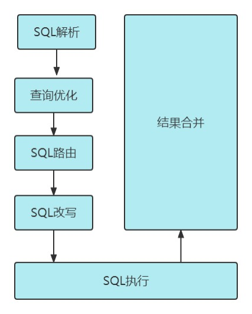

# 一、作用

## 1.1、数据分片

1. 分库
2. 分表
3. 读写分离
4. 分片策略
5. 分布式主键

## 1.2、分布式事务

1. 标准化的事务接口
2. 2XA强一致性事务
3. 柔性事务

## 1.3、数据库治理

1. 配置动态化
2. 编排和治理
3. 数据脱敏
4. 可视化链路追踪

# 二、使用

## 2.1、原理流程

1. 根据配置信息生成configuration对象

2. 通过Factory将configuration对象转化成Rule对象

3. 通过Factory将Rule对象与DataSource对象进行封装

4. 使用shardingjdbc进行分库分表操作

   

## 2.2、使用过程

```
<dependency>
    <groupId>org.apache.shardingsphere</groupId>
    <artifactId>sharding-jdbc-core</artifactId>
    <version>4.1.1</version>
</dependency>
```

Sharding-JDBC可以通过Java，YAML，Spring命名空间和Spring Boot Starter四种方式配置，开发者可根据场景选择适合的配置方式。

## 2.3、概念

### 2.3.1、真实表

数据库中真实存在的物理表。例如b_order0、b_order1

### 2.3.2、逻辑表

在分片之后，同一类表结构的名称（总称）。例如b_order。

### 2.3.3、数据节点

在分片之后，由数据源和数据表组成。例如ds0.b_order1

### 2.3.4、绑定表

指的是分片规则一致的关系表（主表、子表），例如b_order和b_order_item，均按照order_id分片，则此两个表互为绑定表关系。绑定表之间的多表关联查询不会出现**笛卡尔积关联**，可以提升关联查询效率。

### 2.3.5、广播表/全局表

在使用中，有些表没必要做分片，例如字典表、省份信息等，因为他们数据量不大，而且这种表可能需要与海量数据的表进行关联查询。广播表会在不同的数据节点上进行存储，存储的表结构和数据完全相同。

## 2.4、具体每一项功能使用时百度。因为原理已经基本讲完