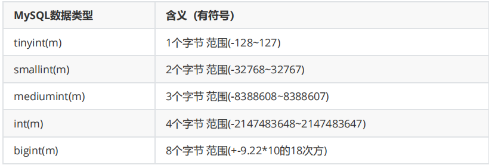
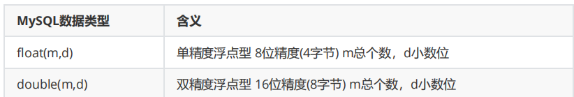
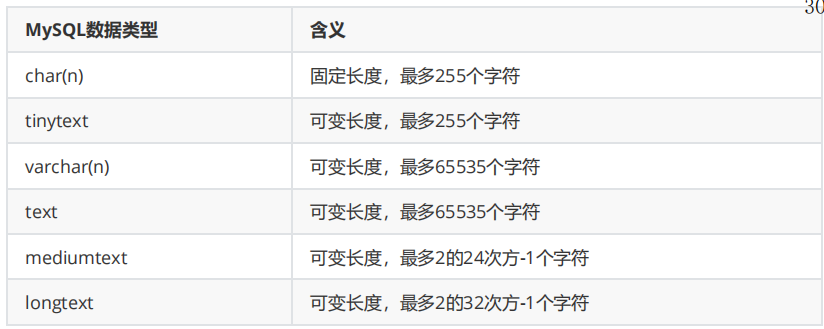
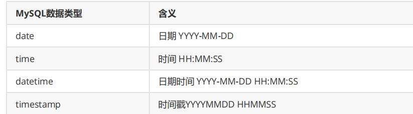

# 一、语言种类

## 1.1、其他

mysql -uroot -proot;

show databases；

show tables；

## 1.2、数据查询语言 DQL（ data query language）

1. SELECT
2. FROM
3. WHERE
4. ORDER BY
5. HAVING

## 1.3、数据操作语言 dml （data manipulation language）

1. INSERT：添加数据

   选择插入：INSERT INTO 表名(列名 1 ，列名 2 ，列名3.....) VALUES(值 1 ，值 2 ，值 3......);

   完全插入：INSERT INTO 表名 VALUES(值 1 ，值 2 ，值3......); 

   如果主键是自动增长，需要使用 default 或者 null 或者 0 占位。

2. UPDATE：更新数据

   UPDATE 表名 SET 列名=值，列名=值 WHERE 条件;

3. DELETE：删除数据

   DELETE FROM 表名 WHERE 条件;

4. truncate 阶段

   TRUNCATE TABLE 表名; 

   truncate 是整体删除(速度较快)， delete 是逐条删除(速度较慢)；

   truncate 不写服务器 log，delete 写服务器 log，也就是 truncate 效率比 delete 高的原因；

   truncate 是会重置自增值，相当于自增列会被置为初始值，又重新从 1 开始记录，而 不是接着原

   来的值。而 delete 删除以后， 自增值仍然会继续累加。

    

## 1.4、数据定义语言（DDL：Data Definition Language）

1. CREATE：创建数据库对象

   create database bjsxt default character set utf8mb4;

   create table employee (id int, employee_name varchar(10), salary(8,2));

2. ALTER：修改数据库对象

   alter table employee rename emp;

   alter table emp change column employee_name rename name;

   alter table emp add column commission_pct float（10,2）；

   alter table emp drop column commission_pct;

   alter table emp modify name varchar(40);////修改数据库字段类型

   alter table emp add constraint emp_fk foreign key(dept_id) references departments(department_id);

3. DROP：删除数据库对象

## 1.5、数据控制语言 dcl（data control language）

1. grant
2. revoke

## 1.6、事务控制语言 tcl（transaction control language）

1. COMMIT：提交事务
2. ROLLBACK：回 滚事务
3. SAVEPOINT：设置回滚点

## 二、数据类型

### 2.1、整数类型

内存长度已经固定，可以修改显示长度

### 2.2、浮点类型

### 2.3、字符类型

char长度固定

varchar不固定，可以设置最大长度

text不设置长度

### 2.4、时间类型

### 2.5、二进制blob

1. BLOB和TEXT存储方式不同，TEXT以文本方式存储，英文存储区分大小写，而Blob是以二进制方式存储，不分大小写。
2. BLOB存储的数据只能整体读出。
3. TEXT可以指定字符集，BLOB不用指定字符集。

## 三、数据库约束

### 3.1、主键（primary key）

alter table emp add primary key(employee_id);

alter table emp modify employee_id int auto_increment; 

////删除主键，必须先删除自增

alter table emp modify employee_id int ; 

alter table emp drop primary key;

### 3.2、外键（foreign key）

alter table emp add constraint emp_fk foreign key (dept_id) references department(department_id)

alter table emp drop key emp_fk;

### 3.3、唯一性约束（unique key）

alter table emp add constraint emp_uk unique(dept_id);

alter table emp drop key emp_uk;

### 3.4、非空约束（not null）

alter table emp modify salary float(8,2) not NULL; 

CREATE TABLE `emp` (
  `name` varchar(40) DEFAULT NULL,
  `salary` float(8,2) DEFAULT NULL,
  `employee_id` int(11) NOT NULL,
  `dept_id` int(11) DEFAULT NULL,
  PRIMARY KEY (`employee_id`),
  UNIQUE KEY `emp_uk` (`dept_id`),
  CONSTRAINT `emp_fk` FOREIGN KEY (`dept_id`) REFERENCES `departments` (`department_id`)
) ENGINE=InnoDB DEFAULT CHARSET=utf8mb4;

## 四、sql执行顺序

–第一步：执行FROM

–第二步：WHERE条件过滤

–第三步：GROUP BY分组

–第四步：执行SELECT投影列，聚集函数

–第五步：HAVING条件过滤

–第六步：执行ORDER BY 排序 