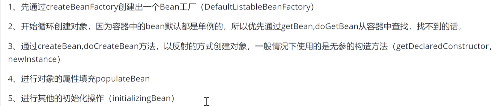
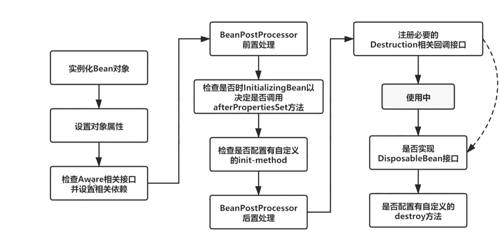
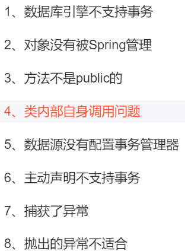

## 一、面试问题

### 1，spring ioc 理解，原理与实现

1. 控制反转（ioc）：讲对象交给spring管理

2. 依赖注入（di） ：把对应属性的值注入到对象中

3. 容器：存储对象，map结构，有三级缓存，singleObject中存在完整对象，bean生命周期（创建到销毁）都是由容器帮忙管理

   1. ioc容器创建（BeanFactory,DefaultListableBeanFactory,向bean中注入一些参数（BeanPostProcessor，Aware接口的子类等）
   2. 加载解析bean对象：准备要创建的bean对象 beanDefination（xml或者注解的解析过程）
   3. beanFactoryPostProcessor的处理：PlaceHolderConfigurationSupport，ConfigurationClassPostProcessor
   4. BeanPostProcessor的注册功能，方便后续对bean对象完成扩展
   5. 通过反射完成beanDefination对象实例化为bean
   6. bean对象初始化（填充属性，调用aware子类方法，BeanPostProcessor前置方法，init-method方法，后置方法
   7. 生成bean对象，通过getBean对象
   8. 销毁

   

4. 

1，事务失效原因

### 2、三级缓存

1. singletonObjects：用于存放完全初始化好的 bean，从该缓存中取出的 bean 可以直接使用
2. earlySingletonObjects：提前曝光的单例对象的cache，存放原始的 bean 对象（尚未填充属性），用于解决循环依赖
3. singletonFactories：单例对象工厂的cache，存放 bean 工厂对象，用于解决循环依赖

#### 2.1、步骤

1. 先从一级缓存singletonObjects中去获取。（如果获取到就直接return）
2. 如果获取不到或者对象正在创建中（isSingletonCurrentlyInCreation()），那就再从[二级缓存earlySingletonObjects中获取。（如果获取到就直接return）
3. 如果还是获取不到，且允许singletonFactories（allowEarlyReference=true）通过getObject()获取。就从三级缓存singletonFactory.getObject()获取。（如果获取到了就从singletonFactories中移除，并且放进earlySingletonObjects。其实也就是从三级缓存移动（是剪切、不是复制哦~）到了二级缓存）