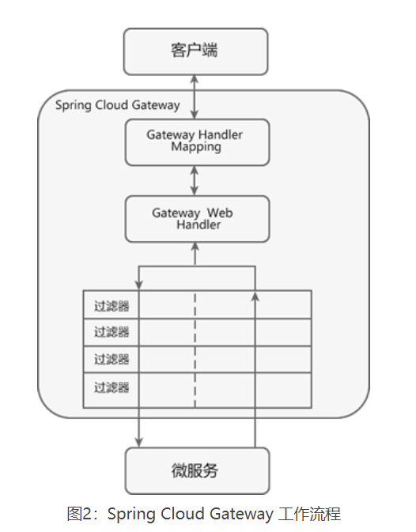

# 一、Eureka 

springcloud和springboot对应关系参见官网

## 1.1、组成

Eureka 采用 CS（Client/Server，客户端/服务器） 架构，它包括以下两大组件：

- **Eureka Server**：Eureka 服务注册中心，主要用于提供服务注册功能。当微服务启动时，会将自己的服务注册到 Eureka Server。Eureka Server 维护了一个可用服务列表，存储了所有注册到 Eureka Server 的可用服务的信息，这些可用服务可以在 Eureka Server 的管理界面中直观看到。
- **Eureka Client**：Eureka 客户端，通常指的是微服务系统中各个微服务，主要用于和 Eureka Server 进行交互。在微服务应用启动后，Eureka Client 会向 Eureka Server 发送心跳（默认周期为 30 秒）。若 Eureka Server 在多个心跳周期内没有接收到某个 Eureka Client 的心跳，Eureka Server 将它从可用服务列表中移除（默认 90 秒）。 
- **心跳**：指的是一段定时发送的自定义信息，让对方知道自己“存活”，以确保连接的有效性。大部分 CS 架构的应用程序都采用了心跳机制，服务端和客户端都可以发心跳。通常情况下是客户端向服务器端发送心跳包，服务端用于判断客户端是否在线。

## 1.2、工作流程

Eureka 实现服务注册与发现的流程如下：

1. 搭建一个 Eureka Server 作为服务注册中心；
2. 服务提供者 Eureka Client 启动时，会把当前服务器的信息以服务名（spring.application.name）的方式注册到服务注册中心；
3. 服务消费者 Eureka Client 启动时，也会向服务注册中心注册；
4. 服务消费者还会获取一份可用服务列表，该列表中包含了所有注册到服务注册中心的服务信息（包括服务提供者和自身的信息）；
5. 在获得了可用服务列表后，服务消费者通过 HTTP 或消息中间件远程调用服务提供者提供的服务。

## 1.3、特点

### 1.3.1、自我保护模式

1. 健康的服务（Eureka Client）也有可能会由于网络故障（例如网络延迟、卡顿、拥挤等原因）而无法与 Eureka Server 正常通讯。
2. 所以如果 Eureka Server 在一段时间内没有接收到 Eureka Client 的心跳，Euraka不会移除服务
3. Eureka Server 就会开启自我保护模式，将所有的 Eureka Client 的注册信息保护起来，而不是直接从服务注册表中移除。
4. 一旦网络恢复，这些 Eureka Client 提供的服务还可以继续被服务消费者消费。

### 1.3.2、注册中心集群

# 二、ribbon

常见的负载均衡方式有两种：

- 服务端负载均衡
- 客户端负载均衡
- Ribbon 就是一个基于 HTTP 和 TCP 的客户端负载均衡器
- 当我们将 Ribbon 和 Eureka 一起使用时，Ribbon 会从 Eureka Server（服务注册中心）中获取服务端列表，然后通过负载均衡策略将请求分摊给多个服务提供者，从而达到负载均衡的目的。
- 可以使用restTemplate发送请求
- 也可以使用openfeign

## 2.1、服务端负载均衡

1. 服务端负载均衡是在客户端和服务端之间建立一个独立的负载均衡服务器
2. 该服务器既可以是硬件设备（例如 F5），也可以是软件（例如 Nginx）。
3. 这个负载均衡服务器维护了一份可用服务端清单，然后通过心跳机制来删除故障的服务端节点，以保证清单中的所有服务节点都是可以正常访问的。
4. 当客户端发送请求时，该请求不会直接发送到服务端进行处理，而是全部交给负载均衡服务器，由负载均衡服务器按照某种算法（例如轮询、随机等），从其维护的可用服务清单中选择一个服务端，然后进行转发。
5. 服务端负载均衡具有以下特点：

- 需要建立一个独立的负载均衡服务器。
- 负载均衡是在客户端发送请求后进行的，因此客户端并不知道到底是哪个服务端提供的服务。
- 可用服务端清单存储在负载均衡服务器上。

## 2.2、客户端负载均衡

1. 客户端负载均衡是将负载均衡逻辑以代码的形式封装到客户端上，即负载均衡器位于客户端。
2. 客户端通过服务注册中心（例如 Eureka Server）获取到一份服务端提供的可用服务清单。
3. 有了服务清单后，负载均衡器会在客户端发送请求前通过负载均衡算法选择一个服务端实例再进行访问，以达到负载均衡的目的；
4. 客户端负载均衡也需要心跳机制去维护服务端清单的有效性，这个过程需要配合服务注册中心一起完成。
5. 客户端负载均衡具有以下特点：

- 负载均衡器位于客户端，不需要单独搭建一个负载均衡服务器。
- 负载均衡是在客户端发送请求前进行的，因此客户端清楚地知道是哪个服务端提供的服务。
- 客户端都维护了一份可用服务清单，而这份清单都是从服务注册中心获取的。

## 2.3、ribbon负载均衡策略

| 1    | RoundRobinRule            | 按照线性轮询策略，即按照一定的顺序依次选取服务实例           |
| ---- | ------------------------- | ------------------------------------------------------------ |
| 2    | RandomRule                | 随机选取一个服务实例                                         |
| 3    | RetryRule                 | 按照 RoundRobinRule（轮询）的策略来获取服务，如果获取的服务实例为 null 或已经失效，则在指定的时间之内不断地进行重试（重试时获取服务的策略还是 RoundRobinRule 中定义的策略），如果超过指定时间依然没获取到服务实例则返回 null 。 |
| 4    | WeightedResponseTimeRule  | WeightedResponseTimeRule 是 RoundRobinRule 的一个子类，它对 RoundRobinRule 的功能进行了扩展。  根据平均响应时间，来计算所有服务实例的权重，响应时间越短的服务实例权重越高，被选中的概率越大。刚启动时，如果统计信息不足，则使用线性轮询策略，等信息足够时，再切换到 WeightedResponseTimeRule。 |
| 5    | BestAvailableRule         | 继承自 ClientConfigEnabledRoundRobinRule。先过滤点故障或失效的服务实例，然后再选择并发量最小的服务实例。 |
| 6    | AvailabilityFilteringRule | 先过滤掉故障或失效的服务实例，然后再选择并发量较小的服务实例。 |
| 7    | ZoneAvoidanceRule         | 默认的负载均衡策略，综合判断服务所在区域（zone）的性能和服务（server）的可用性，来选择服务实例。在没有区域的环境下，该策略与轮询（RandomRule）策略类似。 |

## 2.4、使用

```
@RibbonClient(name = "MICROSERVICECLOUDPROVIDERDEPT", configuration = MySelfRibbonRuleConfig.class)
public class MicroServiceCloudConsumerDept80Application {
```


# 三、OpenFeign

1. Feign 对Ribbon进行了集成，利用 Ribbon 维护了一份可用服务清单，并通过 Ribbon 实现了客户端的负载均衡。
2. OpenFeign 是 Spring Cloud 对 Feign 的二次封装，它具有 Feign 的所有功能，并在 Feign 的基础上增加了对 Spring MVC 注解的支持，例如 @RequestMapping、@GetMapping 和 @PostMapping 等。

## 3.1、超时时间控制

feign和openfeign都继承了ribbon

```
ribbon:
  ReadTimeout: 6000 #建立连接所用的时间，适用于网络状况正常的情况下，两端两端连接所用的时间
  ConnectionTimeout: 6000 #建立连接后，服务器读取到可用资源的时间
```

# 四、Hystrix

1. 微服务架构中的熔断器能够在某个服务发生故障后，向服务调用方返回降级响应（FallBack）
2. 而不是长时间的等待或者抛出调用方无法处理的异常。
3. 这样就保证了服务调用方的**线程**不会被长时间、不必要地占用
4. 避免故障在微服务系统中的蔓延，防止系统雪崩效应的发生。

## 4.1、功能

- **保护线程资源**：防止单个服务的故障耗尽系统中的所有线程资源。
- **快速失败机制**：当某个服务发生了故障，不让服务调用方一直等待，而是直接返回请求失败。
- **提供降级（FallBack）方案**：在请求失败后，提供一个设计好的降级方案，通常是一个兜底方法，当请求失败后即调用该方法。
- **防止故障扩散**：使用熔断机制，防止故障扩散到其他服务。
- **监控功能**：提供熔断器故障监控组件 Hystrix Dashboard，随时监控熔断器的状态。

## 4.2、使用场景

- 程序运行异常
- 服务超时
- 熔断器处于打开状态
- 线程池资源耗尽

## 4.3、Hystrix 服务端服务降级和客户端服务降级。

### 4.3.1、服务端：

```
//一旦该方法失败并抛出了异常信息后，会自动调用  @HystrixCommand 注解标注的 fallbackMethod 指定的方法
    @HystrixCommand(fallbackMethod = "dept_TimeoutHandler",
            commandProperties =
                    //规定 5 秒钟以内就不报错，正常运行，超过 5 秒就报错，调用指定的方法
                    {@HystrixProperty(name = "execution.isolation.thread.timeoutInMilliseconds", value = "5000")})
    @Override
    public String deptInfo_Timeout(Integer id) {
        
    }
    
    // 当服务出现故障后，调用该方法给出友好提示
    public String dept_TimeoutHandler(Integer id) {
       
    }
```

### 4.3.2、客户端

既可以配置所有请求超时时间，也可以配置某一个接口超时时间

```
 @HystrixCommand(fallbackMethod = "dept_TimeoutHandler") //为该请求指定专属的回退方法
    public String deptInfo_Timeout(@PathVariable("id") Integer id) {
        String s = deptHystrixService.deptInfo_Timeout(id);
        log.info(s);
        return s;
    }
    
    ######################配置请求超时时间##########################
hystrix:
  command:
    default:
      execution:
        isolation:
          thread:
            timeoutInMilliseconds: 7000
####################配置具体方法超时时间 为 3 秒########################
    DeptHystrixService#deptInfo_Timeout(Integer):
      execution:
        isolation:
          thread:
            timeoutInMilliseconds: 3000
```

### 4.3.3、降级falllback配置方法

可以像以上步骤中一样为每一个方法配置

也可以在某一个类中为所有方法配置默认返回

```
@DefaultProperties(defaultFallback = "dept_Global_FallbackMethod") //全局的服务降级方法
然后每一个方法添加
@HystrixCommand
```

### 4.4.4、解耦

以上的fallback方法必须和可能出问题的方法在同一个类中，耦合度高

所以可以直接在openfeign中更改

```
@FeignClient(value = "MICROSERVICECLOUDPROVIDERDEPTHYSTRIX", fallback = DeptHystrixFallBackService.class)
```

### 4.4.5、熔断器状态

- 熔断关闭状态（Closed）：当务访问正常时，熔断器处于关闭状态，服务调用方可以正常地对服务进行调用。
- 熔断开启状态（Open）：默认情况下，在固定时间内接口调用出错比率达到一个阈值（例如 50%），熔断器会进入熔断开启状态，时间为**（休眠时间窗）**。进入熔断状态后，后续对该服务的调用都会被切断，熔断器会执行本地的降级（FallBack）方法。
- 半熔断状态（Half-Open）： 在熔断开启一段时间**（休眠时间窗）**之后，熔断器会进入半熔断状态。在半熔断状态下，熔断器会尝试恢复服务调用方对服务的调用，允许部分请求调用该服务，并监控其调用成功率。如果成功率达到预期，则说明服务已恢复正常，熔断器进入关闭状态；如果成功率仍旧很低，则重新进入熔断开启状态。

### 4.4.6、Hystrix Dashboard

# 五、Gateway

## 5.1、客户端直接调用服务劣势

这种客户端直接请求服务的方式存在以下问题：

- 当服务数量众多时，客户端需要维护大量的服务地址，这对于客户端来说，是非常繁琐复杂的。
- 在某些场景下可能会存在跨域请求的问题。
- 身份认证的难度大，每个微服务需要独立认证。

## 5.2、网关好处

对于服务数量众多、复杂度较高、规模比较大的系统来说，使用 API 网关具有以下好处：

- 客户端通过 API 网关与微服务交互时，客户端只需要知道 API 网关地址即可，而不需要维护大量的服务地址，简化了客户端的开发。
- 客户端直接与 API 网关通信，能够减少客户端与各个服务的交互次数。
- 客户端与后端的服务耦合度降低。
- 节省流量，提高性能，提升用户体验。
- API 网关还提供了安全、流控、过滤、缓存、计费以及监控等 API 管理功能。

## 5.3、原理

1. Spring Cloud Gateway 是基于 WebFlux 框架实现的，而 WebFlux 框架底层则使用了高性能的 Reactor 模式通信框架 Netty

2. 核心概念

   - Route（路由）网关最基本的模块。它由一个 ID、一个目标 URI、一组断言（Predicate）和一组过滤器（Filter）组成。
   - Predicate（断言）路由转发的判断条件，我们可以通过 Predicate 对 HTTP 请求进行匹配，例如请求方式、请求路径、请求头、参数等，如果请求与断言匹配成功，则将请求转发到相应的服务。
   - Filter（过滤器）过滤器，我们可以使用它对请求进行拦截和修改，还可以使用它对上文的响应进行再处理。

3. 工作流程

   

Spring Cloud Gateway 工作流程说明如下：

1. 客户端将请求发送到 Spring Cloud Gateway 上。
2. Spring Cloud Gateway 通过 Gateway Handler Mapping 找到与请求相匹配的路由，将其发送给 Gateway Web Handler。
3. Gateway Web Handler 通过指定的过滤器链（Filter Chain），将请求转发到实际的服务节点中，执行业务逻辑返回响应结果。
4. 过滤器之间用虚线分开是因为过滤器可能会在转发请求之前（pre）或之后（post）执行业务逻辑。
5. 过滤器（Filter）可以在请求被转发到服务端前，对请求进行拦截和修改，例如参数校验、权限校验、流量监控、日志输出以及协议转换等。
6. 过滤器可以在响应返回客户端之前，对响应进行拦截和再处理，例如修改响应内容或响应头、日志输出、流量监控等。
7. 响应原路返回给客户端。

## 5.4、断言Predicate 

- Route 路由与 Predicate 断言的对应关系为“一对多”，一个路由可以包含**多个**不同断言。
- 一个请求想要转发到指定的路由上，就必须同时匹配路由上的**所有**断言。
- 当一个请求同时满足多个路由的断言条件时，请求只会被**首个**成功匹配的路由转发。
- 路由可以是静态的http:ip，也可以是动态的http:serviceName

## 5.5、过滤器

按照执行逻辑时间判断：

1. Pre 类型这种过滤器在请求被转发到微服务之前可以对请求进行拦截和修改，例如参数校验、权限校验、流量监控、日志输出以及协议转换等操作
2. Post 类型这种过滤器在微服务对请求做出响应后可以对响应进行拦截和再处理，例如修改响应内容或响应头、日志输出、流量监控等。

按照作用范围来分

1. GatewayFilter：应用在单个路由或者一组路由上的过滤器。

2. GlobalFilter：应用在所有的路由上的过滤器。

3. ```
   /**
   * 自定义全局网关过滤器（GlobalFilter）
   */
   @Component
   @Slf4j
   public class MyGlobalFilter implements GlobalFilter, Ordered {
       @Override
       public Mono<Void> filter(ServerWebExchange exchange, GatewayFilterChain chain) {
           log.info("进入自定义的全局过滤器 MyGlobalFilter" + new Date());
           String uname = exchange.getRequest().getQueryParams().getFirst("uname");
           if (uname == null) {
               log.info("参数 uname 不能为 null！");
               exchange.getResponse().setStatusCode(HttpStatus.NOT_ACCEPTABLE);
               return exchange.getResponse().setComplete();
           }
           return chain.filter(exchange);
       }
       @Override
       public int getOrder() {
           //过滤器的顺序，0 表示第一个
           return 0;
       }
   }
   ```

   