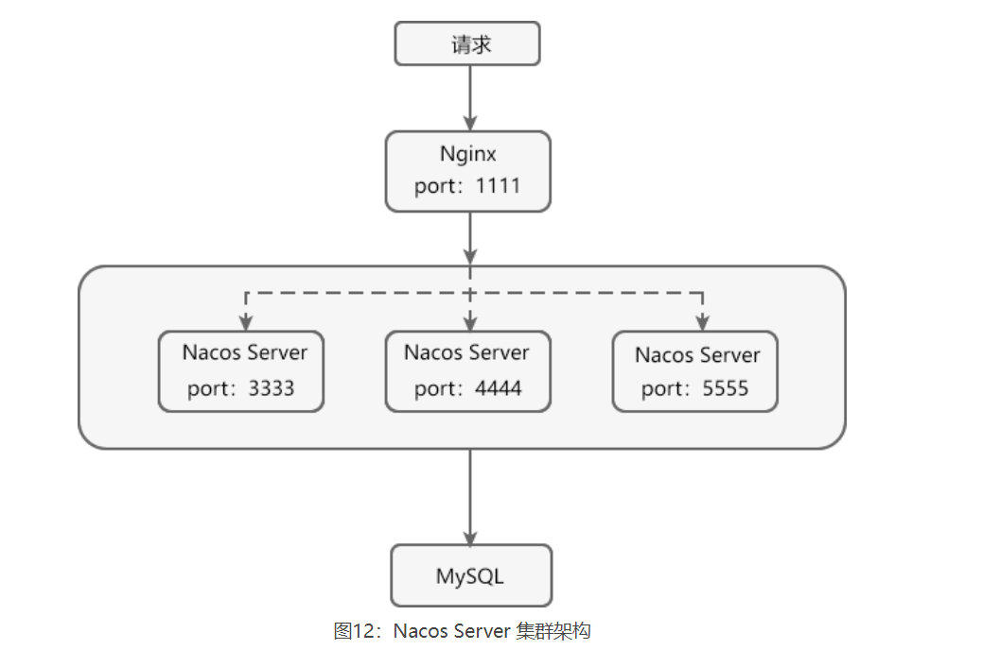

# 一、版本对应

| Spring Cloud 版本           | Spring Cloud Alibaba 版本           | Spring Boot 版本 |
| --------------------------- | ----------------------------------- | ---------------- |
| Spring Cloud 2020.0.1       | 2021.1                              | 2.4.2            |
| Spring Cloud Hoxton.SR12    | 2.2.7.RELEASE                       | 2.3.12.RELEASE   |
| Spring Cloud Hoxton.SR9     | 2.2.6.RELEASE                       | 2.3.2.RELEASE    |
| Spring Cloud Greenwich.SR6  | 2.1.4.RELEASE                       | 2.1.13.RELEASE   |
| Spring Cloud Hoxton.SR3     | 2.2.1.RELEASE                       | 2.2.5.RELEASE    |
| Spring Cloud Hoxton.RELEASE | 2.2.0.RELEASE                       | 2.2.X.RELEASE    |
| Spring Cloud Greenwich      | 2.1.2.RELEASE                       | 2.1.X.RELEASE    |
| Spring Cloud Finchley       | 2.0.4.RELEASE（停止维护，建议升级） | 2.0.X.RELEASE    |
| Spring Cloud Edgware        | 1.5.1.RELEASE（停止维护，建议升级） | 1.5.X.RELEASE    |

| Spring Cloud Alibaba 版本                                 | Sentinel 版本 | Nacos 版本 | RocketMQ 版本 | Dubbo 版本 | Seata 版本 |
| --------------------------------------------------------- | ------------- | ---------- | ------------- | ---------- | ---------- |
| 2.2.7.RELEASE                                             | 1.8.1         | 2.0.3      | 4.6.1         | 2.7.13     | 1.3.0      |
| 2.2.6.RELEASE                                             | 1.8.1         | 1.4.2      | 4.4.0         | 2.7.8      | 1.3.0      |
| 2021.1 or 2.2.5.RELEASE or 2.1.4.RELEASE or 2.0.4.RELEASE | 1.8.0         | 1.4.1      | 4.4.0         | 2.7.8      | 1.3.0      |
| 2.2.3.RELEASE or 2.1.3.RELEASE or 2.0.3.RELEASE           | 1.8.0         | 1.3.3      | 4.4.0         | 2.7.8      | 1.3.0      |
| 2.2.1.RELEASE or 2.1.2.RELEASE or 2.0.2.RELEASE           | 1.7.1         | 1.2.1      | 4.4.0         | 2.7.6      | 1.2.0      |
| 2.2.0.RELEASE                                             | 1.7.1         | 1.1.4      | 4.4.0         | 2.7.4.1    | 1.0.0      |
| 2.1.1.RELEASE or 2.0.1.RELEASE or 1.5.1.RELEASE           | 1.7.0         | 1.1.4      | 4.4.0         | 2.7.3      | 0.9.0      |
| 2.1.0.RELEASE or 2.0.0.RELEASE or 1.5.0.RELEASE           | 1.6.3         | 1.1.1      | 4.4.0         | 2.7.3      | 0.7.1      |

# 二、nacos

## 2.1、组成

1. Nacos Server：Nacos 服务端，与 Eureka Server 不同，Nacos Server 由阿里巴巴团队使用 Java 语言编写并将 Nacos Server 的下载地址给用户，用户只需要直接下载并运行即可。
2. Nacos Server 可以作为服务注册中心，帮助 Nacos Client 实现服务的注册与发现。
3. Nacos Server 可以作为配置中心，帮助 Nacos Client 在不重启的情况下，实现配置的动态刷新。
4. Nacos Client ： Nacos 客户端，通常指的是微服务架构中的各个服务，由用户自己搭建，可以使用多种语言编写。
5. Nacos Client 通过添加依赖 spring-cloud-starter-alibaba-nacos-discovery，在服务注册中心（Nacos Server）中实现服务的注册与发现。
6. Nacos Client 通过添加依赖 spring-cloud-starter-alibaba-nacos-config，在配置中心（Nacos Server）中实现配置的动态刷新。

## 2.2、nacos集群



1. 新建数据库，数据表，官网下载

2. 在 Nacos Server 安装目录下的 conf 文件夹中，将 cluster.conf.example 重命名为 cluster.conf，然后在该文件中添加所有nacos的ip，端口号。

   ```
   192.168.3.138:3333
   192.168.3.138:4444
   192.168.3.138:5555
   ```

3. 在 config 目录下的 application.properties 中，将 server.port（端口号）修改为 3333，并在该文件中添加 MySQL 数据库配置

   ```
   server.port=3333
   ################ MySQL 数据库配置##################
   spring.datasource.platform=mysql
   
   db.num=1
   db.url.0=jdbc:mysql://127.0.0.1:3306/nacos_config?characterEncoding=utf8&connectTimeout=1000&socketTimeout=3000&autoReconnect=true&useUnicode=true&useSSL=false&serverTimezone=Asia/Shanghai
   db.user=root
   db.password=root
   ```

4. 所有nacos server均需要修改

5. 下载 Nginx，并修改 Nginx 中 conf 目录下的 nginx.conf 的配置，内容如下。

```
#user  nobody;
worker_processes  1;

#error_log  logs/error.log;
#error_log  logs/error.log  notice;
#error_log  logs/error.log  info;

#pid        logs/nginx.pid;

events {
    worker_connections  1024;
}


http {
    include       mime.types;
    default_type  application/octet-stream;
    sendfile        on;
    keepalive_timeout  65;
    upstream cluster{
        server 127.0.0.1:3333;
        server 127.0.0.1:4444;
        server 127.0.0.1:5555;
    }

    server {
        listen       1111;
        server_name  localhost;
        #charset koi8-r;
        #access_log  logs/host.access.log  main;
        location / {
            #root   html;
            #index  index.html index.htm;
            proxy_pass http://cluster;
        }
    }
}
```

# 三、Sentinel

## 3.1、介绍

1. Sentinel 主要由以下两个部分组成：

2. Sentinel 核心库：Sentinel 的核心库不依赖任何框架或库，能够运行于 Java 8 及以上的版本的运行时环境中，同时对 Spring Cloud、Dubbo 等微服务框架提供了很好的支持。
   Sentinel 控制台（Dashboard）：Sentinel 提供的一个轻量级的开源控制台，它为用户提供了机器自发现、簇点链路自发现、监控、规则配置等功能。

3. Sentinel 核心库不依赖 Sentinel Dashboard，但两者结合使用可以有效的提高效率，让 Sentinel 发挥它最大的作用。

4. Sentinel 的基本概念有两个，它们分别是：资源和规则。

5. 流控模式

   直接：该api

   关联：关联的资源

   链路：只计算从指定接口发生的调用

6. 流控效果

   快速失败

   Warm up ：一开始阈值是 阈值/3，具体数字可以配，经过n秒之后阈值才恢复正常

   排队等待

| 基本概念 | 描述                                                         |
| -------- | ------------------------------------------------------------ |
| 资源     | 资源是 Sentinel 的关键概念。它可以是 Java 应用程序中的任何内容，例如由应用程序提供的服务或者是服务里的方法，甚至可以是一段代码。  我们可以通过 Sentinel 提供的 API 来定义一个资源，使其能够被 Sentinel 保护起来。通常情况下，我们可以使用方法名、URL 甚至是服务名来作为资源名来描述某个资源。 |
| 规则     | 围绕资源而设定的规则。Sentinel 支持流量控制、熔断降级、系统保护、来源访问控制和热点参数等多种规则，所有这些规则都可以动态实时调整。 |

## 3.2、@SentinelResource 注解

@SentinelResource 注解是 Sentinel 提供的最重要的注解之一，它还包含了多个属性，如下表。


| 属性               | 说明                                                         | 必填与否                       | 使用要求                                                     |
| ------------------ | ------------------------------------------------------------ | ------------------------------ | ------------------------------------------------------------ |
| value              | 用于指定资源的名称                                           | 必填                           | -                                                            |
| entryType          | entry 类型                                                   | 可选项（默认为 EntryType.OUT） | -                                                            |
| blockHandler       | 服务限流后会抛出 BlockException 异常，而 blockHandler 则是用来指定一个函数来处理 BlockException 异常的。  简单点说，该属性用于指定服务限流后的后续处理逻辑。 | 可选项                         | blockHandler 函数访问范围需要是 public；返回类型需要与原方法相匹配；参数类型需要和原方法相匹配并且最后加一个额外的参数，类型为 BlockException；blockHandler 函数默认需要和原方法在同一个类中，若希望使用其他类的函数，则可以指定 blockHandler 为对应的类的 Class 对象，注意对应的函数必需为 static 函数，否则无法解析。 |
| blockHandlerClass  | 若 blockHandler 函数与原方法不在同一个类中，则需要使用该属性指定 blockHandler 函数所在的类。 | 可选项                         | 不能单独使用，必须与 blockHandler 属性配合使用；该属性指定的类中的 blockHandler 函数必须为 static 函数，否则无法解析。 |
| fallback           | 用于在抛出异常（包括 BlockException）时，提供 fallback 处理逻辑。  fallback 函数可以针对所有类型的异常（除了 exceptionsToIgnore 里面排除掉的异常类型）进行处理。 | 可选项                         | 返回值类型必须与原函数返回值类型一致；方法参数列表需要和原函数一致，或者可以额外多一个 Throwable 类型的参数用于接收对应的异常；fallback 函数默认需要和原方法在同一个类中，若希望使用其他类的函数，则可以指定 fallbackClass 为对应的类的 Class 对象，注意对应的函数必需为 static 函数，否则无法解析。 |
| fallbackClass      | 若 fallback 函数与原方法不在同一个类中，则需要使用该属性指定 blockHandler 函数所在的类。 | 可选项                         | 不能单独使用，必须与 fallback 或 defaultFallback 属性配合使用；该属性指定的类中的 fallback 函数必须为 static 函数，否则无法解析。 |
| defaultFallback    | 默认的 fallback 函数名称，通常用于通用的 fallback 逻辑（即可以用于很多服务或方法）。  默认 fallback 函数可以针对所以类型的异常（除了 exceptionsToIgnore 里面排除掉的异常类型）进行处理。 | 可选项                         | 返回值类型必须与原函数返回值类型一致；方法参数列表需要为空，或者可以额外多一个 Throwable 类型的参数用于接收对应的异常；defaultFallback 函数默认需要和原方法在同一个类中。若希望使用其他类的函数，则可以指定 fallbackClass 为对应的类的 Class 对象，注意对应的函数必需为 static 函数，否则无法解析。 |
| exceptionsToIgnore | 用于指定哪些异常被排除掉，不会计入异常统计中，也不会进入 fallback 逻辑中，而是会原样抛出。 | 可选项                         | -                                                            |

> 注：在 Sentinel 1.6.0 之前，fallback 函数只针对降级异常（DegradeException）进行处理，不能处理业务异常。

## 3.3、dashboard

Sentinel 控制台提供的功能如下:

- **查看机器列表以及健康情况**：Sentinel 控制台能够收集 Sentinel 客户端发送的心跳包，判断机器是否在线。
- **监控（单机和集群聚合）**：Sentinel 控制台通过 Sentinel 客户端暴露的监控 API，可以实现秒级的实时监控。
- **规则管理和推送**：通过 Sentinel 控制台，我们还能够针对资源定义和推送规则。
- **鉴权**：从 Sentinel 1.6.0 起，Sentinel 控制台引入基本的登录功能，默认用户名和密码都是 sentinel。

## 3.4、定义资源

Sentinel 为我们提供了多种定义资源的方式：

- 适配主流框架自动定义资源
- 通过 SphU 手动定义资源
- 通过 SphO 手动定义资源
- 注解方式定义资源

### 3.4.1、定义资源

sphu

```
 Entry entry = null;
        try {
            entry = SphU.entry("testAbySphU");
            //您的业务逻辑 - 开始
            log.info("c语言中文网提醒您，服务访问成功------testA："+serverPort);
            return "c语言中文网提醒您，服务访问成功------testA："+serverPort;
            //您的业务逻辑 - 结束
        } catch (BlockException e1) {
            //流控逻辑处理 - 开始
            log.info("c语言中文网提醒您，testA 服务被限流");
            return "c语言中文网提醒您，testA 服务被限流";
            //流控逻辑处理 - 结束
        } finally {
            if (entry != null) {
                entry.exit();
            }
        }
```

spho

```
    /**
     * 通过 SphO 手动定义资源
     *
     * @return
     */
    public String testBbySphO() {
        if (SphO.entry("testBbySphO")) {
            // 务必保证finally会被执行
            try {
                log.info("c语言中文网提醒您，服务访问成功------testB：" + serverPort);
                return "c语言中文网提醒您，服务访问成功------testB：" + serverPort;
            } finally {
                SphO.exit();
            }
        } else {
            // 资源访问阻止，被限流或被降级
            //流控逻辑处理 - 开始
            log.info("c语言中文网提醒您，testB 服务被限流");
            return "c语言中文网提醒您，testB 服务被限流";
            //流控逻辑处理 - 结束
        }
    }
}
```

注解定义

@SentinelResource(value = "testCbyAnnotation") //通过注解定义资源

## 3.5、限流

### 1，dashboard

先定义资源，然后再dashboard全程配置

可以添加blockhandler，也可以不添加（用户体验不好）

### 2，代码控制

```
public static void loadRules(List<FlowRule> rules) {
    currentProperty.updateValue(rules); 
}


/**
 * 通过代码定义流量控制规则
 */
private static void initFlowRules() {
    List<FlowRule> rules = new ArrayList<>();
    //定义一个限流规则对象
    FlowRule rule = new FlowRule();
    //资源名称
    rule.setResource("testD-resource");
     //限流阈值的类型
    rule.setGrade(RuleConstant.FLOW_GRADE_QPS);
    // 设置 QPS 的阈值为 2
    rule.setCount(2);
    rules.add(rule);
    //定义限流规则
    FlowRuleManager.loadRules(rules);
}

调用initFlowRules
```

## 3.6、熔断

### 3.6.1、Sentinel 熔断策略

Sentinel 提供了 3 种熔断策略，如下表所示。

| 熔断策略                         | 说明                                                         |
| -------------------------------- | ------------------------------------------------------------ |
| 慢调用比例 (SLOW_REQUEST_RATIO） | 选择以慢调用比例作为阈值，需要设置允许的慢调用 RT（即最大响应时间），若请求的响应时间大于该值则统计为慢调用。  当单位统计时长（statIntervalMs）内请求数目大于设置的最小请求数目，且慢调用的比例大于阈值，则接下来的熔断时长内请求会自动被熔断。  经过熔断时长后熔断器会进入探测恢复状态（HALF-OPEN 状态），若接下来的一个请求响应时间小于设置的慢调用 RT 则结束熔断，若大于设置的慢调用 RT 则再次被熔断。 |
| 异常比例 (ERROR_RATIO)           | 当单位统计时长（statIntervalMs）内请求数目大于设置的最小请求数目且异常的比例大于阈值，则在接下来的熔断时长内请求会自动被熔断。  经过熔断时长后熔断器会进入探测恢复状态（HALF-OPEN 状态），若接下来的一个请求成功完成（没有错误）则结束熔断，否则会再次被熔断。异常比率的阈值范围是 [0.0, 1.0]，代表 0% - 100%。 |
| 异常数 (ERROR_COUNT)             | 当单位统计时长内的异常数目超过阈值之后会自动进行熔断。  经过熔断时长后熔断器会进入探测恢复状态（HALF-OPEN 状态），若接下来的一个请求成功完成（没有错误）则结束熔断，否则会再次被熔断。 |

### 3.6.2、熔断使用

```
/**
     * 自定义事件监听器，监听熔断器状态转换
     */
    public void monitor() {
        EventObserverRegistry.getInstance().addStateChangeObserver("logging",
                (prevState, newState, rule, snapshotValue) -> {
                    SimpleDateFormat format = new SimpleDateFormat("yyyy-MM-dd HH:mm:ss");
                    if (newState == CircuitBreaker.State.OPEN) {
                        // 变换至 OPEN state 时会携带触发时的值
                        System.err.println(String.format("%s -> OPEN at %s, 发送请求次数=%.2f", prevState.name(),
                                format.format(new Date(TimeUtil.currentTimeMillis())), snapshotValue));
                    } else {
                        System.err.println(String.format("%s -> %s at %s", prevState.name(), newState.name(),
                                format.format(new Date(TimeUtil.currentTimeMillis()))));
                    }
                });
    }
方法上添加：
@SentinelResource(value = "fallback", fallback = "handlerFallback")
```

### 3.6.3、代码配置熔断

```
public static void loadRules(List<DegradeRule> rules) {
    try {
        currentProperty.updateValue(rules);
    } catch (Throwable var2) {
        RecordLog.error("[DegradeRuleManager] Unexpected error when loading degrade rules", var2);
    }
}

/**
 * 初始化熔断策略
 */
private static void initDegradeRule() {
    List<DegradeRule> rules = new ArrayList<>();
    DegradeRule rule = new DegradeRule("fallback");
    //熔断策略为异常比例
    rule.setGrade(CircuitBreakerStrategy.ERROR_RATIO.getType());
    //异常比例阈值
    rule.setCount(0.7);
    //最小请求数
    rule.setMinRequestAmount(100);
    //统计市场，单位毫秒
    rule.setStatIntervalMs(30000);
    //熔断市场，单位秒
    rule.setTimeWindow(10);
    rules.add(rule);
    DegradeRuleManager.loadRules(rules);
}

@SentinelResource(value = "fallback", fallback = "handlerFallback")
public CommonResult<Dept> get(@PathVariable("id") int id) {
    initDegradeRule();
    monitor();
```

# 四、事务

## 4.1、seata简介

Seata 定义了 3 个核心组件：

- TC（Transaction Coordinator）：事务协调器，它是事务的协调者（这里指的是 Seata 服务器），主要负责维护全局事务和分支事务的状态，驱动全局事务提交或回滚。
- TM（Transaction Manager）：事务管理器，它是事务的发起者，负责定义全局事务的范围，并根据 TC 维护的全局事务和分支事务状态，做出开始事务、提交事务、回滚事务的决议。
- RM（Resource Manager）：资源管理器，它是资源的管理者（这里可以将其理解为各服务使用的数据库）。它负责管理分支事务上的资源，向 TC 注册分支事务，汇报分支事务状态，驱动分支事务的提交或回滚。


## 4.2、工作流程

Seata 的整体工作流程如下：

1. TM 向 TC 申请开启一个全局事务，全局事务创建成功后，TC 会针对这个全局事务生成一个全局唯一的 XID；
2. XID 通过服务的调用链传递到其他服务;
3. RM 向 TC 注册一个分支事务，并将其纳入 XID 对应全局事务的管辖；
4. TM 根据 TC 收集的各个分支事务的执行结果，向 TC 发起全局事务提交或回滚决议；
5. TC 调度 XID 下管辖的所有分支事务完成提交或回滚操作。

## 4.3、seata事务模式

AT、TCC、SAGA 和 XA 四种事务模式

### 4.3.1、AT

#### 4.3.1.1、前提

- 必须使用支持本地 ACID 事务特性的关系型数据库，例如 MySQL、Oracle 等；
- 应用程序必须是使用 JDBC 对数据库进行访问的 JAVA 应用。

#### 4.3.1.1、步骤

##### 1，一阶段

业务中涉及的各个数据库表，分别创建一个 UNDO_LOG（回滚日志）表，建表语句参见官网

1. 拦截sql

2. 生成查询前镜像语句

3. 执行业务sql

4. 生成后镜像查询语句：据“前镜像数据”的主键（id : 1

5. 插入回滚日志：将前后镜像数据和业务 SQL 的信息组成一条回滚日志记录，插入到 UNDO_LOG 表中

6. 注册分支事务，生成行锁

   以上所有操作均在同一个数据库事务内完成，可以保证一阶段的操作的原子性。

7. 本地事务提交：将业务数据的更新和前面生成的 UNDO_LOG 一并提交。

8. 上报执行结果：将本地事务提交的结果上报给 TC。

##### 2，二阶段提交

1. 所有的 RM 都将自己分支事务的提交结果上报给 TC
2. 若所有分支事务都执行成功，TM 向 TC 发起全局事务的提交，并批量删除各个 RM 保存的 UNDO_LOG 记录和行锁；否则全局事务回滚。

##### 3，二阶段回滚

若全局事务中的任何一个分支事务失败，则 TM 向 TC 发起全局事务的回滚，并开启一个本地事务，执行如下操作。

1. 查找 UNDO_LOG 记录：通过 XID 和分支事务 ID（Branch ID） 查找所有的 UNDO_LOG 记录。

2. 数据校验：将 UNDO_LOG 中的后镜像数据（afterImage）与当前数据进行比较，如果有不同，则说明数据被当前全局事务之外的动作所修改，需要人工对这些数据进行处理。

3. 生成回滚语句：根据 UNDO_LOG 中的前镜像（beforeImage）和业务 SQL 的相关信息生成回滚语句：

```
update webset set url= 'biancheng.net' where id = 1;
```

4. 还原数据：执行回滚语句，并将前镜像数据、后镜像数据以及行锁删除。

5. 提交事务：提交本地事务，并把本地事务的执行结果（即分支事务回滚的结果）上报给 TC

```

```

### 4.3.2、TCC模式

1. 创建接口

   ```
   @LocalTCC
   public interface Bank1Service {
       
       @TwoPhaseBusinessAction(name = "insert", commitMethod = "commitTcc", rollbackMethod = "cancel")
       String insert(
               @BusinessActionContextParameter(paramName = "params") Map<String, String> params
       );
   
       boolean commitTcc(BusinessActionContext context);
   
       boolean cancel(BusinessActionContext context);
   }
   
   ```

   说明：

   ```
   @LocalTCC:一定需要注解在接口上，否则不生效，此接口可以是寻常的业务接口，只要实现了TCC的两阶段提交对应方法便可，适用于SpringCloud+Feign模式下的TCC。
   @TwoPhaseBusinessAction:注解try方法，其中name为当前tcc方法的bean名称，写方法名便可（全局唯一），commitMethod指向提交方法，rollbackMethod指向事务回滚方法。指定好三个方法之后，seata会根据全局事务的成功或失败，自动调用提交方法或者回滚方法。
   @BusinessActionContextParameter:使用该注解可以将参数传递到二阶段commit或者rollback的方法中，方便调用。
   BusinessActionContext:TCC事务上下文，使用BusinessActionContext.getActionContext("params")便可以得到一阶段try中定义的参数，在二阶段参考此参数进行业务回滚操作。
   建议:可以在try方法中使用@Transational，直接通过spring来控制关系型数据库的事务，进行回滚的操作，而非关系型数据库等中间件的回滚操作可以交给rollbackMethod方法处理。
   建议:try接口不可以捕获异常，否则TCC将识别该操作为成功，直接执行二阶段commit方法。
   
   ```

