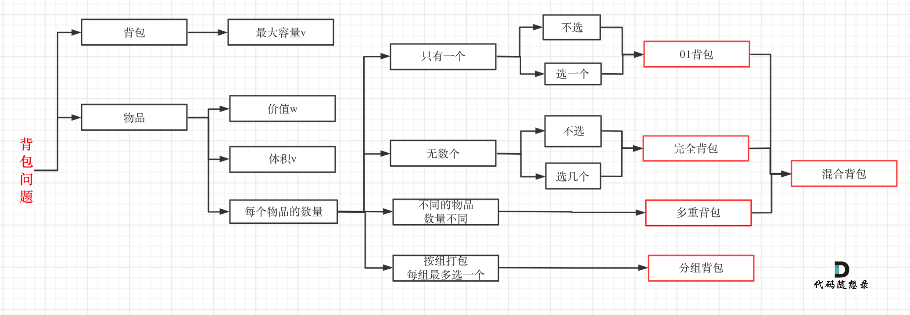

# 刷题总结：

## 一、数据结构（数组，字符串，set等）

思路：尽量借助已经有的数据结构，方法完成，不必重新实现一次

1. 排序，去重

   可以借助treeset，map，Arrays.sort等

   collection.sort(c,new Comparator(arg1,arg2){

   });

2. 去重

   可以用替换hashset，bitSet；

3. 计算某一个字母数量大小，

   ```java
   String newStr = str.replaceAll(``"1"``, ``""``);
   System.out.println(length - newStr.length());
   ```

4. java输入输出

   next，hasNext，nextLine

5. 大量的if判断

   可以用map映射，如果key不止一个，则用字符串当key，map.containsKey

6. 进制转换

   Integer.valueOf(num、String,进制)，

   Integer.toBinaryString(nm); 

   Integer.parseInt(字符串，进制）

7. 反转

   之类的可以转换为StringBuffer，然后用reverse(),string没有这个方法。
   
8. double 小数点保留

   ```
   String.format("%.1f",mid)
   ```
   
9. 双指针法

   遍历集合，可以使用双指针法，包括头尾法和同时法

   

10. a

11. a

12. 

## 二、动态规划

记忆化搜索，空间换时间，带备忘录的递归，递归树的剪枝



### 2.1、解题步骤

1. 确定dp数组（dp table）以及下标的含义
2. 确定递推公式
3. dp数组如何初始化
4. 确定遍历顺序
5. 举例推导dp数组

### 2.2、背包问题

#### 22.1、01背包

```
f[i][v]=max{f[i-1][v],f[i-1][v-c[i]]+w[i]}
```

```
f[v]=max{f[v],f[v-c[i]]+w[i]};///for循环一定要先遍历物品，再遍历背包，且背包倒序
```

#### 22.2、完全背包

```
f[i][v]=max{f[i-1][v], f[i-1][v-k*c[i]]+k*w[i]|0<=k*c[i]<=v}
```

```
f[v]=max{f[v],f[v-k*c[i]]+k*w[i]|0<=k*c[i]<=v}
///for循环一定要先遍历物品，再遍历背包，且背包正序
```


#### 22.3、多重背包

#### 22.4、混合背包

#### 22.5、二维费用的背包问题

#### 22.6、分组背包

#### 22.7、有依赖的背包问题

#### 22.8、泛化物品

#### 22.9、背包问题的问法变化

### 3.2、类型总结

1. 整数拆分乘积：

   给定一个正整数 n，将其拆分为至少两个正整数的和，并使这些整数的乘积最大化。返回最大乘积。

   ```
   curMax = Math.max(curMax, Math.max(j * (i - j), j * dp[i - j]));
   ```

2. 完全二叉搜索树数量

   有n个元素的搜索树数量就是dp[n]。

    dp[i] += dp[以j为头结点左子树节点数量] * dp[以j为头结点右子树节点数量]

   ```
   for (int i = 1; i <= n; i++) {
       for (int j = 1; j <= i; j++) {
           dp[i] += dp[j - 1] * dp[i - j];
       }
   }
   ```

3. 分割子集

   ```
   // 开始 01背包
   for(int i = 0; i < nums.size(); i++) {
       for(int j = target; j >= nums[i]; j--) { // 每一个元素一定是不可重复放入，所以从大到小遍历
           dp[j] = max(dp[j], dp[j - nums[i]] + nums[i]);
       }
   }
   ```

4. 排列组合

   /////求**组合**数的时候一定要外循环为物品，内循环为空间

   /////求**排列**数的时候一定要外循环为空间，内循环为物品

   ```
   dp[i][j] = dp[i-1][j-num[i]]+dp[i-1][j]
   dp[j] = dp[j-num[i]]+dp[j]
   
   /////求组合数的时候一定要外循环为物品，内循环为空间
    for (int i = 0; i < nums.length; i++) {
               for (int j = size; j >= nums[i]; j--) {
                   dp[j] += dp[j - nums[i]];
               }
           }/////一定要倒序
   ```

5. 多维背包

   ```
   for (int i = m; i >= zeroNum; i--) { // 遍历背包容量且从后向前遍历！
           for (int j = n; j >= oneNum; j--) {
               dp[i][j] = max(dp[i][j], dp[i - zeroNum][j - oneNum] + 1);
           }
       }
       //////两个都要倒序遍历
   ```

6. 打家劫舍

   ```java
   dp[i] = max(dp[i - 2] + nums[i], dp[i - 1]);
   ```

7. 

## 三、数组

1. 查找可用二分查找
2. 移除元素可用双指针法（优化后一个从头走，一个从尾部走，时间复杂度，最多为n，之前为2n）
3. 倒序可以用栈

## 四、树

### 4.1、赫夫曼树：

路径长度：层数减一

权：节点的数值

带权路径长度：结点和它的路径长度的乘积之和

树的带权路径长度（wpl）：树的所有叶子结点和它的路径长度的乘积之和

赫夫曼树：wpl最小的树

### 4.2、赫夫曼编码

压缩率在20%-90%

将字符列转为赫夫曼树。然后用**路径编号**取代原文。

（一定要把字符都放在叶子结点，否则会出现前缀编码，解析时候会出错）

排序方法不通，哈弗曼树不一样，但是wpl一样，也就是说长度是一样的