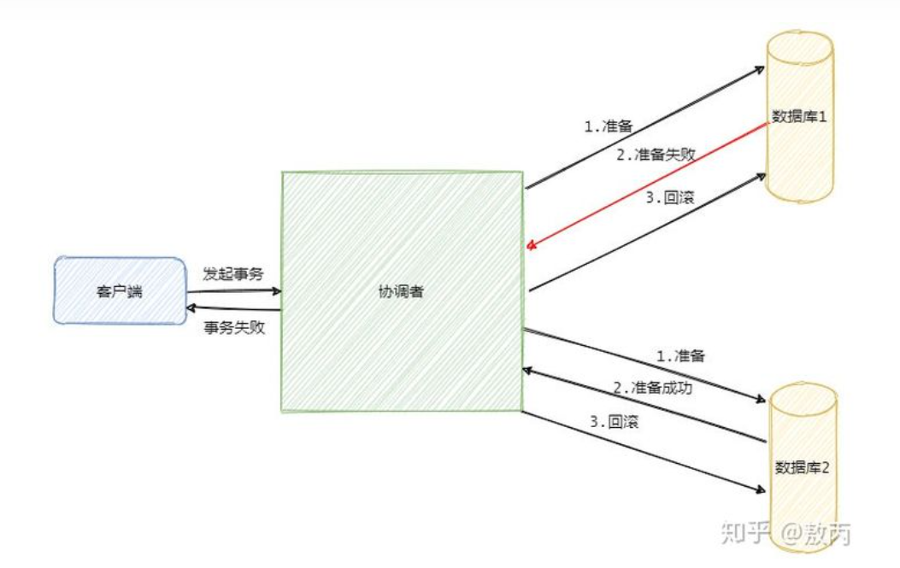

# 1、分布式事务

## 1.1、事务基本概念概述

### 1.1.1、特性（acid）

1. 数据库事务的几个特性：原子性(Atomicity )、一致性( Consistency )、隔离性或独立性( Isolation) 

   和持久性(Durabilily)，简称就是 ACID； 

2. 原子性：一系列的操作整体不可拆分，要么同时成功，要么同时失败 

3. 一致性：数据在事务的前后，业务整体一致。 

4. 隔离性：事务之间互相隔离。 

5. 持久性：一旦事务成功，数据一定会落盘在数据库。

### 1.1.2、事务的隔离级别

1. READ UNCOMMITTED（读未提交） 

   该隔离级别的事务会读到其它未提交事务的数据，此现象也称之为脏读。

2. READ COMMITTED（读提交） 

   一个事务可以读取另一个已提交的事务，多次读取会造成不一样的结果，此现象称为不可重 

   复读问题，Oracle 和 SQL Server 的默认隔离级别。 

3.  REPEATABLE READ（可重复读） 

   该隔离级别是 MySQL 默认的隔离级别，在同一个事务里，select 的结果是事务开始时时间 

   点的状态，因此，同样的 select 操作读到的结果会是一致的，但是，会有幻读现象。MySQL 

   的 InnoDB 引擎可以通过 next-key locks 机制（参考下文"行锁的算法"一节）来避免幻读。 

4. SERIALIZABLE（序列化） 

   在该隔离级别下事务都是串行顺序执行的，MySQL 数据库的 InnoDB 引擎会给读操作隐式 

   加一把读共享锁，从而避免了脏读、不可重读复读和幻读问题。

### 1.1.3、事务的传播

1. PROPAGATION_REQUIRED：

   如果当前没有事务，就创建一个新事务，如果当前存在事务， 就加入该事务，该设置是最常用的设置。 

2. PROPAGATION_SUPPORTS：

   支持当前事务，如果当前存在事务，就加入该事务，如果当前不存在事务，就以非事务执行。 

3. PROPAGATION_MANDATORY：

   支持当前事务，如果当前存在事务，就加入该事务，如果当前不存在事务，就抛出异常。 

4. PROPAGATION_REQUIRES_NEW：

   创建新事务，无论当前存不存在事务，都创建新事务。 

5. PROPAGATION_NOT_SUPPORTED：

   以非事务方式执行操作，如果当前存在事务，就把当前事务挂起。 

6. PROPAGATION_NEVER：

   以非事务方式执行，如果当前存在事务，则抛出异常。 

7. PROPAGATION_NESTED：

   如果当前存在事务，则在嵌套事务内执行。如果当前没有事务， 则执行与 PROPAGATION_REQUIRED 类似的操作

### 1.1.4、要点

1. 本地失误失效：

   同一个类里面，事务设置失效。因为事务本质上用的是代理模式。

   解决

- 导入 spring-boot-starter-aop 
- @EnableTransactionManagement(proxyTargetClass = true) 
- @EnableAspectJAutoProxy(exposeProxy=true) 
- AopContext.currentProxy() 调用方法

## 1.2、分布式事务基本概念

### 1.2.1、cap定理

### 1.2.2、base理论

1. 基本可用

2. 软状态

   软状态是指允许系统存在中间状态，而该中间状态不会影响系统整体可用性。分布 

   式存储中一般一份数据会有多个副本，允许不同副本同步的延时就是软状态的体 

   现。mysql replication 的异步复制也是一种体现。

3. 最终一致性

   最终一致性是指系统中的所有数据副本经过一定时间后，最终能够达到一致的状 

   态。弱一致性和强一致性相反，最终一致性是**弱一致性的一种特殊情况。**

4. 强一致性、弱一致性、最终一致性

   从客户端角度，多进程并发访问时，更新过的数据在不同进程如何获取的不同策略，决定了 

   不同的一致性。对于关系型数据库，要求更新过的数据能被后续的访问都能看到，这是**强一** 

   **致性**。如果能容忍后续的部分或者全部访问不到，则是**弱一致性**。如果经过一段时间后要求 

   能访问到更新后的数据，则是**最终一致性**

## 1.3、解决方案

### 1.3.1、2pc（xa）模式（数据库层面）

1，准备

2，提交

3，第二阶段失败的话会不断重试，因为有可能一些参与者的事务已经提交成功了，这个时候只有一条路，就是头铁往前冲，不断的重试，直到提交成功

缺点：

- 同步阻塞，效率低
- 单点故障，尤其是参与者故障，这时候协调者（或者重新选举后的协调者）无法判断是否应该提交还是回滚
- 上一步中，判断失误的话，可能会造成数据不一致

### 1.3.2、3pc模式

**把 2PC 的提交阶段变成了预提交阶段和提交阶段**

3PC 的引入是为了解决提交阶段 2PC 协调者和某参与者都挂了之后新选举的协调者不知道当前应该提交还是回滚的问题。

但依然无法解决2pc阶段数据不一致的问题

### 1.3.2、at模式

### 1.3.3、柔性事务-tcc模式（业务层面）

TCC 指的是`Try - Confirm - Cancel`。

### 1.3.4、柔性事务-最大努力通知型方案

### 1.3.5、柔性事务-可靠消息-最终一致性方案

