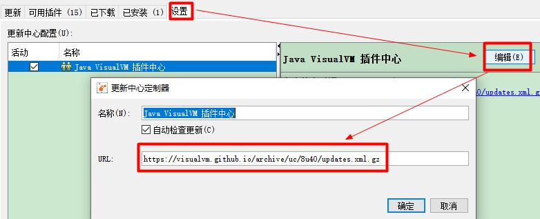
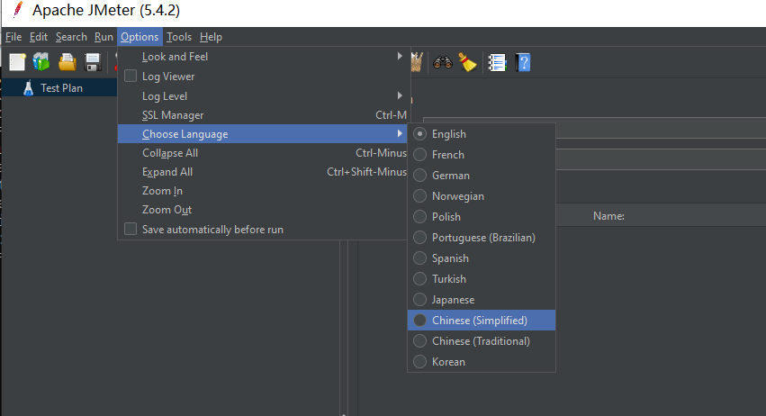
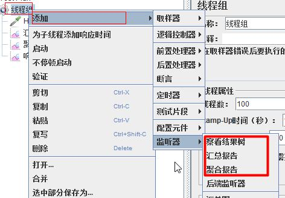
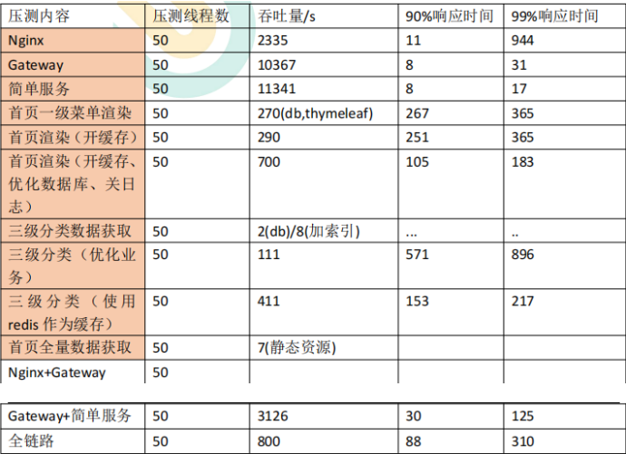
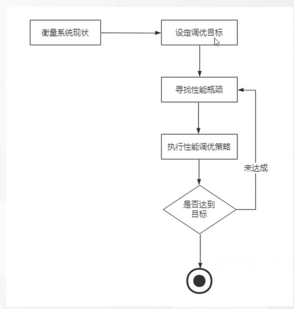
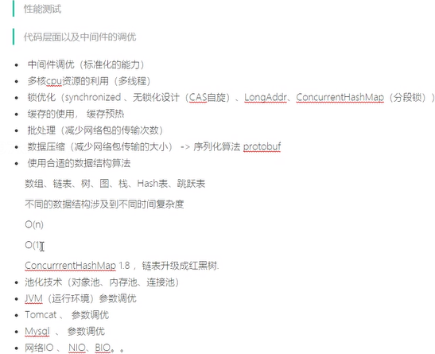

# 1、工具

## 1.1、jvisualvm（升级版本的jconsole）

### 1.1.1、打开方式

两者都位于jdk德安装目录之中，所以在cmd中输入jvisualvm||jconsole即可

### 1.1.2、插件安装

1. 点击 工具->插件

2. 打开https://visualvm.github.io/pluginscenters.html，选择本地jdk对应的插件下载地址

3. 更改插件下载地址

   

4. 选择gcc插件，安装

## 1.2、jmeter

### 1.2.1、下载地址

https://jmeter.apache.org/download_jmeter.cgi

### 1.2.2 、选择语言

### 1.2.3、使用

1. 添加线程组
2. 添加监听器

### 1.2.4、低版本windows导致的bug

1. bug

   JMeter Address Already in use

2. 解决

   1）cmd 中，用 regedit 命令打开注册表 

   2）进入 HKEY_LOCAL_MACHINE\SYSTEM\CurrentControlSet\Services\Tcpip\Parameters  

   3）右击 parameters，添加一个新的 DWORD，名字为 MaxUserPort 

   4）双击 MaxUserPort，输入数值数据为 65534，基数选择十进制（如果是分布式运 

   行的话，控制机器和负载机器都需要这样操作哦） 

3. 修改配置完毕之后记得重启机器才会生效 

## 1.3、性能调优策略

### 1.3.1、常见原因

1. 中间件太多(大多都损失在网络交互了)

   1）改良中间件，提高吞吐量

   2）用更高速的网络（光纤）

2. mysql交互

   1）mysql优化（建立索引等）

   2）尽量一次查完，不要多次查询

   3）使用redis

3. 模板渲染（jsp\themeleaf)

   1）开启缓存

4. 静态资源

   2）nginx

5. io输出

   1) log调整到error等

6. cpu性能

7. jvm

### 1.3.2、实例（谷粒商城）(未填写idea搭建的伪集群)

# 二、系统方案

提高并发处理能力

提高请求响应时间

## 2.1、性能瓶颈

cpu，内存，io，网络io，应用程序

### 2.1.1、cpu

1. 用户空间线程：新建，销毁，上下文切换
2. 内核空间线程
3. 硬件中断

### 2.2.2、应用程序

线程锁

死锁

分布式锁

### 2.2.3、其他

