# 一、osi七层网络模型

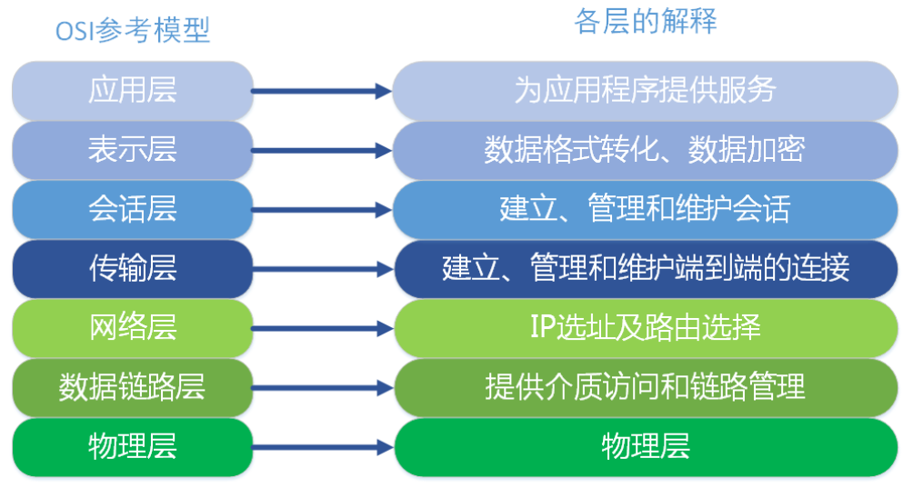

1. 物理层

   物理设备的bit流传输

2. 数据链路层

   物理寻址，确保两个邻近设备之间的数据传输

3. 网络层

   把封包从一个ip地址传输到另一ip地址

4. 传输层

   数据从一个实体传输到另一个实体，但是不负责传输方式

   数据拆分重组

   纠错

   管理链接

   流量控制·

   端口寻址

5. 会话层

   负责管理两个实体间的连接

6. 表现层

   协商数据的语法语义、格式

7. 应用层

   各种应用程序协议，http、ftp、pop3、

# 二、tcp、ip协议群

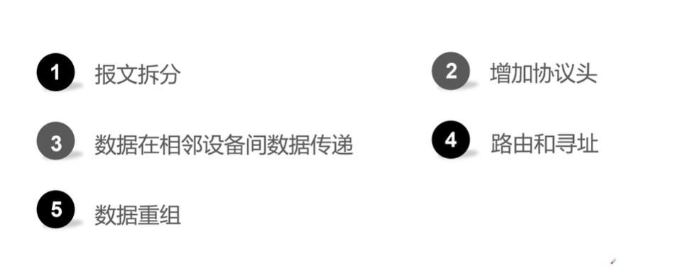

## 1.1、五层模型

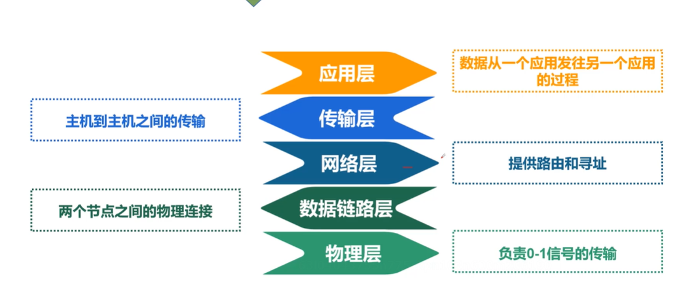

## 1.2、tcp协议

### 1.2.1、定义

TCP全名是(Transport Control Protocol)，是一个可以提供可靠的、支持全双工、连接导向的协议，因此在客户端和服务端之间传输数据的时候，是必须先建立一个连接的

### 1.2.2、解释

#### 1.2.2.1、全双工

单工

半双工

双工

#### 1.2.2.2、可靠性

可靠性指，数据保证无损传输

### 1.2.3、工作过程

#### 1.2.3.1、三次握手

1. 客户端发送SYN
2. 服务端发送ack、syn
3. 客户端发送ack

#### 1.2.3.2、四次挥手

1. 客户端发送fin
2. 服务端发送ack
3. 服务端发送fin
4. 客户端发送ack

#### 1.2.3.3、报文拆分

1. 应用层数据很大时无法一次传输完成

2. 顺序发出、乱序到达

   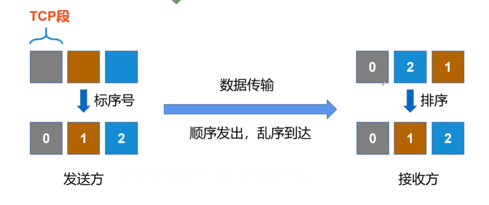

3. 一个端的发送顺序是另一个端的接收顺序

   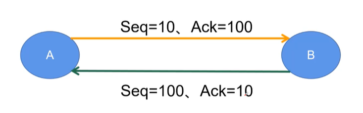

   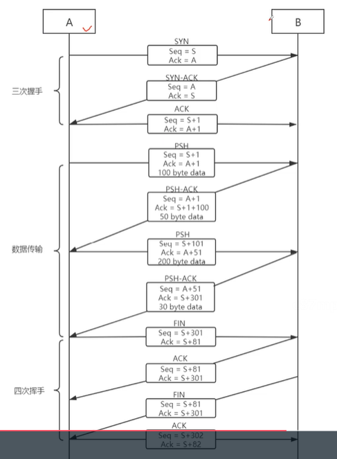

## 1.3、ip协议

1. 不解决封包损坏、丢包、重发、乱序问题

2. 作用

   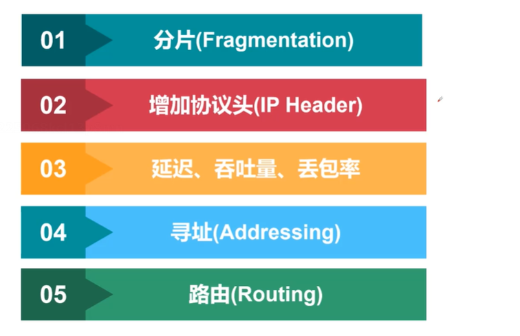

## 1.4、ip6协议

与ip4区别

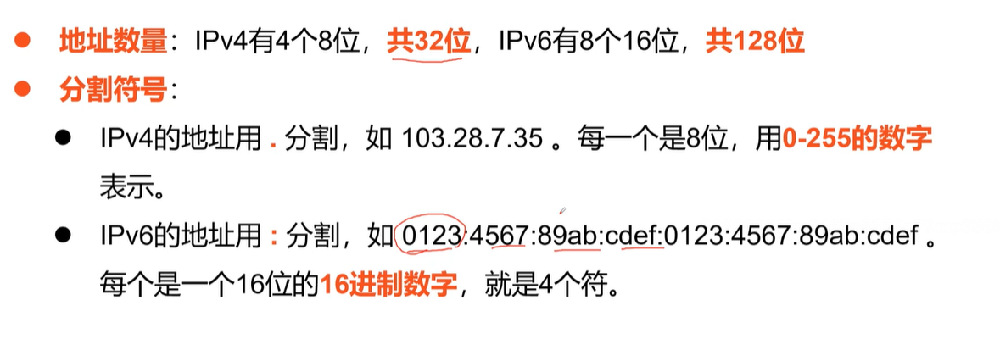

## 1.5、udp协议

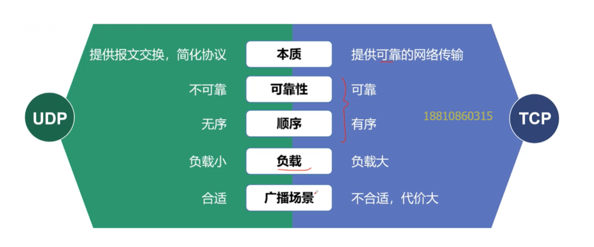

## 1.6、加密

之前非对称加密，之后对称

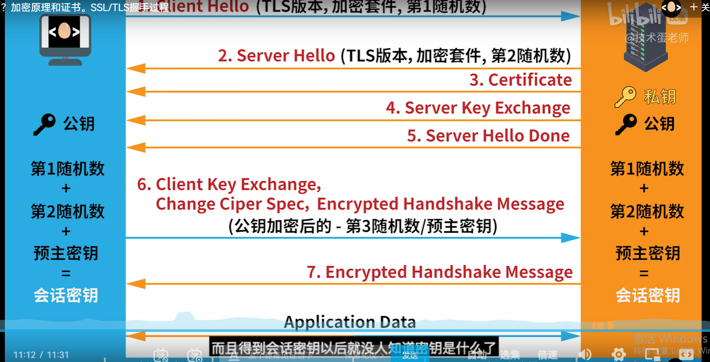

## 1.7、dns

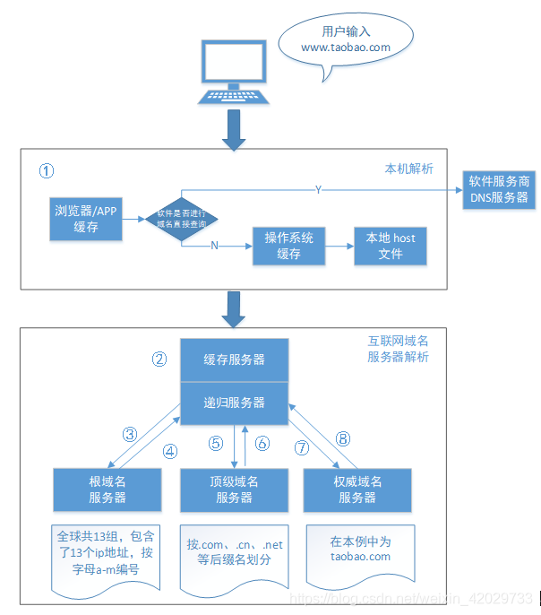