# 一、前置

## 1.1、和windows区别

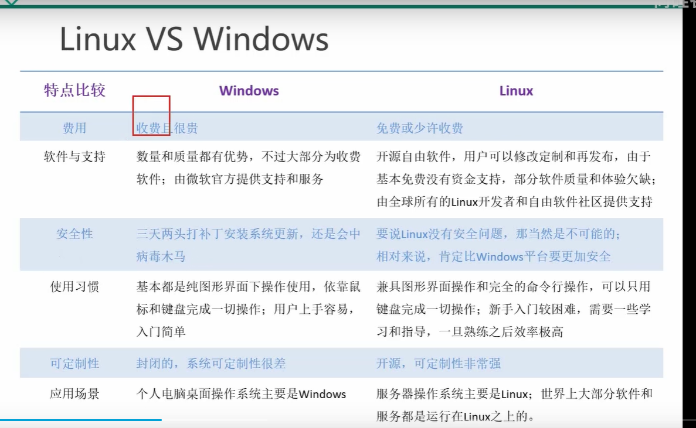

## 1.2、硬件介绍

1. 插槽：cpu数量

2. 内核：核心处理器

3. 逻辑处理器：实际工作线程

   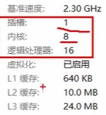

   该系统可以看做有16个核心的cpu，相当于16个cpu

## 1.3、结构

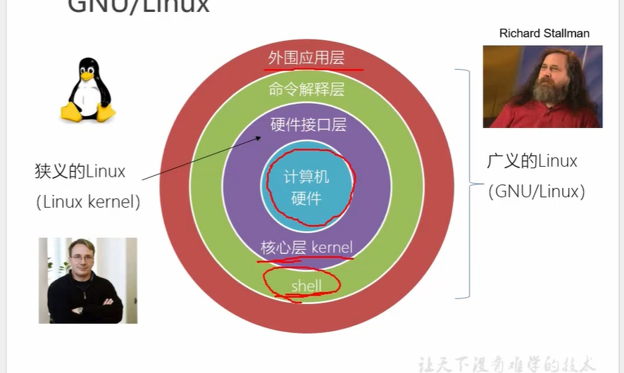

# 二、网络模式

## 1.1、bridged 桥接模式

相当于在物理主机与虚拟机网卡之间架设了一座桥梁，从而可以通过物理主机的网卡访问外网。

需要保证ip在同一网段，dns，子网掩码相同

## 1.2、network net模式

让 VM 虚拟机的网络服务发挥路由器的作用，使得通过虚拟机软件模拟 的主机可以通过物理主机访问外网，在真机中 NAT 虚拟机网卡对应的物理网卡是 VMnet8。

外界电脑无法访问到虚拟机

## 1.3、host-only

NAT和host-only 不会占用一个ip地址，只能和你的本机进行通讯

## 1.4、主机名字相关

### 1.4.1、查看hostname

hostname

### 1.4.2、修改

1. vim  /etc/hostname  重启
2. hostnamectl set-hostname name

### 1.4.3、配置映射

vim /etc/hosts

### 1.4.4、远程连接

ssh  username@servername

### 1.4.5、远程上传，下载

前提是服务器要开启写入权限。

scp username@servername:path path

scp path username@servername:path

上传下载目录

scp -r username@servername:path path

scp -r path username@servername:path

# 三、目录结构

linux 万物皆文件

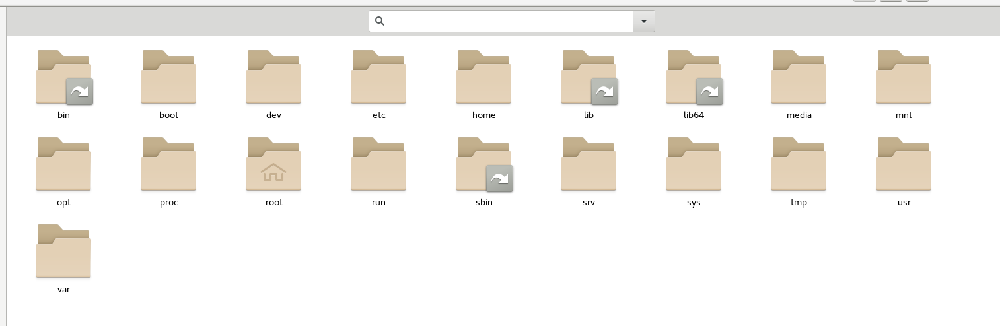

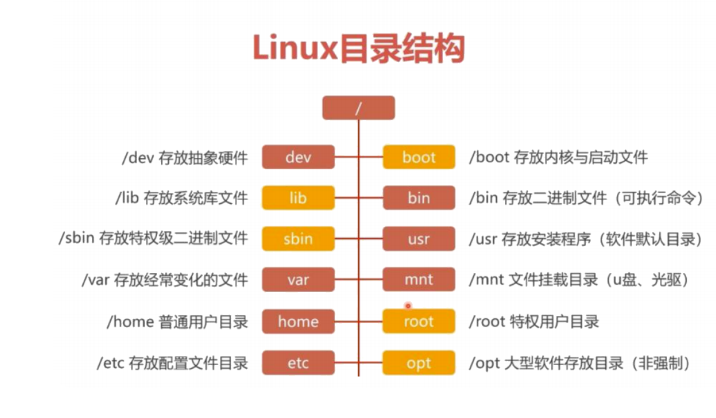

- **/run**：
  是一个临时文件系统，存储系统启动以来的信息。当系统重启时，这个目录下的文件应该被删掉或清除。如果你的系统上有 /var/run 目录，应该让它指向 run。

- **/proc**

   是 Processes(进程) 的缩写，/proc 是一种伪文件系统（也即虚拟文件系统），存储的是当前内核运行状态的一系列特殊文件，这个目录是一个虚拟的目录，它是系统内存的映射，我们可以通过直接访问这个目录来获取系统信息。
   
- **/srv**：
    该目录存放一些服务启动之后需要提取的数据。

# 四、文本编辑

vim、vi编辑器

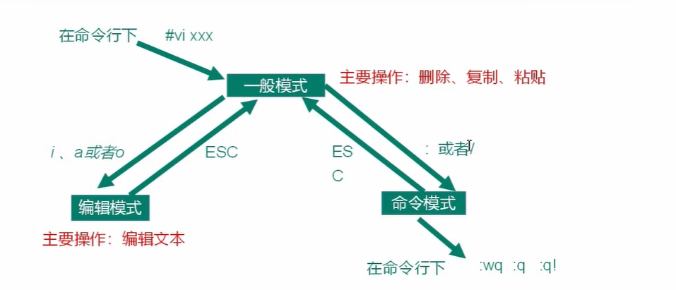

### 3.1、一般模式：

复制：yy，数字yy

粘贴：p

复制词：yw

删除词：dw

删除：dd  数字dd

撤销：u

末行：G

首行：gg

保存退出：ZZ

不保存退出：ZQ

### 3.2、命令模式

查找 /word  查找下一个 n

行号 ：set nu

取消行号  ：set nonu

# 五、进程管理

进程（procss）：正在执行的程序

服务（service）：常驻内存的进程（守护进程）

## 5.1、操作服务

### 5.1.1、centos6:

service name start|stop|restart|status|disable|enable

查看服务：ls /etc/init.d/

### 5.1.2、centos7：

systemctl start|stop|restart|status|disable|enable name

查看服务：ls /usr/lib/systemd/system

## 5.2、运行级别

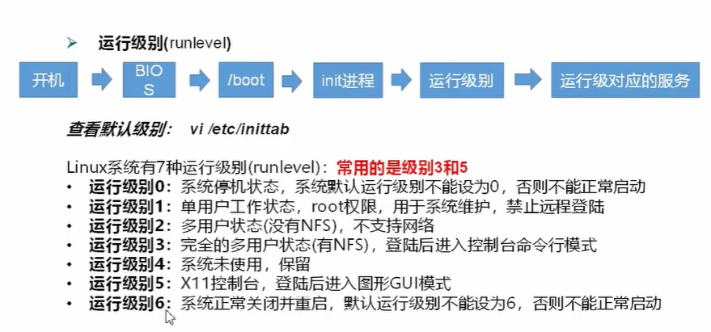

### 5.2.1、centos7运行级别     

multi-user.tartget  3

graphical.target 5

### 5.2.2、查看，修改   

systemctl get-default 

systemctl set-default multi-user\graphical 

### 5.2.3、切换用户级别

init n

重启

## 5.3、开机自启动

显示服务 systemctl list-unit-files

开启，关闭开机自启  sysyemctl enable，disable name

## 5.4、开关机

1. halt：立刻关机，停止系统但是不断电

2. reboot：重启

3. poweroff：立刻关机停止系统断电

4. sync：将内存中的数据写入磁盘（linux底层有缓存，异步写入磁盘）

5. shutdown：

   shutdown默认为shutdown  1（因为需要时间把数据写入磁盘）

   shutdown  时间 （n分钟后关机）

   shutdown   now 立刻关机

   shutdown -r now  立刻重启

   -h：关机

   -H：停机

   -r：重启

# 六、shell命令

shell可以看做是命令解释器，通过终端输入命令，由shell解释之后交给内核执行

分为嵌入（内置）命令，非嵌入（外部）命令

内置命令：shell自带的

外部命令：linux系统的程序

## 6.1、help

### 6.1.1、详细解释

man 命令name

### 6.2.2、用法介绍

help 内嵌命令

非内嵌命令 --help

## 6.2、文件目录类

1. pwd

2. cd

   ```
    上一级：cd ..
    根目录：cd / 
    用户根目录：cd : 或者cd   
    上一个目录：cd -
   ```

3. ls 

   ```
    -a 会把列出所有（包括.开头的隐藏文件）
    -l 详细信息
   ```

4. mkdir 目录

   ```
   -p 会把目录的父目录也创建出来 /a/b/c
   ```

5. rmdir(删除**<u>空</u>**目录) 和mkdir同用法

6. touch 创建文件

7. cp 复制或者覆盖文件  

   ```
    -r   代表递归复制文件夹及之下的文件   
    \cp  覆盖时候不用提示
   ```

8. rm

   ```
   -f 强制删除不提示
   -r 递归删除目录
   ```

9. mv

   移动文件或目录或重命名

10. cat 查看文件内容

    ```
    -n 显示行号
    |more 分页浏览
    ```

11. more 只读的文本文件

    ```
    space：下一页
    enter：换行
    q:离开
    ctrl f:下一屏
    ctrl b：上一屏
    =：输出行号
    :f:输出文件名和行号
    ```

12. less：less 指令在显示文件内容时，并不是一次将整个文件加载之后才显示，而是根据显示 

    需要加载内容，**对于显示大型文件具有较高的效率**。
    
    ```
    /word 查找  n 向下翻页 N向上翻页
    ```
    
14. ">", ">>"

    ```
    >  name 标准内容覆盖原文件内容
    >> name 标准内容追加
    2> name 错误内容覆盖文件内容
    2>>name 错误内容追加
    &>>name 标准内容和错误内容追加
    ```

    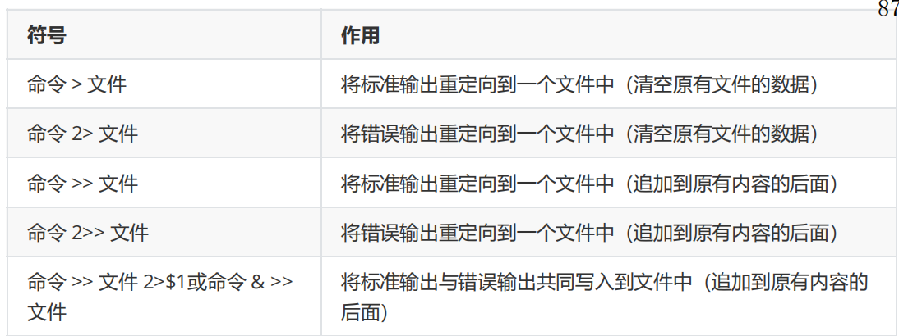

15. echo输出内容

    ```
    -e ：支持/转义字符
    ```

18. ln连接

    软连接：

    1. 仅仅包含所链接文件的路径名
    2. 能链接目录文件，也可以跨越文件系统进行链接。
    3. 当原始文件被删除后，链接文件也将失效

    硬链接：

    1. 可以将它理解为一个“指向原始文件 inode 的指针”，系统不为 它分配独立的 inode 和文件。
    2. 硬链接文件与原始文件其实是同一个文件，只是名字不同。
    3. 我们每添加一个硬链接，该文件的 inode 连接数就会增加 1
    4. 而且只 有当该文件的**inode** 连接数为 0 时，才算彻底将它删除。
    5. 即便原始文件被删除，依然可以通过硬链接文件来访问。
    6. 由于技术的局限性我们不能**跨分区**对目录文件进行链接。

    ```
    硬链接：ln （-f，默认是它）文件 连接名字
    软连接：ln -s 文件  连接名字
    ```

19. history

## 6.3、时间类

```
date 
date +%Y
date +%m
date +%d
date +%H
date +%M
date +%S
date "+%Y-%m-%d %H:%M:%S"
设置日期：date -s 字符串时间
日历：cal 年份
```

## 6.4、查找

1. find  搜索范围  [options] 

   ```
   -name
   -user
   -size +n 大于 -n 小于 n 等于
   ```

2. locate：查找文件目录

   获得文件的目录地址

   第一次使用使用用updatedb创建 locate 数 据库。

3. grep [option] 内容 name

   ```
   -n：行号
   -i：忽略大小写
   ```

1. head

   ```
   前10行文字
   -n number 前number行文字
   ```

2. tail

   ```
   tail 
   tail -n number
   tail -f：实时追踪更新
   ```

## 6.5、压缩&解压缩

1. gzip，gunzip

   ```
   .gz文件
   gzip 文件
   gunzip 文件.gz
   压缩后不会保留原文件
   ```

2. zip unzip

   ```
   .zip文件
   zip [选项] XXX.zip 将要压缩的内容（功能描述：压缩文件和目录的命令） 
   unzip [选项] XXX.zip 文件（功能描述：解压缩文件）
   -r：递归压缩，即压缩目录
   -d：
   ```

3. tar

```
.tar.gz
tar [选项] XXX.tar.gz 打包的内容
-c 产生.tar打包文件
-v 显示详细信息
-f 指定压缩后的文件名
-z 打包同时压缩 Gzip
-x 解压缩
```

## 6.6、用户管理

每一个用户至少要属于一个组

1. 添加用户

   ```
   useradd 用户名
   添加用户并指定用户目录
   useradd -d 目录 用户名
   ```

2. 建立或者修改密码

   ```
   passwd 用户名
   ```

3. 删除用户

   ```
   userdel：删除用户但是保留用户目录
   userdel -r 用户：删除用户和用户目录
   ```

4. 查看用户

   ```
   id 用户名
   ```

5. 切换用户

   ```
   su name
   或者
   exit
   ```

6. 用户组

   ```
   增加用户组
   groupadd name
   groupdel name
   ```

7. 增加用户到用户组

   ```
   useradd -g 用户组 用户名
   ```

8. 用户修改查询

   ```
   /etc/passwd：记录用户的各种信息
   /etc/shadow：口令配置文件
   /etc/group：组(group)的配置文件，记录 Linux 包含的组的信息
   
   ```

9. 更改用户，用户组

   ```
   用户组：chgrp 组名 文件名
   用户：chown name 文件名字
   改变用户所在的组： usermod –g 组名 用户名 
   改变该用户登陆的初始目录：usermod –d 目录名 用户名 
   ```

## 6.7、权限管理

### 6.7.1、介绍

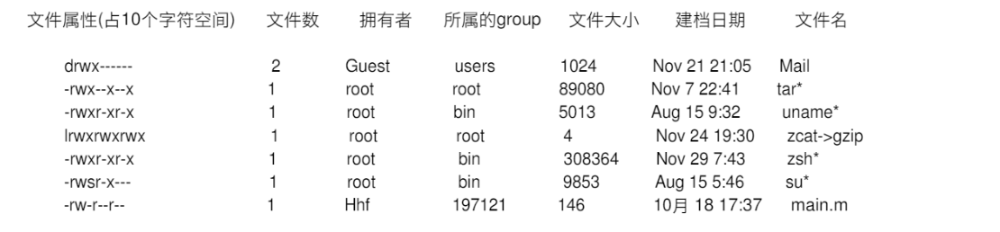

1. 第0位：文件类型

   ```
   -：普通文件
   d：目录
   b：块文件（硬盘等）
   c：字符设备（鼠标，键盘）
   l:连接
   ```

2. 1-3：文件所有者的权限

   **有w权限不代表可以删除文件，因为linux中删除文件默认为是对该文件的目录的修改，所以需要修改目录的权限**

   ```
   -：没有
   r：可读
   w:可写
   x：可执行
   ```

3. 4-6：用户组的权限

4. 7-9：非用户组的其他用户的权限

### 6.7.2、修改权限

可以通过字符变更

```
u:所有者 g:所有组 o:其他人 a:所有人(u、g、o 的总和) 
1) chmod  u=rwx,g=rx,o=x 文件目录名 
2) chmod o+w 文件目录名 
3) chmod a-x 文件目录名 
```

可以通过数字变更

```
规则：r=4 w=2 x=1 
rwx=4+2+1=7 
chmod u=rwx,g=rx,o=x 文件目录名 
相当于 chmod 751 文件目录名
```

### 6.7.3、改变文件所有者

```
chown newowner file 改变文件的所有者 
chown newowner:newgroup file 改变用户的所有者和所有组 
-R 如果是目录 则使其下所有子文件或目录递归生效
```

### 6.7.4、改变文件的所有组

```
chgrp newgroup file
```

## 6.8、磁盘

### 6.8.1、查看所有目录结构

```
tree ./
```

### 6.8.2、查看大小

```
ls -lh：文件夹的大小（不包括子文件夹的大小，所以不推荐）
du：文件夹和子文件夹的大小
```

其他等待总结

## 6.9、进程相关

### 6.9.1、查看进程

```
ps：当前终端，用户的进程
ps -aux 常用来查看cpu，内存
ps -ef 常用来查看进程信息（会显示父子进程）
top：实时查看
```

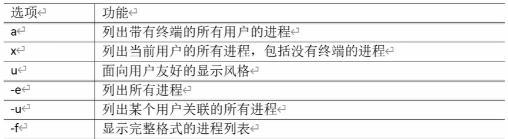

### 6.9.2：杀死进程

```
kill 进程号：杀死进程
kill -9 进程号 ：强制杀死
killall name：杀死进程
```

### 6.9.3、查看进程树

```
ptree 
-p：查看进程号
-u: 查看用户
```

### 6.9.4、网络相关

```
ifconfig
ping
netstat -anp|grep 进程号：查看网络信息
netstat -nlp |grep 进程号：网络端口号占用状况
```

## 6.10、定时任务crond

```
crontab -l 查看
crontab -e 编辑
crontab -r 删除当前用户的定时任务
```

cron表达式

分，时，日，月，星期

*：任意

,：某一列填多个时间

-：某一列范围

*/n:每隔n执行一次（单位看在哪一位）

## 6.11、输出重定向作用表


## 6.12、安装

### 6.12.1、安装方式

wget  下载

rpm  下载安装

yum 下载并安装以及它依赖的软件

### 6.12.2、源文件

自己下载安装配置

### 6.12.3、rpm

源码文件的二进制可执行程序和依赖的软件的记录表

```
rpm -qa：查询所有已安装rpm
rpm -qi name：查询某一个
rpm -e：卸载
rpm -ivh name：下载并安装
```


### 6.12.4、yum

底层是rpm，依赖rpm软件包管理器，扩展了rpm功能

作用是安装软件及其**依赖的软件**

## 6.13、文本处理工具

### 6.13.1：cut

```
cut 参数 filename
-f：提取的列
-d：分隔符
-c：按照字符分割，后加n代表取第几列
```

### 6.13.2：awk

```
awk 参数 ‘/pattern/{action} /pattern/{action}’ filename
-F:指定分隔符
-v：赋予用户变量
BEGIN:action之前
END：action‘
print NR：输出行号
```


# 七、内核

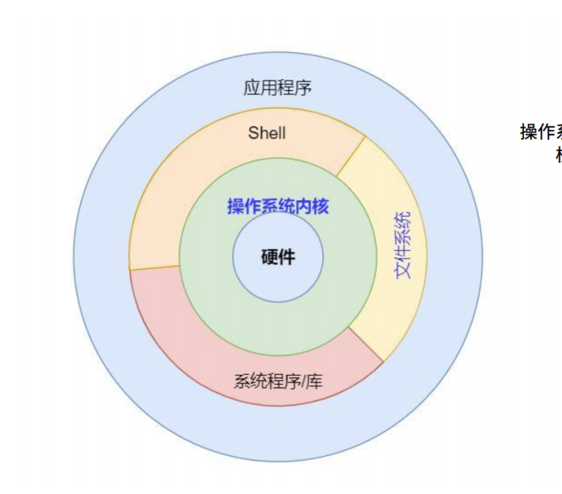