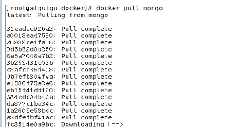
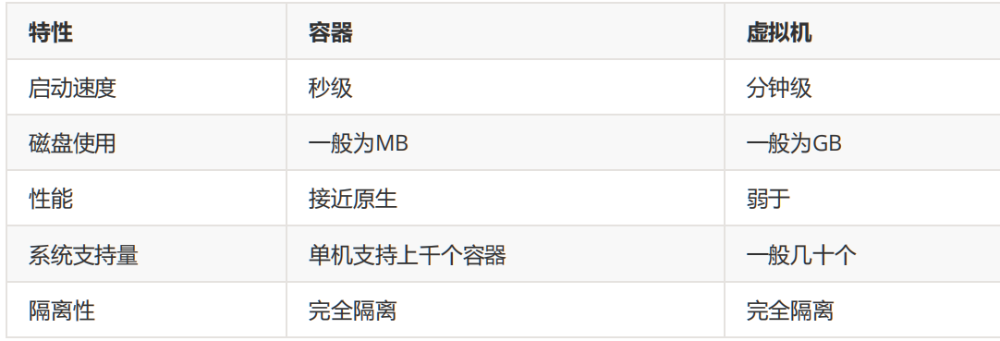
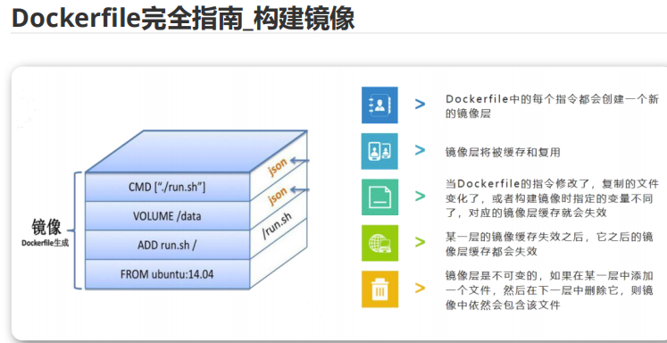
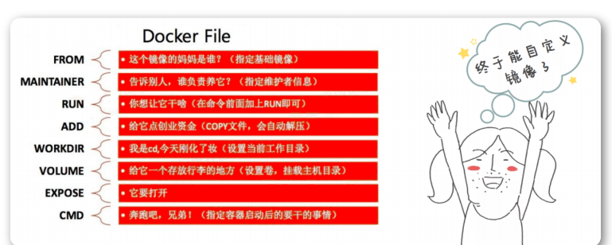
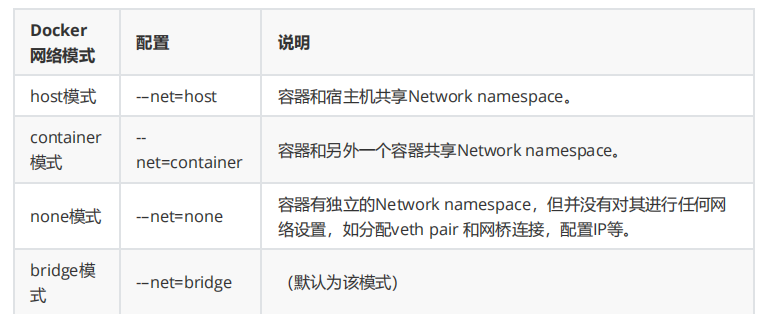

# 一、介绍

## 1.1、基本概念

Build once，Run anywhere

### 1.1.1、镜像：

打包软件和软件运行环境包括代码，配置文件，运行时库，环境变量

来源：

1. 从Docker Hub或者其他仓库中下载
2. 通过Docker file自己创建出来

### 1.1.2、容器：

容器是从镜像创建的应用运行实例，可以启动、开始、停止、删除，

而这些容器都是相互隔离、互不可见

### 1.1.3、仓库：

是Docker集中存放镜像文件的场所。目前，最大的公开仓库是Docker Hub，存放了数量庞

大的镜像供用户下载。国内的公开仓库包括Docker Pool等

### 11.4、联合文件系统（UnioFA）

分层的，轻量级的，高性能的文件系统

每一次对文件的一次修改可以作为一次提交，一层层的叠加作为一个整体。

（images均是只读，container加了一层可写）

文件名，生成镜像docker load -i 文件名 

### 11.5、docker镜像加载原理

docker镜像由一层层的文件系统构成

#### 11.5.1、bootfs（boot file system）：

包含bootloader和kernel

内核加载器会加载内核到内存中，之后卸载

#### 11.5.2、rootfs（root file system）

linux 系统中的文件系统（docker中只包含最基本的命令、工具、程序库）

#### 11.5.3、镜像分层

可以共享资源，磁盘中可以只存储一份，内存中也可以只加载一份base镜像

### 1.1.6、与容器区别

# 二、常用命令

## 2.1、镜像命令

docker images

docker search  xxx

docker pull xxx : [版本号]

docker rmi  name/id 

## 2.2、容器命令

docker create -it iname

docker ps

docker start name/id

docker run 镜像名字

docker run -it 镜像名字  /bin/bash

exit

不停止退出：crl+P+Q

docker stop name/id

docker start name/id

docker restart name/id

docker  rm name/id

进入正在运行的容器之中：

docker exec -it 容器id /bin/bash

-i：以交互模式运行容器（没有-i，可以输入命令，但无法交互）

-t：为容器重新分配一个伪输入终端（出现可以输入的命令行）

-d:后端启动

## 2.3、其他

查看日志：docker logs 容器id

查看进程：docker top id

拷贝:     docker cp 容器目录  系统目录

# 三、数据卷（Data Volume）

## 3.1、概念

1. 数据卷是宿主机中的一个目录或文件。
2. 当容器目录和数据卷目录绑定后，对方修改会立即同步。
3. 一个数据卷可以同时被多个容器同时挂载。
4. 一个容器也可以被挂载多个数据卷。

## 3.2、作用

1. 容器数据持久化。
2. 外部机器和容器间接通信。
3. 容器之间数据交换。

## 3.3、命令

docker run -v 宿主机目录(文件):容器内目录(文件)

## 3.4、容器卷

创建：

docker volume create edc-tomcat-vol

使用：

docker run -d -it --name=edc-tomcat -p 8080:8080 -v edc-tomcat-vol:/usr/local/tomcat/webapps tomcat

如果没有通过-v指定，那么Docker会默认帮我们创建匿名数据卷进行映射和挂载

## 3.5、分类

1. -V  容器内路径             #匿名挂载
2. -v  卷名:容器内路径           #具名挂载
3. -v  /宿主内路径:容器内路径        #指定路径挂载

## 3.6、容器内部权限

ro readonly # 只读

rw readwrite # 可读可写

# 四、docker file

Dockerfile是一个文本格式的配置文件，用户可以使用Dockerfile快速创建自定义的镜像。

## 4.1、组成

Dockerfile分为四部分:

1. 基础镜像信息（所基于的镜像名称）
2. 维护者信息、
3. 镜像操作指令
4. 容器启动时执行指令。

## 4.2、特点

## 4.3、构建

docker build -t （-file）仓库:tag (-f：name代表dockerfile名字，否则默认为Dockerfile)

每一层命令都会构建一层

## 4.4、常用指令

from必须，其他非必需

FROM：基于的镜像

WORDDIRE:工作目录

COPY: 拷贝文件到docker内

RUN：构建时运行的脚本

CMD：容器启动时运行的脚本（执行完之后，容器生命周期结束）

ENTRYPOINT：（如果entpoint不是json，以他为准，忽略cmd，如果ENTRYPOINT和cmd都是json，拼接为shell）

EXPOSE:暴露端口

VOLUMN：映射数据卷

ENV：环境变量

ARG：构建时才有效，env运行时有效

LABEL：标识符，不起作用

ONBUILD：子镜像会集成该值，但是本镜像无用

# 五、网络管理

每启动一个docker容器， docker就会给容器分配一个ip，只要安装docker就会有一个docker0 网卡。

## 5.1、网络管理的四种网络模式

