# 一、组成

现代计算机

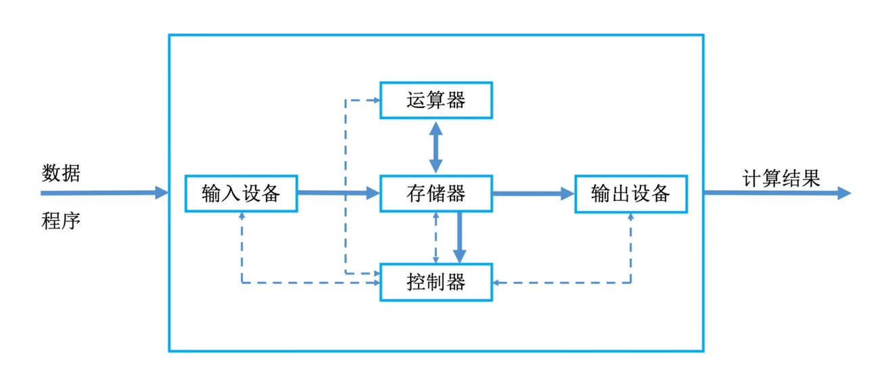

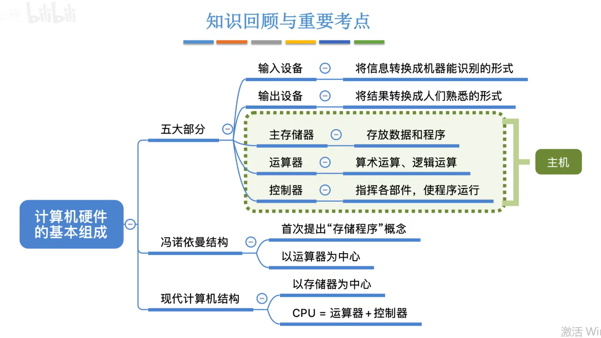

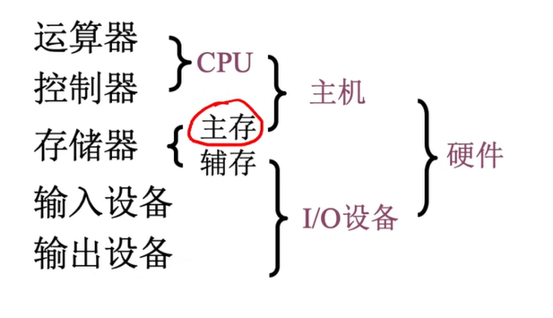

## 1.1、主存储器

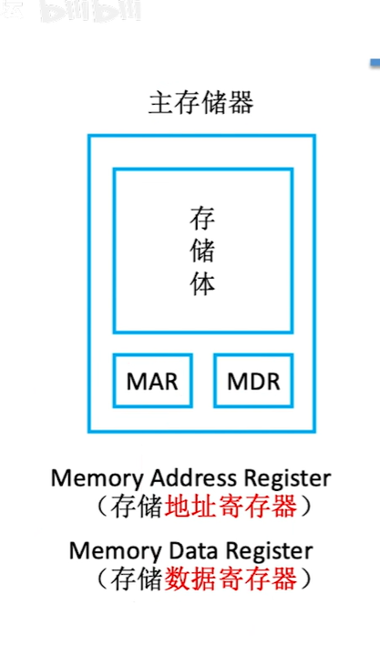

存储单元：存放一串二进制代码的地方

存储字：二进制代码组合

存储字长：二进制代码位数

存储元：存储二进制代码的电子元件，可以存储1bit

MAR：存储单元的个数

MDR：存储字长

## 1.2、运算器

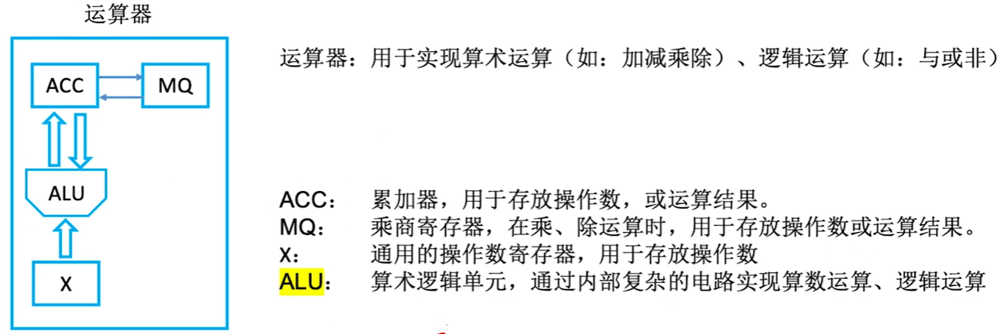

## 1.3、控制器：

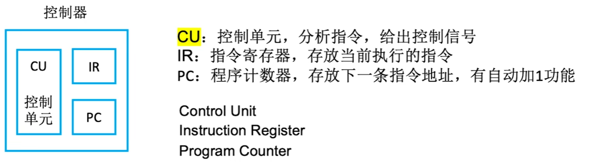

## 1.4、计算机的工作过程

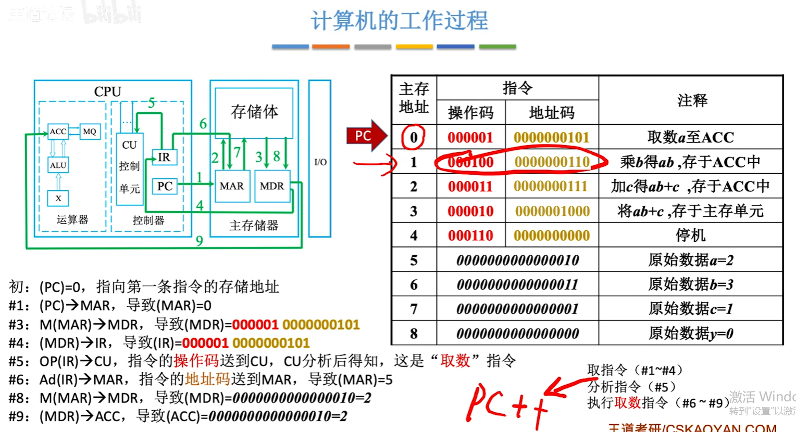

## 1.5、计算机层次结构

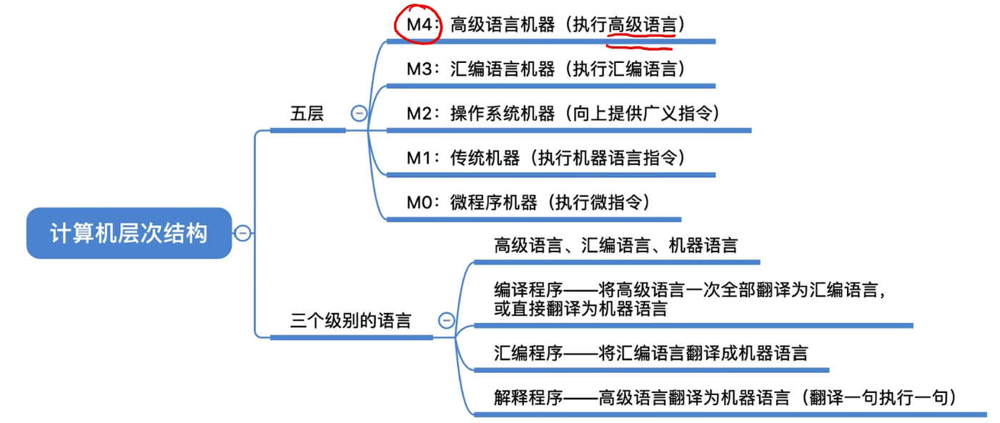

## 1.6、CPU介绍

pc：程序计数器，计算下一条指令的地址

regesiters：暂时存储运算的结果

ALU：arithmatic & Logic Unit 运算单元

CU: 控制单元  主要负责发出各种**微操作命令**序列来控制完成各种指令

MMU：内存管理单元

cache：因为内存和cpu的运算速度不一样，比例约为1：80，所以可以需要缓存

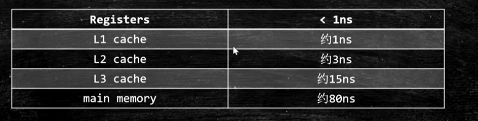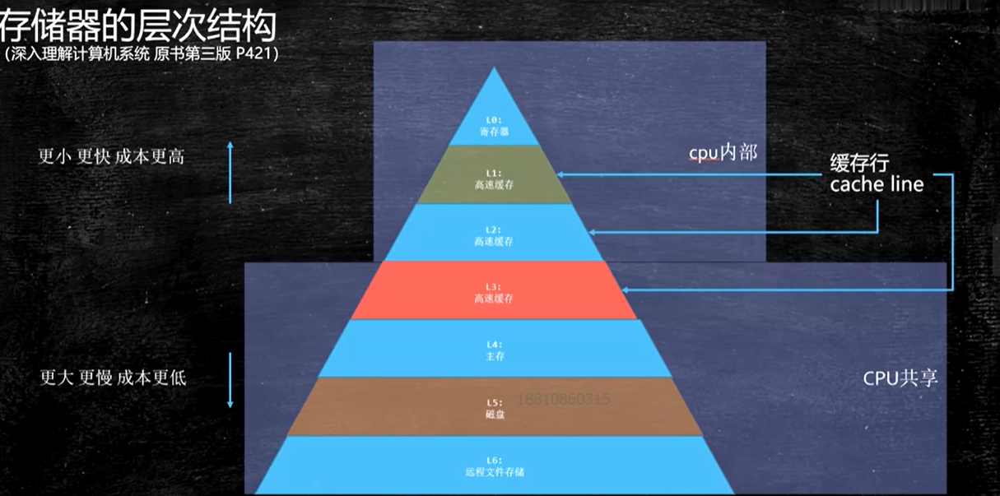

多核cpu：

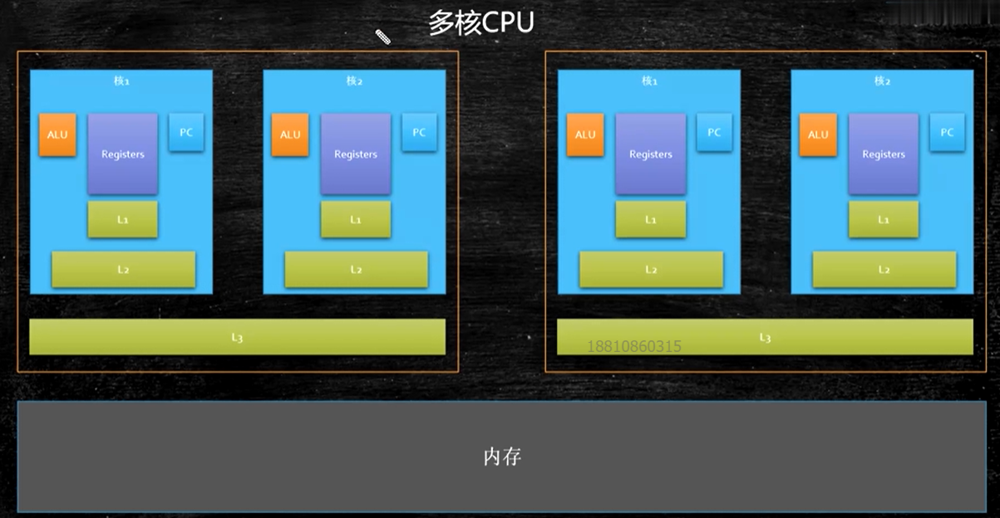

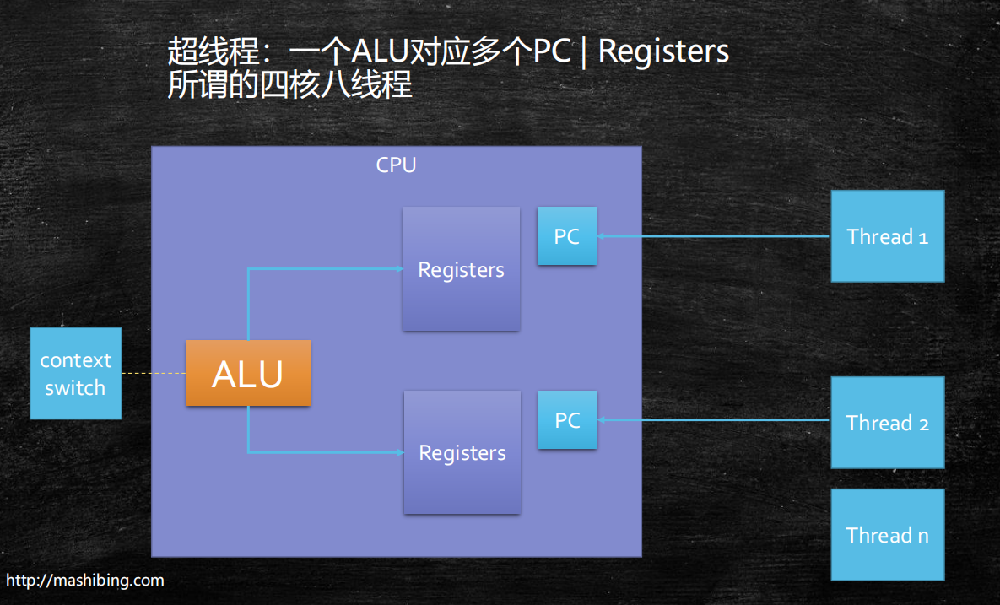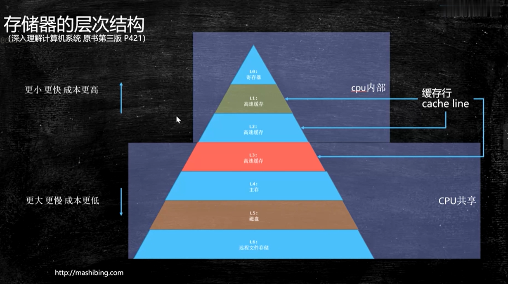