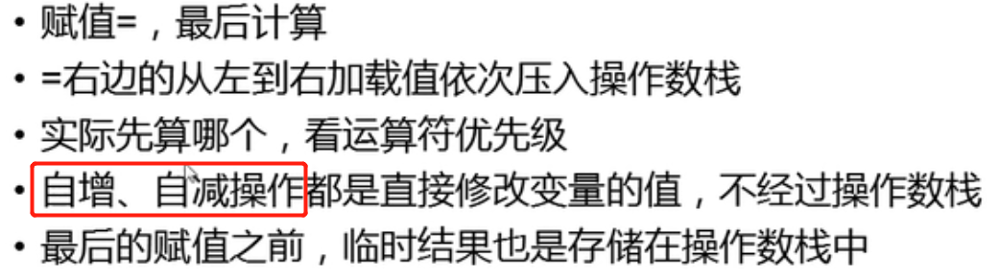

# 一、面试易错题

## 1.1、i++指令相关



## 1.2、类加载

### 12.1、类初始化

1. 一个类要创建实例需要先加载并初始化该类

2.  main方法所在的类需要先加载和初始化

3. 一个子类要初始化需要先初始化**父类**

4. 一个类初始化就是执行 clinit 方法

5.  clinit 方法由**静态类变量显示赋值代码和静态代码块**组成

6.  类变量显示赋值代码和静态代码块代码从上到下执行

7.  clinit 方法只调用一次

### 12.2、实例初始化

1. 实例初始化就是执行 init() 方法

2.  init () 方法可能重载有多个，有几个构造器就有几个 init() 方法

3.  init() 方法由**非静态**实例变量显示赋值代码和非静态**代码块**，对应构造器代码组成

4.  非静态实例变量显示赋值代码和非静态代码块从上到下顺序执行，而对应构造器的代码最后执行

5.  每次创建实例对象，调用对应构造器，执行的就是对应的 ini方法

6.  init 方法的首行是super()和super(实参列表) ,即对应父类的 init 方法
7. 非静态方法前面有一个this关键字，this代表当前正在创建的对象。所以父类中初始化的时候会调用子类重写的方法

```
package com.atguigu.classLoader;


public class Father {
    private int i = test();
    private static int j = method();

    static{
        System.out.println("(1)");
    }
    Father() {
        System.out.println("(2)");
    }
    {
        System.out.println("(3)");
    }
    public int test(){
        System.out.println("(4)");
        return 1;
    }
    public static int method() {
        System.out.println("(5)");
        return 1;
    }
}

package com.atguigu.classLoader;


public class Son extends Father {
    private int i = test();
    private static int j = method();
    static {
        System.out.println("(6)");
    }
    Son() {
        super();
        System.out.println("(7)");
    }
    {
        System.out.println("(8)");
    }
    public int test(){
        System.out.println("(9)");
        return 1;
    }
    public static int method() {
        System.out.println("(10)");
        return 1;
    }

    public static void main(String[] args) {
        Son son = new Son();
        System.out.println();
        Son son1 = new Son();
    }
}


结果：
(5)(1)(10)(6)(9)(3)(2)(9)(8)(7)(9)(3)(2)(9)(8)(7)

```

